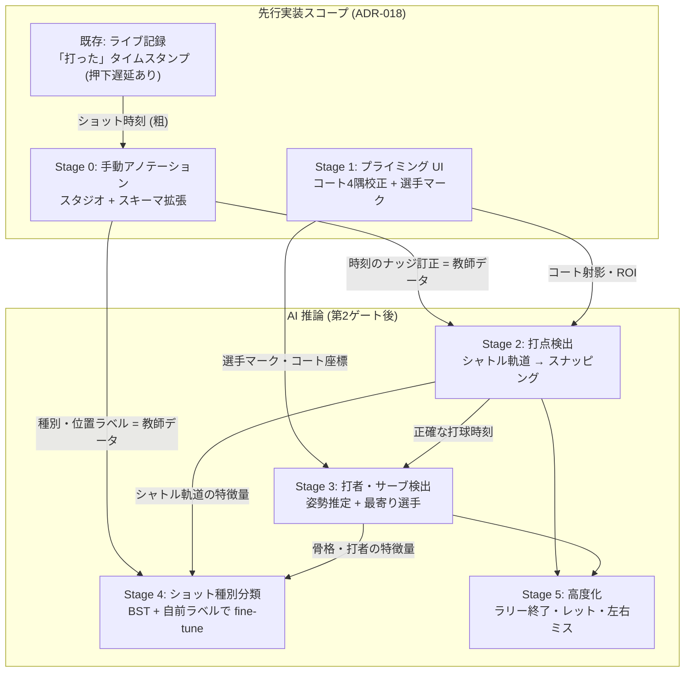

# ADR-017: AI導入の段階戦略とショットアノテーション基盤

## ステータス
Accepted (2026-07-19)

## 背景

[[project_monetization_strategy]] (ADR-013 §6) で AI 入力補助の大方針
(**AI 下書き → 人が確認・訂正** / クライアント側 or ハイブリッド推論 / プライミング注釈 /
訂正フライホイール) を確定したが、「どの順番で・何を土台に上っていくか」は粗いままだった。

並行して、川島氏より「**ショット種類・打った場所を手動で入力する UI**」を検討すべきという
アドバイスを得た。PRD §3.2 は「ショット種別の記録・コート上の位置記録」を
『手動入力は負荷が高すぎる。AI で対応予定』として MVP から除外しており、
このアドバイスは一見 PRD の決定と衝突する。

本 ADR は両者を統合し、以下を確定する:

1. PRD §3.2 の除外判断の**条件付け直し** (リアルタイム入力なら正しいが、後付けなら成立する)
2. 手動アノテーションを **AI 階段の Stage 0** と位置づける段階戦略 (Stage 0〜5)
3. Stage 0 のアノテーション UI・データモデル・分類語彙 (taxonomy) の設計

実装時期は当初「設計のみ確定・実装は第2ゲート後」(ADR-016) としていたが、
**ADR-018 (検証戦略の改訂) により Stage 0 とショットレベル統計は需要検証の試料として
先行実装する**に改めた (§9 参照)。

## 決定

### 1. 手動アノテーションは「AI への回り道」ではなく「AI 階段の1段目」

ADR-013 §6 の「AI 下書き → 人が確認・訂正」における**訂正 UI の実体は手動アノテーション UI**
である。手動入力 UI を先に作ることは:

- (a) AI 以前にショットレベル統計 (配球ヒートマップ・決定打/エラー傾向) という機能価値を出す
- (b) 訂正フライホイール (§6-4「人の訂正履歴 = 最大の資産」) の器を先に完成させる
- (c) PRD §3.3 優先度6「ショット種別分類」の最大障壁だった**教師データ不足を自前ラベルで解消**する

の三重に効く。AI 導入後も UI の形は変わらず、AI が値を先入れして人の操作が
「入力」から「確認・訂正」に変わるだけである。

### 2. AI 階段 (Stage 0〜5)

各段が「単体でユーザー価値を出す」×「次の段の資産を貯める」の二役を持つ。

| Stage | 作るもの | ユーザー価値 | 次段への資産 |
|---|---|---|---|
| **0. 手動アノテーション** | スキーマ拡張 + アノテーションスタジオ | ショットレベル統計 | 教師ラベル蓄積・訂正 UI の器 |
| **1. プライミング UI** | コート4隅校正 + 選手4人マーク (ADR-013 §6-5) | 動画上を直接タップして打点入力 | 射影行列・ROI・選手 ID (AI 全段の前提入力) |
| **2. 打点検出** | TrackNetV3 系のブラウザ内推論 (WebGPU)、軌道反転→打点 | **タイムスタンプ・スナッピング** + ショット下書き | シャトル軌道特徴量の抽出パイプライン |
| **3. サーブ / 誰が打ったか** | 姿勢推定 + 最寄り選手 + ID 追跡 | スコア進行の下書き自動化、**打点パスの自動化** | 骨格キーポイント特徴量 |
| **4. ショット種別分類** | BST/ShuttleSet + Stage 0 の自前ラベルで fine-tune | **種別パスの自動化** (タップ数激減) | 訂正がさらにラベルを生む (フライホイール稼働) |
| **5. 高度化** | ラリー終了検出・レット推定・左右ミス自動検出 | 記録作業のほぼ全自動下書き化 | — |

#### 依存関係図

矢印 = 「成果物の受け渡し」。上流が完成しないと下流が作れない (または精度が出ない)。



読み方:

- **Stage 0 と Stage 1 は互いに独立** (並行して作れる)。両方とも AI を含まない手動 UI で、
  先行実装スコープはこの2つ + ショットレベル統計 (ADR-018)。
- **Stage 2 は「Stage 1 の校正」と「Stage 0 のナッジ訂正データ」の上に乗る**。
  コート校正が ROI (コート外ノイズ除去) を与え、人間のフレーム合わせ訂正が
  精度検証・学習データを与える。
- **Stage 3 は Stage 1 (誰がどこにいるか) と Stage 2 (いつ打たれたか) の合流点**。
  「打球瞬間の最寄り選手 = 打者」という推論は、時刻と位置の両方が揃って初めて成立する。
- **Stage 4 は全部の合流点**。軌道 (Stage 2) + 骨格 (Stage 3) を入力特徴量とし、
  Stage 0 で貯めた種別ラベルを教師データとして fine-tune する。
  だから種別分類は最後 = PRD で「教師データ不足」とされていた障壁を、
  手前の Stage が全部解消してから着手する。

各 Stage の完成で消える (軽くなる) 手動作業:

| Stage 完成時 | 消える/軽くなる手動作業 |
|---|---|
| 2 | 打点パスのフレーム合わせ (ナッジ) が不要になり、静止画紙芝居が本来の速度 (1〜2秒/ショット) になる |
| 3 | 打点パスそのもの (位置 + 打者) が AI 下書きになり、人は確認・訂正だけ |
| 4 | 種別パスが AI 下書きになる |
| 5 | クイックパス (決着注釈) 周辺も下書き化。記録作業のほぼ全体が「確認・訂正」になる |

依存関係の要点:

- **Stage 2 (スナッピング) は打点パス UX の前提技術** (§4 参照)。「あれば楽」ではない。
- 手動で辛い方 (打点) が Stage 3 で先に自動化され、種別は Stage 4。
  「AI は時短を買う機能」の実感が段階ごとに得られる順序になっている。

### 3. ライブ記録 UI は聖域。注釈は後付けスタジオに一本化

match-recording の記録フロー (「見る → Space 連打 → 得点ボタン」の 100ms リズム、
UI ヒアリング 2026-06-05 で確定) には**一切手を入れない**。
ライブ中の注釈入力 (決着時1タップ等) は不採用 (§採用しなかった選択肢 A)。

注釈は記録済み試合に対する**アノテーションスタジオ** (別画面) に一本化し、3モードを持つ:

| モード | 対象 | 操作モデル | 目安時間/試合 |
|---|---|---|---|
| **クイックパス** | ラリー決着のみ (end_reason + 決定打種別 + 落下点) | 最終ショット付近 (±2秒) を自動ループ再生 → 入力 → 次のラリー | 10〜15分 |
| **種別パス** | 全ショットの種別 | 連続再生 (可変速) + キーボード | 約15分 |
| **打点パス** | 全ショットの打点座標 (+打者の二択) | 静止画ステッピング + マウス/タップ | 20〜35分 (Stage 2 後は 10〜17分) |

- 種別と打点を1周で同時入力する方式は不採用 (人間の処理速度を超える。選択肢 B)。
- 2周に分けても視聴は2倍にならない: 種別パスはラリー間を自動スキップした実プレー時間のみ、
  打点パスはそもそも再生しない。
- どの列も nullable であり、モードは任意・途中打ち切り可。進捗はフィールドの null 有無から
  導出する (v1 では専用の進捗テーブルを持たない)。セット単位・ラリー範囲単位で
  チーム分担できる (RLS は既にグループ単位)。

### 4. 2パスの操作モデル詳細

#### 種別パス: 連続再生 + 順番マッチング

- タイムスタンプは全ショット分あるため、キー入力は**タイミングでなく順番**で対応づける
  (ラリー内 k 回目のキー押下 = k 番目のショット)。打球の瞬間に合わせて押す必要がない。
- **ラリー境界で自動一時停止** (息継ぎ)。取りこぼしはラリー単位でやり直し。
- 再生速度はユーザー可変 (速い打ち合いだけ 0.75 倍等)。ラリー間の死に時間は自動スキップ。
- キー割当は**常に固定** (筋肉記憶保護)。直前ショットがスマッシュ/プッシュ/ドライブのときは
  レシーブ3種を**ハイライト表示のみ**行う (選択肢は減らさない)。
  文脈と矛盾する入力 (スマッシュ直後のロブ等) には軽い警告 (レシーブでは?) を出せる。

#### 打点パス: 静止画ステッピング + タイムスタンプ補正

「打った」押下は**見てから押す**ため 0.2〜0.5 秒の反応遅延を含み、速い展開では
ショット間隔 (0.4〜0.8 秒) を超える。**無補正タイムスタンプの静止画は打球瞬間を写さない**
前提で設計する (選択肢 C):

1. **一律オフセット補正**: パス開始時に最初の数ショットで合わせ、平均反応遅延を全体に適用
2. **候補フレーム帯**: 補正後時刻の前後 ±0.5 秒から抜いた 5〜7 枚のサムネイルを表示し、
   正しい打球フレームをクリック → 同一画面でコート位置をクリック
3. **スローループ fallback**: サムネ帯でも苦しい連打区間は、該当 1.5 秒を 0.5 倍速ループ →
   Space で静止 → クリック

- **人間のナッジ操作 (押下時刻 → 真の打球時刻) はそのまま Stage 2 スナッピングの
  検証・学習データになる**。フライホイールは種別・位置より先にタイムスタンプで回り始める。
  訂正後時刻は `annotated_timestamp_ms` として別列に保存し、押下時刻
  (`video_timestamp_ms`) は上書きせずペアで保持する (追補 2026-07-19)。
- **動画ソース制約**: フレーム精度シーク・フレーム画像の取得 (canvas 描画) は
  ローカル動画のみ可能。YouTube iframe API は `seekTo(秒)` のみでフレーム制御が無く、
  クロスオリジンのためピクセルにもアクセスできない。よって
  (a) 打点パスのサムネ帯・静止画紙芝居は YouTube では成立せず**常時ループ方式に劣化**、
  (b) **Stage 1 以降のブラウザ内 AI 推論 (シャトル追跡・姿勢推定) は YouTube 動画に適用不可**
  (フレーム画像が入力のため)。検証フェーズは YouTube のみで行い、この劣化を受容する
  (ユーザー決定 2026-07-19)。将来の解は「再生・共有は YouTube、注釈/AI 処理時のみ
  ローカル原本を再選択する両対応」または自前クラウド保存 (R2 等、原本3GB・1年保持で
  ¥100/年オーダー)。クラウド保存は方式 A (動画非保存) の前提変更になるため着手時に別 ADR。
- 位置の入力精度は ±50cm 程度で足りる (集計はゾーン単位)。厳密さを要求しない UI トーンにする。

#### rule-engine によるプレフィル (AI 以前の自動化)

| 項目 | 自動化 |
|---|---|
| 1打目の打者 | `server_player_id` で確定 (入力不要) |
| 2打目の打者 | `receiver_player_id` で確定 |
| 3打目以降の打者 | チームは打順の偶奇で確定。残りは**ペア2人の二択のみ** |
| 1打目の種別 | サーブで確定 (ショート/ロング/ドライブの三択のみ) |
| 決定打 | 勝者チームの最後のショットとして導出 (入力不要)。帰責は最終接触者 + end_reason で決まる (§7) |
| 落下点 | n 打目の落下点 ≈ n+1 打目の打点。独立入力は最終ショットの1回だけ |

### 5. データモデル (additive、既存に非破壊)

```sql
ALTER TABLE shots ADD COLUMN
  hit_player_id      uuid REFERENCES players(id),  -- 誰が打ったか
  shot_type          text,                          -- §6 の16種 (CHECK)
  hand               text CHECK (hand IN ('forehand', 'backhand')),  -- 任意入力
  hit_x  real, hit_y real,                          -- 打点 (正規化コート座標)
  hit_height text CHECK (hit_height IN ('high', 'low')),  -- 打点の高さ (対象球種のみ任意入力。追補 2026-07-24)
  annotated_timestamp_ms integer,                   -- 人間が確定した打球時刻 (押下時刻は上書きせず保持 → ペアが Stage 2 の教師データ。追補 2026-07-19)
  annotation_source  text CHECK (annotation_source IN ('human', 'ai')),
  ai_model_version   text,
  ai_confidence      real;

ALTER TABLE rallies ADD COLUMN
  end_reason    text CHECK (end_reason IN
    ('in', 'out', 'net', 'not_over', 'body', 'service_fault', 'unknown')),
  -- 決着の落下点 (in/out のときのみ)。1ラリーに高々1点のラリー属性なので
  -- shots ではなく rallies に持つ (追補 2026-07-19)
  land_x real, land_y real,
  -- out の細分は通常 land_x/y から導出。落下点未入力時のみのフォールバック
  out_direction text CHECK (out_direction IN ('side', 'back', 'both'));

-- 訂正フライホイール: AI 値 → 人の訂正を append-only で残す
CREATE TABLE shot_corrections (
  id uuid PRIMARY KEY DEFAULT gen_random_uuid(),
  shot_id uuid NOT NULL REFERENCES shots(id),
  field text NOT NULL,          -- 'shot_type' | 'hit_x' | 'video_timestamp_ms' | ...
  ai_value text, human_value text,
  ai_model_version text,
  created_at timestamptz NOT NULL DEFAULT now()
);
```

設計原則:

- **位置は連続座標で保存し、ゾーン (3×3 等) は表示・集計時に導出** (選択肢 D を却下)。
  AI 出力 (座標) と互換で、情報を捨てない。ADR-013 §6-4「特徴量はケチらず広く」と同じ論理。
- **座標は2種類で役割とテーブルが別**: 打点 (`shots.hit_x/y`) は**ショットの属性**で
  全ショットに入力 (打点パス)。落下点 (`rallies.land_x/y`) は**ラリーの決着の属性**で、
  end_reason が in / out のとき1ラリーに1点だけ入力 (クイックパス)。
  ラリー中の球は床に落ちる前に打ち返されるためショットに落下点は存在せず、
  n 打目の軌道の行き先は n+1 打目の打点が代替する (§4)。1ラリーに高々1つの値を
  子テーブル (shots) に置かない (追補 2026-07-19)。
- **コート図はライン外の領域まで描画**する。アウトの落下点はライン外のその場所をタップ:
  x がサイドライン外 → サイドアウト、y がバックバウンダリー外 → バックアウト、
  **両方外 (コーナー奥) → 「どちらも」が座標として自然に表現**される。
  enum は `out` 1値のままで細分は座標から導出。
- 座標系の厳密な定義 (原点・向き・チーム相対/絶対) は要件定義で確定する。
  推奨: 絶対座標 (カメラ非依存) で保存し、集計時に打者基準へミラー正規化。
- 既存 `input_source` (タイミングの入力元) と `annotation_source` (注釈の入力元) は別概念。
- 削除・修正の扱いは match-recording の物理削除方針 (REQ-110) に整合させる。

### 6. ショット種別 taxonomy (16種)

**細かく保存し、統合は学習・集計時に行う** (座標と同じ原則)。
保存値は自前語彙とし、ShuttleSet (18種) への対応はマッピング表を別途保持
(1対1 対応がない種別は学習時に寄せるか除外するかを選べる)。

| グループ (UI 表示区分) | 種別 | 保存値 |
|---|---|---|
| サーブ | ショート / ロング / **ドライブ** | `serve_short` / `serve_long` / `serve_drive` |
| 後方から | クリア、スマッシュ、カット、リバースカット、ドロップ | `clear` / `smash` / `cut` / `reverse_cut` / `drop` |
| 前方から | ヘアピン、ロブ、プッシュ、ハーフ | `hairpin` / `lob` / `push` / `half` |
| フラット | ドライブ | `drive` |
| レシーブ | ロング / ドライブ / ショート | `receive_long` / `receive_drive` / `receive_short` |

- **レシーブは独立グループ** (プレーヤーの語彙として別物。ShuttleSet も防守系を独立クラスに
  している)。スマッシュ・プッシュ等の次のショットはレシーブ3種のいずれか。
- **ハーフ**: 前衛と後衛の間に落とすショット。前方から打つ。
- ショット名に位置情報は含めない (**球種 × 打点座標の直交設計**)。
  「中間から上げた球」は `lob` × 打点座標 (中間) として表現され情報は失われない。
- 1打目はサーブで自動確定 (S/L/D の三択のみ提示)。
- キーボード配置 (案): 数字段 = 通常ショット (1 クリア / 2 スマッシュ / 3 カット /
  4 リバースカット / 5 ドロップ / 6 ドライブ / 7 プッシュ / 8 ハーフ / 9 ヘアピン / 0 ロブ)、
  QWE = レシーブ3種。
- **フォア/バックは修飾キーの任意入力** (PC: Shift+種別キー = バック、スマホ: 長押し)。
  必須タップは増やさない。null は「未入力」であり「フォア」ではない (統計側で明確に区別)。
  将来 Stage 3 の姿勢推定で導出可能になったら手動分は検証データになる。
- **打点の高さ (`hit_height`: high / low) も同じ任意入力の作法** (追補 2026-07-24)。
  対象はオーバーヘッド系・プッシュ・サーブを除く球種のみ (高さが球種から自明なものには
  UI を出さない)。ネット前でどれだけ高く取れたか・レシーブが沈められたか等、球種で
  拾えない高さの残差を拾う。入力は矢印修飾 (種別キー → ↑/↓) とタップ + 縦フリック。
  連続値の z は入力させず (人間は cm 単位で判定できない)、Stage 3 の姿勢推定で自動導出する。

### 7. end_reason は物理分類のみ (touched フラグは廃止)

**動画を見れば誰がやっても同じ答えになる客観分類**に限定する
(コーチング分類 = ウィナー/強制エラー/凡ミス は不採用。選択肢 E)。

前提となる運用ルール: **ラケットに当たった接触はすべて「打った」として記録する**
(かすり・失敗した返球も `shots` の1行になる)。これによりラリー最後の接触者が常に
データから分かるため、独立した touched フラグは不要で、**最終接触者 + end_reason だけで
勝敗の向きまで導出できる** (選択肢 K)。ライブ記録側も「返球として成立したか」の判断が
不要になり、接触を見たら押すだけになる (判断コストの削減)。

値の定義 (シャトルの最終結果。互いに排他・動画から客観判定可能):

| 値 | 定義 | 勝敗 (打者 = 最後にラケットで触れた選手) |
|---|---|---|
| `in` | ネットを越え、**相手コート内**の床に落ちた | **打者の得点** |
| `out` | ネットを越え、**ライン外**の床に落ちた | **打者の失点** |
| `net` | ネットに触れて越えられなかった | **打者の失点** |
| `not_over` | ネットに触れずに越えられなかった (自陣側に落下)。かすった接触・**ダブルタッチ**を含む | **打者の失点** |
| `body` | 身体・着衣に当たった | **当たった選手側の失点** |
| `service_fault` | サーブの反則宣告 (腰上・フットフォルト等、物理結果に現れないフォルト) | **サーバー側の失点** |
| `unknown` | 判定不能 (際どい in/out 等)。PRD 注記「IN/OUT の判定は動画からは困難」を踏まえた**正規の選択肢** (強制ラベルはノイズ源) | — |

- out の**サイドアウト / バックアウト / 両方 (コーナー)** は落下点座標から導出する (§5)。
  落下点をスキップした場合のみサブ選択 (`out_direction`: side / back / both) でフォールバック。
- net と not_over の境界は「ネットに触れたか」で客観判定。どちらも打者の失点なので、
  仮に迷っても勝敗の導出は壊れない。
- サーブが**ネット / アウトになった**場合は物理結果どおり net / out を使う
  (1打で終わるラリーとして「サーブミス」を集計側で識別できる)。`service_fault` は
  反則宣告など**物理結果に現れない**サーブの失敗に使う (排他性の維持)。
- **整合チェック**: (最終接触者のチーム, end_reason) から導出される勝者と、記録済みの
  point_winner が矛盾したら入力ミスとして警告できる。
- **決定打 = 勝者チームの最後のショット**として導出する (in / body なら最終ショット、
  out / net / not_over ならその1つ前 = 相手のミスを強いたショット)。専用の入力は不要。
- 失敗した接触のショット行は shot_type の入力を任意とする (球種として成立していないため)。
- 主観的な解釈 (強制/凡ミス) は、物理分類 + 文脈 (直前ショット種別・ラリー長) から
  後段で導出・推定する余地を残す (非可逆な入力段階では客観情報だけ取る)。

### 8. 収益モデルとの接続 (ADR-013 マトリクス準拠)

- **手動アノテーション = Free** (ラベル資産が貯まる方が事業側の得)
- **AI 下書き = Pro (Trial は回数制限)** (従量コスト型 = trial でも絞る、の分類ルール通り)
- 「手動なら無料で全部できる。AI は時短を買う」という売り方。手動パスの所要時間
  (種別15分 + 打点20〜35分/試合) が、そのまま AI が短縮する時間 = 課金価値の根拠数値になる。

### 9. 実装時期 (ADR-018 で改訂)

- **Stage 0 (スキーマ拡張 + アノテーションスタジオ) とショットレベル統計 2〜3枚は、
  第2ゲートを待たず先行実装する** (ADR-018「最小実装先行」)。現在の2統計だけでは
  需要検証の試料が薄く、検証自体がショットレベル統計というモノを要求するため。
- スタジオはまず作者が使えれば十分な粗さでよい。作者チームの試合でドッグフーディングし、
  (a) テスターの試合を預かる前の QA、(b) 教師ラベルの初期蓄積を兼ねる。
  検証手段はテスター限定代行入力 (上限5人・初回1試合、詳細は ADR-018)。
- **Stage 1 以降 (AI 推論) は引き続き第2ゲート通過後** (本丸投資の凍結は維持)。
- Stage 4 着手前に BST / ShuttleSet のライセンス精査が必須 (ADR-013 §6-3 の宿題を引き継ぐ)。

## 理由

### なぜ PRD §3.2 の除外判断を条件付け直すか

「手動入力は負荷が高すぎる」は**試合記録と同時のリアルタイム入力**についてのみ正しい。
動画基盤アプリである強み (タイムスタンプ済みショット + 動画ジャンプ) を使い
**記録後の後付けアノテーション**に分離すれば、負荷問題は操作モデルの設計で解ける。
rule-engine のプレフィル (§4) により実入力は種別1タップ + 打点1タップ (+ たまに二択) まで
圧縮でき、1試合30〜50分・チーム分担可能の範囲に収まる。

### なぜライブ中の注釈を全廃するか

決着時1タップですら、(a) 分類判断が重い (ウィナー/エラーの境界、イン/アウトの不確信)、
(b) 検証済みの記録リズムを壊す、(c) **急いだラベルは教師データとしてむしろ有害**
(フライホイールは量より質が先)、の三重苦がある。ライブ中の注釈は「入力コストが低い」の
ではなく「判断コストを隠していただけ」。スタジオのクイックパスは同じ価値を
見返し・スロー再生つきの高いラベル品質で引き継ぐ。

### なぜ2パスに分けるか

種別と打点は**要求する映像の性質が違う**: 種別の判定には動き (振りとシャトル速度) が要り、
打点は打球瞬間の静止画で足りる。1周で同時入力すると人間の処理速度を超えるが、
分ければ各パスが単一の入力チャネル・単一の認知モードになり、合計時間はほぼ同じまま
認知負荷だけ下がる。2周目は再生しないため視聴も2倍にならない。

### なぜタイムスタンプ補正を前提にするか

押下時刻は反応遅延 (0.2〜0.5秒) を系統的に含み、速い展開ではショット間隔を超える。
反応遅延は同一人物ならほぼ一定なので一律オフセットで大半を救い、残りをサムネ帯ナッジと
スローループで拾う。この人間のナッジがそのまま Stage 2 (スナッピング) の教師データになるため、
補正 UI は「暫定の我慢」ではなく学習基盤の一部である。

### データエンジニアのアナロジー

- **連続座標保存 + 表示時ゾーン化** = raw を保存し、集計粒度はクエリ側で決める
  (bronze を捨てない。ADR-013 §6-4 と同型)
- **順番マッチング** = イベント列の join key を timestamp でなく sequence number にする
  (クロックスキューがあるならシーケンスで突き合わせる)
- **shot_corrections** = CDC / audit log。モデル改善の差分データセットがそのまま得られる
- **全接触のショット記録** = イベントは解釈せず生のまま全部記録し、意味づけ (得点の帰属) は
  end_reason との結合で導出する (raw event を落とさない)

## 影響

### 次のアクション

1. 本 ADR のレビュー・Accept (ADR-018 と併せて)
2. PRD §3.2 (除外理由の条件付け直し) と §3.3 (Stage 0〜5 への再編) の更新
3. `docs/spec/shot-annotation/` 要件定義 (スタジオ3モード・座標系定義・進捗導出・分担 UX)
4. Stage 0 + ショットレベル統計の実装 → 作者ドッグフーディング → テスター限定代行で
   需要検証 (ADR-018)

### まだやらないこと

- AI 各 Stage の実装 (Stage 1 以降は第2ゲート後、Stage 0 の利用実績を見て順次)
- クラウド動画保存・ストリーミング配信 (検証は YouTube のみ。必要になったら別 ADR で
  R2 等を検討 — §4 動画ソース制約を参照)
- コーチング分類 (強制/凡ミス) の導入
- シングルス対応 (偶奇プレフィルはダブルス前提。形式抽象化は PRD 既存方針のまま将来)

## 採用しなかった選択肢

| 案 | 却下理由 |
|---|---|
| A. ライブ中の決着時1タップ注釈 | 分類判断が重くリズムを壊す。急いだラベルはノイズ。スタジオのクイックパスが同価値をより高品質に代替 |
| B. 種別+打点の1周同時入力 | キーボード分類 + マウス座標の同時処理は人間の処理速度を超える。2パス分離で認知負荷のみ下がり合計時間は同等 |
| C. 無補正タイムスタンプでの静止画紙芝居 | 押下時刻は反応遅延を含み、速い展開では隣のショットのフレームを写す。オフセット補正 + ナッジ + ループ fallback が必須 |
| D. 位置をゾーン (3×3 等) で保存 | 座標に戻せず AI 出力 (座標) と二重管理になる。連続座標で保存し表示時に導出 |
| E. コーチング分類 (ウィナー/強制/凡ミス) | 線引きが主観でラベルがブレる。物理分類 + 全接触のショット記録で分析価値の大部分を客観情報のみで確保 |
| F. レシーブを球種 (ロブ/ドライブ等) に畳む | プレーヤーの語彙として別物。ShuttleSet も防守系を独立クラスとする。レシーブ3種を独立させる |
| G. フォア/バックの必須入力 | 入力+1タップの常時コスト。修飾キーの任意入力 + nullable で「入れたい人だけコストほぼゼロ」に |
| H. AI 推論を含む全面的な先行実装 | 本丸投資の凍結 (ADR-016) に違反。先行するのは検証に必要な最小範囲 (Stage 0 + 統計) のみ (ADR-018) |
| I. 手動を飛ばして AI から作る | 教師データ不足 (優先度6の障壁) が解けないまま。訂正 UI はどうせ必要で、手動 UI が先にあれば AI はプレフィルの追加のみ |
| J. ライブ記録 UI へのフィールド追加 | 検証済みの 100ms コアループ (第1ゲートの計測対象) を汚す。記録と注釈の責務分離 |
| K. touched (触ったか) の独立フラグ | ラケット接触をすべてショットとして記録すれば最終接触者はデータから分かり、end_reason だけで勝敗まで導出できる。冗長列は整合性リスクになるだけ (ユーザー指摘 2026-07-17) |

## 関連メモリ

- [[project_monetization_strategy]] (ADR-013: AI 方針 §6・エンタイトルメント。本 ADR はその具体化)
- [[project_validation_rollout]] (ADR-016: ゲート構造。実装時期の読み替えは ADR-018)
- [[project_concierge_validation]] (ADR-018: テスター限定代行・最小実装先行。Stage 0 の検証手段)
- [[project_match_recording_spec]] (ライブ記録 UI = 聖域。タイムスタンプの供給源)
- [[project_state_storage]] (denormalize 方針。プレフィルの源泉)
- [[feedback_doc_language]] (docs は日本語)

## 参考

- ADR-013 §6 (AI 入力補助の方針 — 本 ADR の親)
- ADR-015 / ADR-016 (検証フェーズ・ゲート)
- PRD §3.2 (除外機能) / §3.3 (AI 自動化ロードマップ — 本 ADR で再編)
- docs/design/match-recording/ (ライブ記録 UI・タイムスタンプの実装)
- TrackNetV3 (MIT): https://github.com/qaz812345/TrackNetV3
- BST (CVPR 2025): https://github.com/Va6lue/BST-Badminton-Stroke-type-Transformer
- ShuttleSet: https://arxiv.org/abs/2306.04948
- MediaPipe Pose Landmarker (Web): https://ai.google.dev/edge/mediapipe/solutions/vision/pose_landmarker/web_js
- 川島氏アドバイス (2026-07: ショット種類・位置の手動入力 UI の検討)
