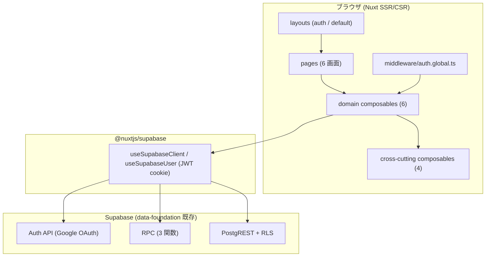

# auth-onboarding アーキテクチャ設計

**作成日**: 2026-05-30
**関連要件定義**: [requirements.md](../../spec/auth-onboarding/requirements.md)
**ヒアリング記録**: [design-interview.md](design-interview.md)

**【信頼性レベル凡例】**:
- 🔵 **青信号**: EARS 要件定義書・ADR・data-foundation 設計文書・ユーザヒアリングを参考にした確実な設計
- 🟡 **黄信号**: 上記資料から妥当な推測による設計
- 🔴 **赤信号**: 上記資料にない推測による設計

> **本単位の設計判断の大部分は ADR-005〜010 で確定済**。本書はそれらを auth-onboarding の
> 具体構造に落とし込み、ADR で未確定だった構造的判断 (レイアウト戦略・招待参加 UI) を補完する。

---

## システム概要 🔵

**信頼性**: 🔵 *requirements.md §概要 + note.md §単位概要*

auth-onboarding は、ユーザが **Google でログイン → Group に所属 → アプリ本機能 (player-management 以降) を
使い始められる状態になるまでの UI 体験**を担う単位。

- **責務**: ログイン UI / OAuth コールバック / オンボーディング / Group 作成 / 招待リンク参加 /
  Group 設定 (招待リンク発行・メンバー一覧) / 認証ガード (middleware) / ログアウト
- **責務外**: Supabase Auth プロバイダ設定・Group/GroupMember/Invitation テーブル・RLS・3 RPC
  (すべて data-foundation で完成済)、選手 CRUD 以降 (player-management 以降)
- **依存**: data-foundation (Auth 基盤 + スキーマ + RPC + RLS、適用済)

本単位は **新しい DB スキーマも新しい API エンドポイントも作らない**。data-foundation が提供する
既存の RPC / PostgREST / Auth API を「消費」する UI 層である (→ §既存 API の利用マッピング)。

## アーキテクチャパターン 🔵

**信頼性**: 🔵 *ADR-010 + ADR-001 + data-foundation/api-endpoints.md §このドキュメントの位置づけ*

**BaaS 直結 + レイヤード (Nuxt SSR)**。独自の API サーバー (Nitro server route) を持たず、
クライアント (Nuxt) が `@supabase/supabase-js` 経由で直接 Supabase に接続する。

```
[Page / Component / Layout]   ← UI 層 (Vue SFC, script setup)
        │  composable 経由のみ (ADR-005 §D1, REQ-406)
        ▼
[Domain composable]           ← ドメインロジック層 (use*.ts、RPC/クエリを内包)
        │  useSupabaseClient<Database>()
        ▼
[@nuxtjs/supabase]            ← データアクセス層 (JWT cookie 管理, isomorphic)
        │
        ▼
[Supabase (BaaS)]             ← PostgREST / Auth API / RPC + RLS (data-foundation)
```

**選択理由**:
- MVP では server route を作らず、すべてのデータ操作を RLS + RPC で完結させる (ADR-010 D2)。
  → 認可ロジックをアプリ側で実装する必要がない (RLS が自動フィルタ)
- 「1 ユースケース = 1 composable」で UI とドメインロジックを分離 (ADR-007 D2)。
  page から Supabase を直接叩かない (ADR-005 §D1, REQ-406)

**データエンジニアのアナロジー**: page = BI ダッシュボードのビュー、composable = dbt macro
(再利用可能な変換ロジック)、Supabase RPC = stored procedure、RLS = row-level grant。

## コンポーネント構成

### フロントエンド 🔵

**信頼性**: 🔵 *note.md §技術スタック + package.json 実測 + error-handling.md §7-8*

- **フレームワーク**: Nuxt 4 (Vue 3 + TypeScript strict mode)、SSR デフォルト
  - 🔵 *Nuxt 4.0 は 2025-07 に stable リリース済で標準。`package.json` 実測は **Nuxt 4.4 / Nuxt UI v4.5**。
    ADR-001 (更新 2026-05-30) で Nuxt 4 に統一。関連ドキュメントの「Nuxt 3」表記も同日 Nuxt 4 に修正済*
- **UI ライブラリ**: Nuxt UI v4 (`<UButton>` `<UForm>` `<UFormField>` `<UAlert>` `<USkeleton>` `useToast()` 等)
  - 🔵 *v4 公式 migration guide / docs 実測 (2026-05-30 確認): 旧 `<UFormGroup>` は v4 で `<UFormField>` に改称済 (v4.3+)。
    本単位が使う `UButton` / `UForm` / `UFormField` / `UAlert` / `USkeleton` / `useToast` はいずれも v4 で同名存続。
    (参考: v4 では `UButtonGroup`→`UFieldGroup` のリネームもあるが本単位では未使用)*
- **状態管理**: `useAsyncData` / `useState` のみ (Pinia 不採用、ADR-010 D7)
- **ルーティング**: ファイルベースルーティング (`app/pages/`)、SSR 動的レンダリング (prerender なし)
- **バリデーション**: Zod (`app/schemas/`、auth-onboarding で初登場、ADR-012 D5)
- **i18n**: `@nuxtjs/i18n` (ja のみ、en はハコ、`?locale=en` で dev 切替、REQ-403, error-handling.md §7)
- **エラー監視**: `@sentry/nuxt` (error-handling.md §8、NFR-304)

### 認証・データアクセス 🔵

**信頼性**: 🔵 *ADR-010 D1 + ADR-009 (provider) + data-foundation/api-endpoints.md §認証の前提*

- **認証方式**: Google OAuth のみ (REQ-402)。dev は integration test 用に Email Provider も ON だが
  `signup` は OFF で攻撃面を遮断 (ADR-009 provider)。prd は Google only
- **Client**: `@nuxtjs/supabase` の isomorphic composable (`useSupabaseClient<Database>()` /
  `useSupabaseUser()` / `useSupabaseSession()`)。`serverSupabaseClient` 等の server-only API は
  本単位では使わない (ADR-010 D1)
- **キー**: publishable key (`sb_publishable_*`) のみ。service_role (`sb_secret_*`) はクライアント
  バンドルに含めない (NFR-102, ADR-010 D2)

### バックエンド (Supabase / data-foundation 既存) 🔵

**信頼性**: 🔵 *data-foundation 設計文書 + supabase/migrations 実測*

- **DBMS**: PostgreSQL (Supabase)
- **認可**: RLS (`is_member_of(group_id)`)。auth-onboarding は新規ポリシーを追加しない (NFR-103)
- **データ操作**: 3 RPC (`create_group_with_owner` / `join_group_with_code` /
  `generate_invitation_code`) + PostgREST SELECT (group_members / group_invitations)

## レイアウト戦略 🔵

**信頼性**: 🔵 *ADR-011 (2026-05-30 Accepted) で確定。ADR-008 の「global で保護漏れゼロ」思想を踏襲*

認証**前後で画面の外枠が根本的に異なる**ため、2 レイアウト構成を採用する。
ADR-008 が middleware を global 一本にして「保護漏れゼロ」を構造的に保証したのと同じ思想で、
レイアウトも共通化して「ヘッダー (ログアウト) 付け忘れゼロ」を保証する。

| レイアウト | 適用ページ | 内容 | 指定方法 |
|-----------|----------|------|---------|
| `app/layouts/auth.vue` | `/login`, `/confirm` | 中央寄せ・ロゴのみ・ヘッダーなし | 各 page で `definePageMeta({ layout: 'auth' })` |
| `app/layouts/default.vue` | 認証後の全ページ (`/onboarding`, `/groups/new`, `/join/[code]`, `/groups/[id]/settings` ほか後続単位) | ヘッダー (ロゴ + ユーザアバター + **ログアウト**) + `<slot />` | 無指定で自動適用 |

- **REQ-008 (ログアウト) の配置**: `default.vue` のヘッダーに 1 回だけ実装する。
  → player-management 以降の page を足しても、自動でヘッダー + ログアウトが付く (NFR-104 と同じ事故防止思想)
- **レイアウト内部の具体マークアップ** (どの Nuxt UI コンポーネントで組むか) は **kairo-implement で確定**。
  本設計では「枚数・責務・ログアウトの所在」のみ確定する

## 画面構成 (6 page) 🔵

**信頼性**: 🔵 *note.md §画面一覧 + ADR-007 D2-2 + ADR-008 D1*

| パス | 画面 | layout | 認証要件 | 使う composable | 認証分岐 (auth.global.ts) |
|------|------|--------|---------|----------------|--------------------------|
| `/login` | ログイン | auth | 未ログイン専用 | `useLogin` | 公開。Group 所属済なら `/` へ (REQ-103) |
| `/confirm` | OAuth コールバック | auth | 遷移中 | `useCurrentGroup`, `useSupabaseUser` | 公開 (判定対象外)。セッション確立後に page 内で遷移 |
| `/onboarding` | オンボーディング | default | ログイン済 + Group 未所属専用 | (静的、2 ボタン) | Group 所属済なら `/` へ (REQ-103) |
| `/groups/new` | Group 作成 | default | ログイン済 | `useCreateGroup` | 未認証→`/login`、未所属でも到達可 |
| `/join/[code]` | 招待リンク着地 | default | ログイン済 (未ログインは page で `/login` へ) | `useJoinGroup`, `useSupabaseUser` | 公開 path。page 内で未認証リダイレクト (ADR-008 D1 例外) |
| `/groups/[id]/settings` | Group 設定 | default | ログイン済 + 該当 Group メンバー | `useGenerateInvitation`, `useListInvitations`, `useCurrentGroup` | 未認証→`/login`、未所属→`/onboarding` |

> **`/onboarding` の「招待リンクから参加」**: MVP では**手入力フォームを提供しない** (note.md §用語、
> ヒアリング 2026-05-30 承認)。「Group を作る」ボタン (→ `/groups/new`) と、「発行者から受け取った
> 招待 URL を直接開いてください」という**説明テキスト**を表示する静的画面。
> → `INVITATION_NOT_FOUND_BY_CODE` 等の手入力系識別子は MVP では追加しない (error-handling.md §5.2)。

## composable 構成 🔵

**信頼性**: 🔵 *ADR-007 D1-D5 + error-handling.md §6.4-6.5*

### domain composable (6 本、新規)

すべて `app/composables/` 直下に flat 配置 (ADR-007 D3)。命名は自然な英語 (ADR-007 D1)。

| composable | 種別 | 内包する操作 | 戻り値 (要約) | 関連 REQ |
|-----------|------|------------|-------------|---------|
| `useLogin` | Write (Auth) | `supabase.auth.signInWithOAuth({ provider: 'google', options: { redirectTo } })` / `signOut()` | `{ login, logout, pending, notice }` | REQ-001, REQ-008 |
| `useCurrentGroup` | Read | `group_members` を `.maybeSingle()` で SELECT (1 user = 1 group, ADR-006) | `useAsyncData('current-group', …)` の戻り | REQ-005, REQ-103, NFR-002 |
| `useCreateGroup` | Write (RPC) | `create_group_with_owner({ group_name })` | `{ create, pending, fieldErrors }` | REQ-004 |
| `useJoinGroup` | Write (RPC) | `join_group_with_code({ invite_code })` | `{ join, pending, notice }` | REQ-005 |
| `useGenerateInvitation` | Write (RPC) | `generate_invitation_code({ target_group_id })` + `useListInvitations.refresh()` | `{ generate, pending }` (+ toast) | REQ-007 |
| `useListInvitations` | Read | `group_invitations` SELECT | `useAsyncData('invitations-list:{groupId}', …)` の戻り | REQ-006 |

詳細な戻り値の型は [interfaces.ts](interfaces.ts) を参照。

> **戻り値形の統合判断 (🔵)**: ADR-007 D4-2 は Write 系の戻りを `{ action, pending, error: AppErrorCode }`
> と例示し、error-handling.md §6.5 は UI チャネル composable から `{ action, notice }` /
> `{ action, fieldErrors }` を返す例を示す。この矛盾を **ADR-007 §補遺 (2026-05-30) で確定**:
> **error-handling.md §6.5 の UI チャネル composable パターンを正**とし、各 Write composable は
> 「決定木 (error-handling.md §6.2) で定まるチャネル state」+ `pending` を expose する
> (生 `error: AppErrorCode` ref の expose は廃止)。`pending` は二重送信防止 (EDGE-003) 要件を満たすため全 Write に付与する。

### cross-cutting composable (4 本、error-handling.md §6.4 で確定済を本単位で初実装)

| composable | チャネル | 用途 |
|-----------|---------|------|
| `useErrorMessage` | — | エラー識別子 → i18n 文言変換 + Sentry fallthrough (error-handling.md §5.1) |
| `useFormErrors` | `<UFormField>` inline | フィールド単位 (Group 名検証等) |
| `useNoticeErrors` | `<UAlert>` | 招待リンク着地の永続通知 (`INVITATION_*` / `ALREADY_IN_GROUP`) |
| `useToastErrors` | `useToast()` | 一過性通知 (`NOT_A_MEMBER` / コピー完了等) |

## 認証 middleware 🔵

**信頼性**: 🔵 *ADR-008 D1-D8*

`app/middleware/auth.global.ts` 1 ファイルで全分岐を判定する (ADR-008 D1)。詳細フローは
[dataflow.md §middleware 判定フロー](dataflow.md) を参照。要点:

- public path (`/login` `/confirm` `/join/**`) は早期 return (ただし `/login` で Group 所属済なら `/` へ)
- 未認証 → `navigateTo('/login?redirect=' + encodeURIComponent(to.fullPath))` (REQ-101, REQ-108)
- ログイン済 + Group 未所属 → `navigateTo('/onboarding')`。ただし**未所属許可 path** (`/onboarding`, `/groups/new`) は通す
  (`/groups/new` は未所属ユーザが Group を作る動線、ADR-008 2026-05-30 修正) (REQ-102)
- ログイン済 + Group 所属 + `/login`|`/onboarding` → `navigateTo('/')` (REQ-103)
- データ取得は `useCurrentGroup` の `useAsyncData('current-group')` キャッシュを middleware と page で共有
  し、1 ナビゲーション 1 クエリを保証 (ADR-008 D4, NFR-002)

## 既存 API の利用マッピング 🔵

**信頼性**: 🔵 *app/types/supabase.ts 実測 + supabase/migrations 実測*

> 本単位は新規 API を作らないため `api-endpoints.md` は生成しない。代わりに「どの composable が
> どの既存 RPC / クエリを、どの引数で消費するか」を以下に明示する。**引数名・エラーは
> 生成済み型 (`app/types/supabase.ts`) と適用済み migration を真**とする (要件定義の `p_group_name`
> は誤記で、実際は `group_name`)。

| composable | 呼び出す既存 API | 引数 (実測) | 戻り | DB 例外 (実測) → App 識別子 |
|-----------|----------------|-----------|------|---------------------------|
| `useLogin` | `auth.signInWithOAuth` / `auth.signOut` | `{ provider: 'google', options: { redirectTo } }` | — | (Auth エラーは EDGE-002 で `<UAlert>`) |
| `useCurrentGroup` | `from('group_members').select('group_id, groups(id, name)').eq('user_id', …).maybeSingle()` | — | `{ group_id, groups } \| null` | (クエリエラーは throw → error.vue) |
| `useCreateGroup` | `rpc('create_group_with_owner', …)` | `{ group_name: string }` | `string` (group_id) | `not_authenticated`→NOT_AUTHENTICATED / `invalid_group_name`→INVALID_GROUP_NAME |
| `useJoinGroup` | `rpc('join_group_with_code', …)` | `{ invite_code: string }` | `string` (group_id) | `already_in_group`→**ALREADY_IN_GROUP** / `invitation_not_found`→**INVITATION_NOT_FOUND_BY_LINK** / `invitation_expired`→INVITATION_EXPIRED |
| `useGenerateInvitation` | `rpc('generate_invitation_code', …)` | `{ target_group_id: string }` | `string` (8 hex code) | `not_a_member`→NOT_A_MEMBER / `invitation_code_collision_after_retry`→INVITATION_CODE_COLLISION_AFTER_RETRY |
| `useListInvitations` | `from('group_invitations').select(…).eq('group_id', …)` | — | `Invitation[]` | (クエリエラーは throw → error.vue) |

**重要 (識別子マッピングの非自明点) 🔵**:
1. `create_group_with_owner` は **`groups.name` に UNIQUE 制約がない** (CHECK のみ)。
   → 「同名グループ重複」エラーは存在しない。ADR-007 D4-2 例の `GROUP_NAME_TAKEN` /
   `UNIQUE_VIOLATION` 分岐は**不正確なため採用しない**。create のエラーは `invalid_group_name` のみ。
2. DB の `invitation_not_found` と App の `INVITATION_NOT_FOUND_BY_LINK` は**文字列が異なる**。
   `isAppError(error, INVITATION_NOT_FOUND_BY_LINK)` (= `message.includes('invitation_not_found_by_link')`)
   では一致しない。→ `useJoinGroup` 内で **DB メッセージ `invitation_not_found` を明示判定**して
   App 識別子に変換する (素朴な includes に頼らない)。
3. `already_in_group` は error-handling.md §4.1 の `APP_ERROR_CODES` に**未定義**。
   → auth-onboarding で `ALREADY_IN_GROUP: 'already_in_group'` を追加する (REQ-105, NFR-304, TC-105-01)。
4. `join_group_with_code` は ADR-006 migration で `already_in_group` を**最初に**チェックするため、
   1 user = 1 group 違反は識別可能な例外で早期失敗する (PG 23505 を待たない)。

## システム構成図 🔵

**信頼性**: 🔵 *ADR-010 + 上記レイヤー構成*



## ディレクトリ構造 🔵

**信頼性**: 🔵 *ADR-007 D3 + ADR-012 D5 + 既存 app/ 構造実測*

```
app/
├── layouts/                    ← 新規 (本単位で初登場)
│   ├── auth.vue                ← /login, /confirm
│   └── default.vue             ← 認証後 全ページ (ヘッダー + ログアウト)
├── middleware/
│   └── auth.global.ts          ← 新規 (ADR-008)
├── pages/
│   ├── index.vue               ← 既存。保護ページ化 (テンプレ差し替えは別単位だが middleware 対象に)
│   ├── login.vue               ← 新規
│   ├── confirm.vue             ← data-foundation TASK-0016 のスタブを本実装に置換
│   ├── onboarding.vue          ← 新規
│   ├── groups/
│   │   ├── new.vue             ← 新規
│   │   └── [id]/settings.vue   ← 新規
│   └── join/
│       └── [code].vue          ← 新規
├── composables/                ← 新規 10 本 (domain 6 + cross-cutting 4)
│   ├── useLogin.ts / useCurrentGroup.ts / useCreateGroup.ts
│   ├── useJoinGroup.ts / useGenerateInvitation.ts / useListInvitations.ts
│   └── useErrorMessage.ts / useFormErrors.ts / useNoticeErrors.ts / useToastErrors.ts
├── schemas/                    ← 新規 (Zod, 本単位で初登場)
│   └── group-name.ts
├── types/
│   ├── supabase.ts             ← 既存 (自動生成)
│   ├── error-codes.ts          ← 新規 (error-handling.md §4.1 + ALREADY_IN_GROUP 追加)
│   └── domain.ts               ← 必要になれば (CurrentGroup 型等、ADR-007 D6)
└── error.vue                   ← 新規 (グローバルフォールバック + Sentry, error-handling.md §8.4)

locales/                        ← 新規 (error-handling.md §7)
├── ja.json
└── en.json                     ← ハコ

tests/
└── unit/
    ├── composables/*.test.ts   ← 新規 (ADR-012 D5)
    ├── middleware/auth.test.ts ← 新規
    └── schemas/group-name.test.ts ← 新規
```

## 非機能要件の実現方法

### パフォーマンス 🔵

**信頼性**: 🔵 *NFR-001, NFR-002 + ADR-008 D4 + ADR-010 D7*

- **重複クエリ防止**: `useCurrentGroup` は `useAsyncData('current-group', …)` で SSR キャッシュ。
  middleware と page が同一キーで呼んでも 1 ナビゲーション 1 クエリ (NFR-002) 🔵
- **ログインフロー時間** (NFR-001、dev 5 秒以内): **設計面の対策は確定済**で不確実性なし
  — 唯一の設計レバーである「1 ナビゲーション 1 クエリ」(NFR-002, ADR-008 D4) が上記で保証される。
  残るのは**実装後の実測検証のみ** (OAuth ラウンドトリップは外部要因)。
  → kairo-implement 完了後の受入テストで実測し、5 秒超なら個別チューニング。設計の 🟡 ではなく
  **実測ゲート**として acceptance-criteria に委譲 (🟡 は「未実測」であって「設計が曖昧」ではない)

### セキュリティ 🔵

**信頼性**: 🔵 *NFR-101〜104 + ADR-009 (provider) + ADR-010 D2-D6*

- publishable key のみ使用、service_role はクライアントに含めない (NFR-102)
- 認証 middleware は global で保護漏れゼロ (NFR-104, ADR-008 D1)
- prerender 廃止: `routeRules: { '/': { prerender: true } }` を削除。静的 HTML に認証前提が
  焼き付くのを防ぐ (ADR-010 D6)
- 招待コードは data-foundation の CSPRNG 8 hex (NFR-101)
- signup OFF で野良登録を遮断、RLS で Group 未所属を閉じ込め (ADR-009 provider の二重防御)

### ユーザビリティ 🔵

**信頼性**: 🔵 *NFR-201〜204 + error-handling.md §6*

- フォーム検証は Zod + `<UFormField>` inline (NFR-201)
- 処理中は `<USkeleton>` / spinner + 送信ボタン disabled (NFR-202, EDGE-003)
- コピー完了は `<UToast>` 2 秒 (NFR-203)
- 文言は `locales/ja.json` から取得、コードに直書きしない (NFR-204)

### 保守性 🔵

**信頼性**: 🔵 *NFR-301〜304 + ADR-012 (test)*

- mock unit (composable / middleware / Zod) + integration (RLS/RPC は data-foundation 側) の 2 層 (ADR-012 test)
- i18n キー構造一致を CI で検証 (NFR-303)
- Sentry は想定外例外と unmapped 識別子のみ。ユーザ操作起因の想定エラーは送らない (NFR-304)

## 技術的制約

### 互換性制約 🔵

**信頼性**: 🔵 *package.json 実測 + ADR-010*

- Nuxt 4 / Nuxt UI v4 / `@nuxtjs/supabase` 2.x / Zod 4.x
- `@nuxtjs/i18n` / `@sentry/nuxt` は **未インストール** → 本単位で `pnpm add` する (error-handling.md §7.1, §8.1)
- SSR デフォルト、全 page 動的レンダリング (prerender なし)

### モジュール設定変更 (nuxt.config.ts) 🔵

**信頼性**: 🔵 *ADR-008 D3 + ADR-010 D5-D6 + error-handling.md §7.2, §8.2*

| 変更 | 内容 | 出典 |
|------|------|------|
| `routeRules: { '/': { prerender: true } }` | **削除** | ADR-010 D6 |
| `supabase.redirect: false` | **追加** (内蔵リダイレクト無効化) | ADR-008 D3 |
| `supabase.redirectOptions` | `login: '/login'` / `callback: '/confirm'` 維持、`exclude: []` | ADR-008 D3, ADR-010 D5 |
| `modules` に `@nuxtjs/i18n` 追加 + `i18n` 設定 | ja/en, no_prefix, detectBrowserLanguage:false | error-handling.md §7.2 |
| `modules` に `@sentry/nuxt/module` 追加 + `sentry` 設定 | DSN / environment | error-handling.md §8.2 |

## 関連文書

- **データフロー**: [dataflow.md](dataflow.md)
- **型定義**: [interfaces.ts](interfaces.ts)
- **ヒアリング記録**: [design-interview.md](design-interview.md)
- **要件定義**: [requirements.md](../../spec/auth-onboarding/requirements.md)
- **エラー実装規約**: [error-handling.md](../cross-cutting/error-handling.md)
- **data-foundation API**: [api-endpoints.md](../data-foundation/api-endpoints.md)
- **ADR**: [005](../../decisions/005-error-handling-strategy.md) / [006](../../decisions/006-single-group-per-user-mvp.md) / [007](../../decisions/007-composable-naming-conventions.md) / [008](../../decisions/008-middleware-strategy.md) / [009-provider](../../decisions/009-supabase-auth-provider-policy.md) / [010](../../decisions/010-supabase-ssr-csr-boundary.md) / [011-layout](../../decisions/011-layout-strategy.md) / [012-test](../../decisions/012-test-strategy.md)

## 信頼性レベルサマリー

| 項目 | 件数 |
|------|------|
| 🔵 青信号 | 28 |
| 🟡 黄信号 | 1 (NFR-001 ログイン時間の実測のみ — 設計面は確定、実測ゲートに委譲) |
| 🔴 赤信号 | 0 |

**品質評価**: 高品質 (🔵 97%、🔴 0%)。当初の 🟡 4 件のうち 3 件を 2026-05-30 に解消:
②Nuxt UI v4 コンポーネント名 = v4 公式 docs 実測で確定、③レイアウト戦略 = ADR-011 Accepted、
④戻り値統合 = ADR-007 §補遺で確定。残る 🟡 は NFR-001 の実測 1 件のみで、これは設計の曖昧さではなく
実装後に測るべき受入項目 (設計面の対策は §パフォーマンス で確定済)。
