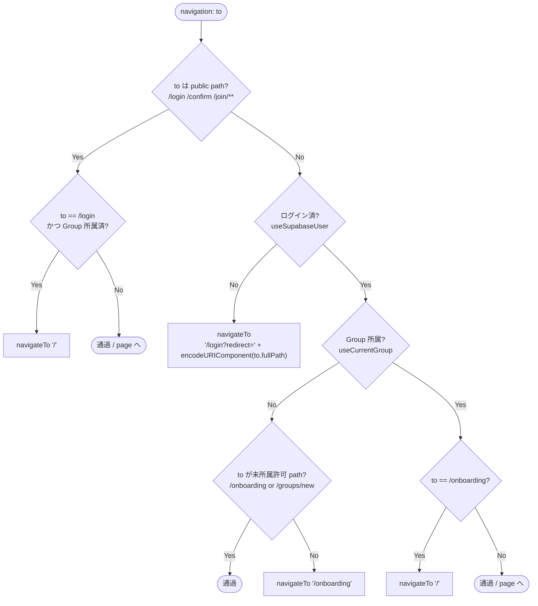
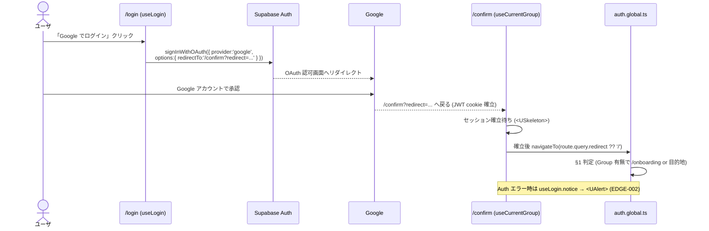
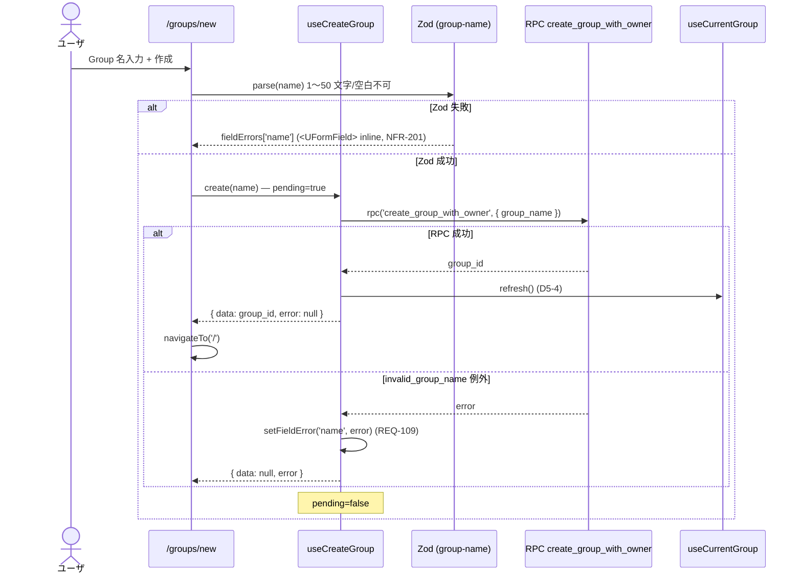
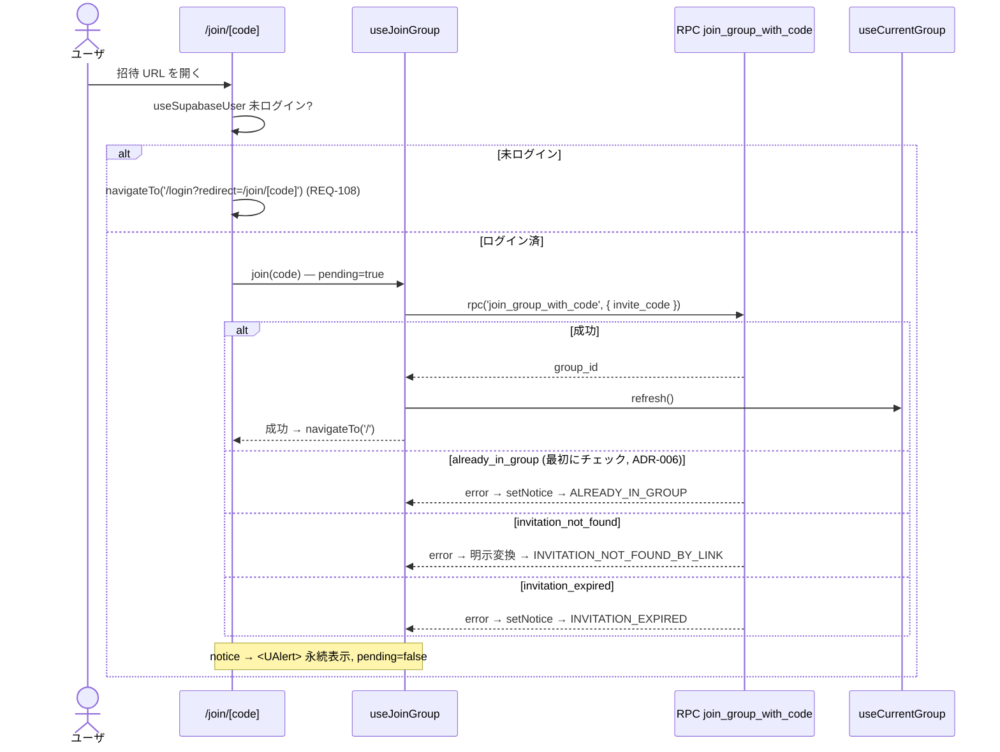
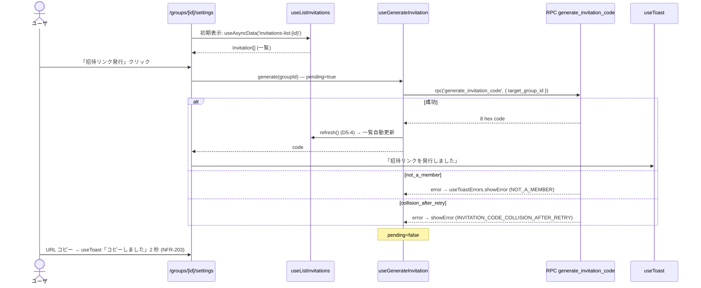

# auth-onboarding データフロー

**作成日**: 2026-05-30
**関連**: [architecture.md](architecture.md) / [interfaces.ts](interfaces.ts) / [error-handling.md](../cross-cutting/error-handling.md)

**信頼性**: 🔵 *ADR-008 (middleware) + ADR-007 (§補遺含む) + error-handling.md §6 + 既存 API マッピング (architecture.md)*

> 本単位は新規 API を作らない。以下のフローはすべて、UI 層 (page/composable) が
> data-foundation 既存の Auth API / RPC / PostgREST を「消費」する経路を示す。

---

## 1. 認証 middleware 判定フロー (`auth.global.ts`) 🔵

ADR-008 D1: 全分岐を 1 ファイルで判定。データ取得は `useCurrentGroup` の `useAsyncData('current-group')`
キャッシュを共有し、1 ナビゲーション 1 クエリ (ADR-008 D4 / NFR-002)。

- **未所属許可 path** (`/onboarding`, `/groups/new`): ログイン済だが Group 未所属でも通す。
  `/groups/new` は「未所属ユーザがここで Group を作って所属する」動線の終点 (ADR-008 D1、2026-05-30 修正)。
- `/login` で Group 所属済 → `/` の分岐は **public path 側** (図上部 `PubLogin`) で処理。認証済ブランチでは `/onboarding` のみ判定。
- public path の `/join/**` は未ログインでも通過させ、**page 内で未認証リダイレクト** (ADR-008 D1 例外)。
- 関連 REQ: REQ-101/108 (未認証→/login+redirect)、REQ-102 (未所属→/onboarding)、REQ-103 (所属済→/)。

---

## 2. ログイン + OAuth コールバック 🔵

REQ-001 / REQ-008 / A2 (redirect クエリ運搬)。`useLogin` 経由 (page から直接 `supabase.auth` を叩かない、ADR-007 D9)。

---

## 3. Group 作成 (`/groups/new`) 🔵

REQ-004。`useCreateGroup` → `create_group_with_owner` RPC。検証エラーは `useFormErrors` (inline)。

> `groups.name` に UNIQUE 制約は無く「同名重複」エラーは存在しない (architecture.md §既存 API マッピング 注1)。
> create のエラーは `invalid_group_name` のみ。

---

## 4. 招待リンク参加 (`/join/[code]`) 🔵

REQ-005 / REQ-105。public path のため未認証は page 内で `/login` へ。`useJoinGroup` → `join_group_with_code`。
永続通知は `useNoticeErrors` (`<UAlert>`)。

> DB メッセージ `invitation_not_found` と App 識別子 `INVITATION_NOT_FOUND_BY_LINK` は文字列が異なるため、
> `useJoinGroup` 内で**明示判定して変換**する (素朴な includes に頼らない、architecture.md §既存 API マッピング 注2)。

---

## 5. 招待リンク発行 (`/groups/[id]/settings`) 🔵

REQ-006 / REQ-007。`useGenerateInvitation` → `generate_invitation_code`、発行後 `useListInvitations.refresh()`。
一過性通知は `useToast`。

---

## 6. エラーチャネルの集約ビュー 🔵

各フローのエラーがどのチャネルに流れるか (error-handling.md §6.2 決定木の本単位への適用):

| 発生源 | App 識別子 | チャネル | composable |
|--------|-----------|---------|-----------|
| Group 名検証 (Zod / RPC) | `INVALID_GROUP_NAME` | `<UFormField>` inline | `useFormErrors` |
| 招待リンク参加失敗 | `ALREADY_IN_GROUP` / `INVITATION_NOT_FOUND_BY_LINK` / `INVITATION_EXPIRED` | `<UAlert>` 永続 | `useNoticeErrors` |
| 招待発行失敗 / コピー完了 | `NOT_A_MEMBER` / `INVITATION_CODE_COLLISION_AFTER_RETRY` | `useToast()` 一過性 | `useToastErrors` |
| OAuth 失敗 | (Auth エラー) | `<UAlert>` | `useLogin.notice` (EDGE-002) |
| 認証切れ | `NOT_AUTHENTICATED` | `navigateTo('/login')` | middleware |
| 想定外例外 / unmapped | — | `error.vue` + Sentry | `useErrorMessage` fallthrough (NFR-304) |

## 関連文書

- [architecture.md](architecture.md) §認証 middleware / §画面構成 / §既存 API の利用マッピング
- [interfaces.ts](interfaces.ts) — 各 composable の戻り契約
- [error-handling.md](../cross-cutting/error-handling.md) §6 UI チャネル決定木
- ADR: [007](../../decisions/007-composable-naming-conventions.md) / [008](../../decisions/008-middleware-strategy.md) / [011](../../decisions/011-layout-strategy.md)
