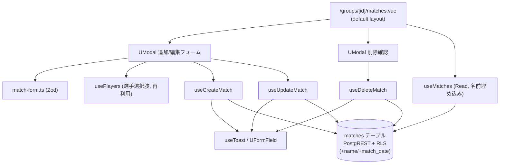

# match-management アーキテクチャ設計

**作成日**: 2026-06-05
**関連要件定義**: [requirements.md](../../spec/match-management/requirements.md)
**ヒアリング記録**: [design-interview.md](design-interview.md)

**【信頼性レベル凡例】**:
- 🔵 **青信号**: EARS要件定義書・設計文書・ヒアリングを参考にした確実な設計
- 🟡 **黄信号**: 妥当な推測による設計
- 🔴 **赤信号**: 出典のない推測による設計

---

## システム概要 🔵

**信頼性**: 🔵 *requirements.md 概要より*

所属 Group の試合（matches）を管理する **UI + composable 層**。data-foundation 確定済みの
`matches` テーブル（PostgREST + RLS）を消費する player-management と同型の構造。
ただし本単位の要件（試合名・試合日付）のため、`matches` に **additive な列追加 migration を 1 本**
data-foundation 側に加える（`name` / `match_date`）。新規 API・新規 RPC は作らない。

スコープは **matches のみ**。sets / set_player_positions / rallies 等の録画系は match-recording 責務
（REQ-405）。本単位は「いつの・何という名前の・どの 4 選手の・どの動画の試合か」の登録・編集・削除に限定。

## アーキテクチャパターン 🔵

**信頼性**: 🔵 *ADR-007 / ADR-011 / player-management 設計より*

- **パターン**: レイヤード（page/layout → domain composable → PostgREST/RLS）。ADR-007 の domain
  composable 規約に従う。
- **選択理由**: player-management / auth-onboarding で確立した「page は supabase を直叩きせず
  composable 経由」（REQ-403）を踏襲し、一貫性とテスト容易性を確保する。

## コンポーネント構成

### ルーティング 🔵

**信頼性**: 🔵 *requirements.md（/groups/[id]/matches）+ 既存 /groups/[id]/players*

- **パス**: `/groups/[id]/matches`（`app/pages/groups/[id]/matches.vue`）
- player-management の `/groups/[id]/players` と一貫。`[id]` は `useCurrentGroup()` の `group_id`。
- **layout**: `default`（認証後レイアウト、無指定で自動適用）。ADR-011 D1。
- **保護**: 非 public path のため `auth.global.ts` が認証 + Group 所属を保証（未認証→/login、未所属→/onboarding）。
- 作成/編集は**専用ページを設けず**、一覧画面上の `<UModal>` で行う（ヒアリング2026-06-05）。

### domain composable（ADR-007 準拠、操作ごとに分割） 🔵

**信頼性**: 🔵 *ADR-007 D1 命名規約 + player-management composable 構成*

| composable | 種別 | 中身 | 関連要件 |
|---|---|---|---|
| `useMatches` | Read | `matches` を `group_id` 一致 + `deleted_at IS NULL` で SELECT、`match_date` 降順→`created_at` 降順。**4 選手名を PostgREST 埋め込みで解決**（削除済 player も名前解決、EDGE-007） | REQ-001 / REQ-201 / NFR-001 / NFR-203 |
| `useCreateMatch` | Write | `matches` へ insert（group_id / 4 player / video_source_type / video_source_url / name / match_date） | REQ-002 / REQ-104 |
| `useUpdateMatch` | Write | `matches` の全項目を update | REQ-003 |
| `useDeleteMatch` | Write | `matches.deleted_at` を now() に update（ソフト削除） | REQ-004 / REQ-105 |

- Read 系は `useAsyncData<MatchListItem[]>('matches', …)` 固定キー（ADR-007 D4）。Write 後は `refresh()`。
- Write 系は Supabase native `{ data, error }` を返し、page は error を成否分岐に、表示はチャネル
  state（toast / form field）を見る（ADR-007 §補遺）。player-management と完全同型。
- 選手選択肢は **既存 `usePlayers`（未削除ロスター）を再利用**（NFR-202 / REQ-006）。

### バリデーション（Zod） 🔵

**信頼性**: 🔵 *player-name.ts パターン + ヒアリング2026-06-05*

`app/schemas/match-form.ts`（Zod）に集約:
- **試合名** `name`: `z.string().trim().min(1).max(50)` を **任意**（空文字→undefined/null 変換）。DB
  `matches_name_length_check`（IS NULL OR 1〜50字）と一致（REQ-108 / EDGE-011）。
- **試合日付** `match_date`: 必須。`YYYY-MM-DD` 形式（REQ-008 / REQ-109 / EDGE-012）。
- **動画ソース**: `video_source_type` は `'youtube' | 'local'` union。
  - `local`: `video_source_url` = 選択ファイルの**元ファイル名ラベル**（非空、REQ-106）。
  - `youtube`: `video_source_url` を **youtube.com / youtu.be URL または 11 桁動画 ID** で検証し
    動画 ID を抽出（ヒアリング2026-06-05、EDGE-004）。
- **4 選手の相異**: フォーム全体の `refine` で 4 player が全員別人かを送信前に検証（REQ-101 /
  EDGE-001、DB の `matches_players_distinct_check` と一致）。

### UI（一覧・追加/編集モーダル・削除確認） 🔵

**信頼性**: 🔵 *ヒアリング2026-06-05 + CLAUDE.md UI規約*

- 一覧は「試合名（未入力時は対戦カード `A1・A2 vs B1・B2`）」+「試合日付（日付のみ）」を `match_date`
  降順で表示（NFR-203）。Nuxt UI v4 使用（NFR-201）。
- 追加/編集は `<UModal>`（一覧から離れない）。フォーム項目: 試合名 / 試合日付 / 4 選手 / 動画ソース。
  - 選手選択は 4 枠の `<USelectMenu>`。各枠は**他枠で選択済の player を選択肢から除外**（NFR-202）。
  - 動画ソースは `<URadioGroup>`（youtube/local）+ 条件付きフィールド（local=ファイル選択で
    `file.name` を取得 / youtube=URL テキスト入力）。
- 削除は **確認ダイアログ（`<UModal>`）→ 承認で `useDeleteMatch`**（REQ-105、player の無警告削除と差分）。
- 試合 0 件は空状態 + 「試合を追加」CTA（REQ-201）。
- **選択可能 player が 4 人未満**のとき「試合を追加」を disabled にし、`/groups/[id]/players` への
  導線/説明を表示（REQ-203）。

## システム構成図



**信頼性**: 🔵 *requirements.md + ADR-007 + error-handling.md より*

## ディレクトリ構造 🔵

**信頼性**: 🔵 *既存プロジェクト構造（player-management）より*

```
app/
├── pages/groups/[id]/
│   └── matches.vue              # 一覧 + 追加/編集モーダル + 削除確認
├── components/matches/          # MatchFormModal.vue / MatchDeleteConfirm.vue 等に分割
├── composables/
│   ├── useMatches.ts
│   ├── useCreateMatch.ts
│   ├── useUpdateMatch.ts
│   └── useDeleteMatch.ts
├── schemas/
│   └── match-form.ts            # Zod (name/match_date/video source/4選手相異)
└── types/
    └── match.ts                 # Match / MatchListItem / VideoSourceType / 入力型
supabase/migrations/
└── <timestamp>_match_management_add_name_match_date.sql   # additive migration
```

## 既存 DB マッピング 🔵

**信頼性**: 🔵 *initial_schema.sql / matches RLS*

| 操作 | 既存リソース | RLS |
|---|---|---|
| 一覧 | `from('matches').select('...,埋め込み').eq('group_id',gid).is('deleted_at',null).order('match_date',{ascending:false}).order('created_at',{ascending:false})` | matches_select = is_member_of |
| 追加 | `from('matches').insert(...)` | matches_insert = is_member_of |
| 編集 | `from('matches').update(...).eq('id', id)` | matches_update = is_member_of |
| 削除 | `from('matches').update({ deleted_at: now }).eq('id', id)` | matches_update（DELETE ポリシー無し） |

> **新規 RPC・新規エラーコードは不要**。唯一の DB 変更は `matches` への **additive 列追加 migration**
> （name / match_date）。検証はクライアント Zod、その他エラーは既存チャネル（toast）で処理。

### 選手名の解決（EDGE-007） 🟡

**信頼性**: 🟡 *PostgREST 埋め込み仕様 + EDGE-007（実装時に複合FK埋め込みを検証）*

一覧では 4 選手名が必要。削除済（`deleted_at IS NOT NULL`）の player も名前表示を維持する要件
（EDGE-007）があるため、未削除のみを返す `usePlayers` での解決は不可。よって **`useMatches` 内で
PostgREST resource embedding により players(name) を結合**して取得する。

- 推奨: `select('id, name, match_date, video_source_type, video_source_url, ta1:players!team_a_player1_id(name), ta2:players!team_a_player2_id(name), tb1:players!team_b_player1_id(name), tb2:players!team_b_player2_id(name)')`
- 注意: matches→players は **複合 FK `(group_id, player_id)`** のため、PostgREST の埋め込みヒントが
  単一列指定で解決できるか実装時に検証する。解決できない場合のフォールバック: 当該 Group の
  players を **deleted_at フィルタなし**で `(id, name)` だけ別取得し、クライアントで id→name マップ。

## 非機能要件の実現方法

### パフォーマンス 🔵

**信頼性**: 🔵 *NFR-001 / initial_schema.sql:305*

- 一覧 SELECT は `deleted_at IS NULL` を含め、部分インデックス `idx_matches_group_id` の対象。
- 並び替え高速化のため複合インデックス `(group_id, match_date DESC) WHERE deleted_at IS NULL`
  を migration に含める（🔵 ヒアリング2026-06-05 で確定、NFR-203）。

### セキュリティ 🔵

**信頼性**: 🔵 *NFR-101 / NFR-102 / matches RLS*

- 全操作が RLS `is_member_of(group_id)` を通過。他 Group の試合は取得・追加・更新いずれも不可。
- publishable key のみ使用（service_role をバンドルに含めない、NFR-102）。
- page から supabase 直叩き禁止、composable 経由（REQ-403）。

### 国際化 🔵

**信頼性**: 🔵 *NFR-301 / 既存 i18n 基盤*

- 全文言を locales/ja.json・en.json に定義（`matches` namespace）。キー構造一致 CI チェックの対象。

## 技術的制約 🔵

**信頼性**: 🔵 *requirements.md 制約要件より*

- 物理削除禁止（ソフト削除のみ、REQ-402）。
- ダブルス（4 選手）固定（REQ-407）。
- 4 選手は同一 Group 所属（複合 FK、REQ-406）。
- 録画系テーブルへ書き込まない（REQ-405）。
- migration 適用は CI 経由（db:push、ローカル不可）、型は Management API で再生成（REQ-408 / memory）。
- 検索・絞り込み・undelete UI は MVP 範囲外。

## 関連文書

- **データフロー**: [dataflow.md](dataflow.md)
- **型定義**: [interfaces.ts](interfaces.ts)
- **DBスキーマ(migration)**: [database-schema.sql](database-schema.sql)
- **要件定義**: [requirements.md](../../spec/match-management/requirements.md)
- **エラー実装規約**: [error-handling.md](../cross-cutting/error-handling.md)
- **踏襲元**: [player-management/architecture.md](../player-management/architecture.md)

## 信頼性レベルサマリー

- 🔵 青信号: 大半（確定スキーマ + 🔵94% 要件 + ヒアリングが出典）
- 🟡 黄信号: 1（選手名の複合FK埋め込み解決 = 実装時に実地検証、フォールバック明記済）
- 🔴 赤信号: 0

**品質評価**: 高品質
