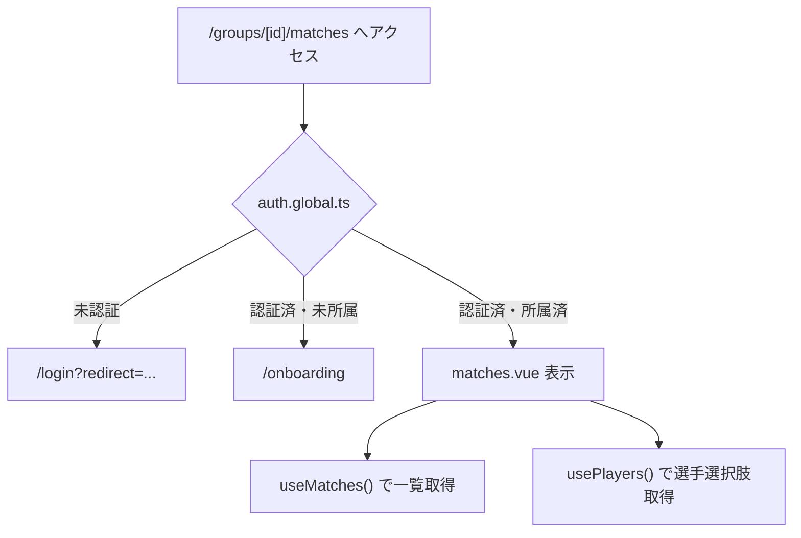
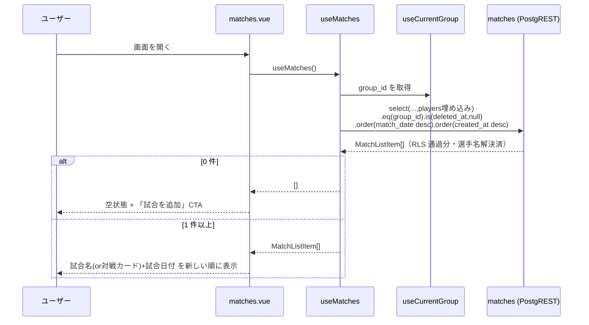
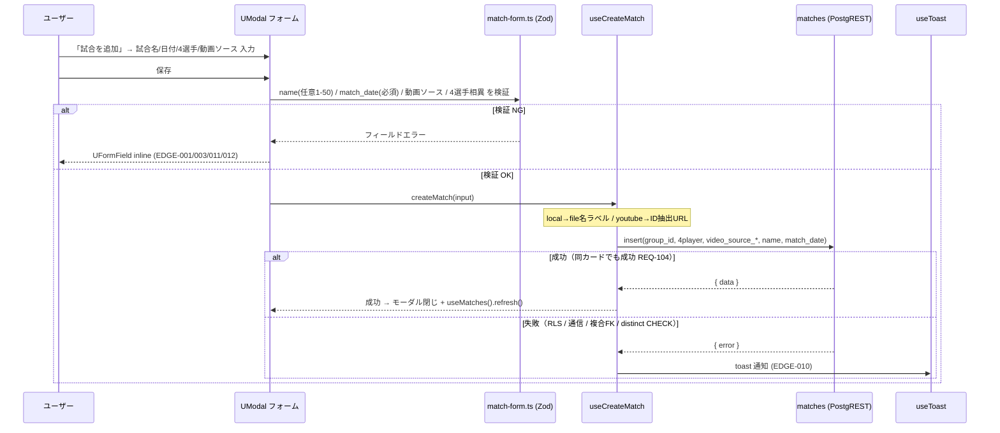
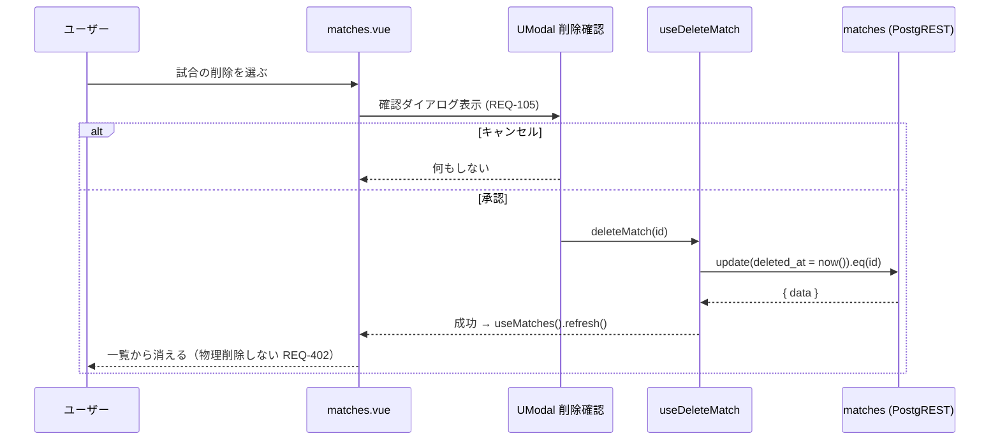
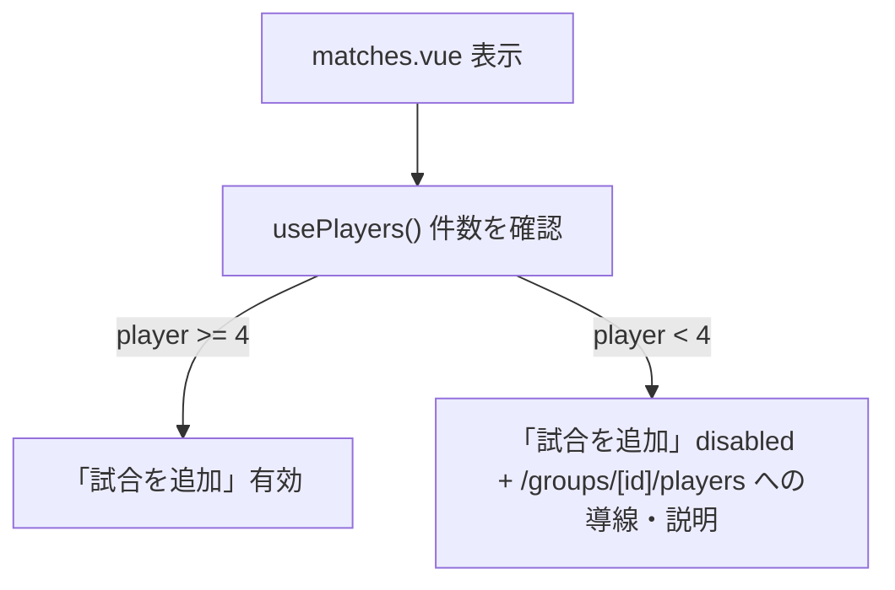
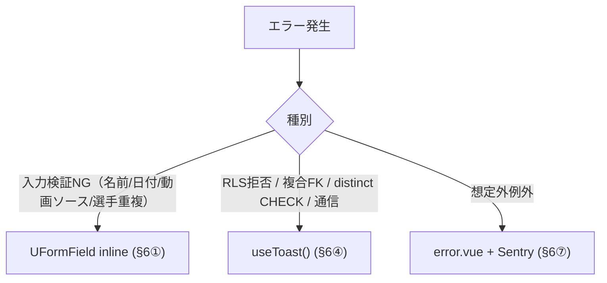
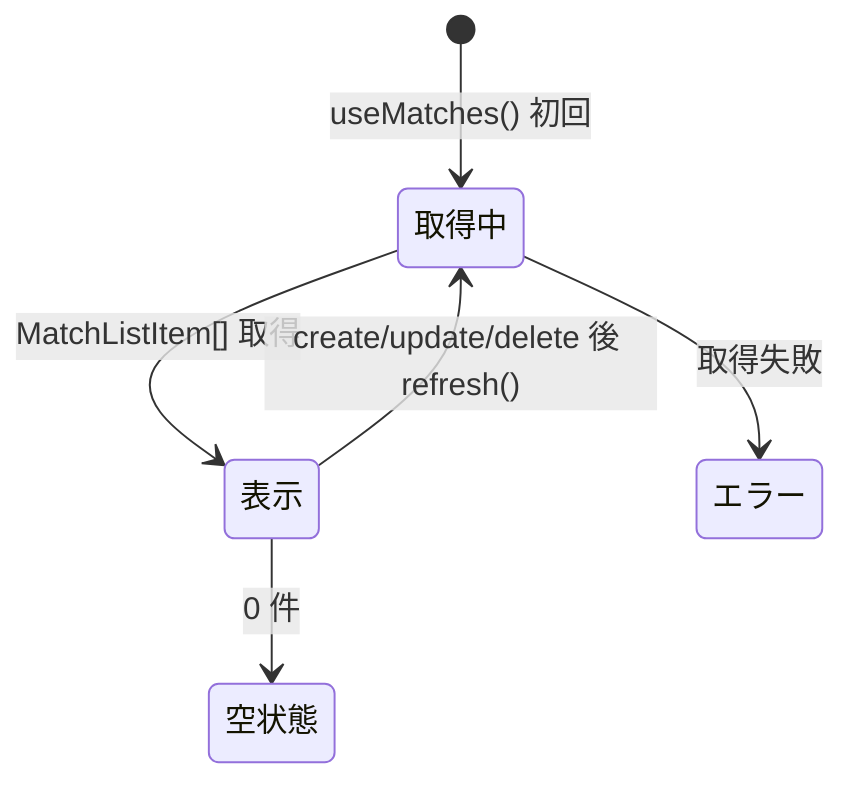

# match-management データフロー図

**作成日**: 2026-06-05
**関連アーキテクチャ**: [architecture.md](architecture.md)
**関連要件定義**: [requirements.md](../../spec/match-management/requirements.md)

**【信頼性レベル凡例】**:
- 🔵 確実なフロー / 🟡 妥当な推測 / 🔴 出典のない推測

---

## 画面到達フロー 🔵

**信頼性**: 🔵 *auth.global.ts middleware / REQ-202*

> 本 page は非 public path。到達時点で「認証済み・Group 所属済み」が middleware により保証される。

## 機能1: 試合一覧取得 🔵

**信頼性**: 🔵 *user-stories 3.1 / TC-001 / NFR-203 / EDGE-007*

**関連要件**: REQ-001, REQ-201, NFR-001, NFR-203

**詳細ステップ**:
1. `useMatches()` が `useCurrentGroup()` の `group_id` を読む 🔵
2. `deleted_at IS NULL` で未削除のみ、`match_date` 降順→`created_at` 降順で SELECT 🔵
3. 4 選手名を PostgREST 埋め込みで解決（削除済 player も名前維持、EDGE-007）🟡
4. RLS `is_member_of` により自 Group の試合のみ返る 🔵
5. 0 件なら空状態（REQ-201）、1 件以上なら一覧 🔵

## 機能2: 試合の追加 🔵

**信頼性**: 🔵 *user-stories 1.1 / TC-002 / EDGE-001〜005,011,012*

**関連要件**: REQ-002, REQ-006, REQ-007, REQ-008, REQ-101, REQ-102, REQ-103, REQ-106, REQ-107, REQ-108, REQ-109

**詳細ステップ**:
1. クライアント Zod で先に検証（DB CHECK / 制約と一致）🔵
2. 4 選手の相異は Zod refine で送信前に検証（REQ-101 / EDGE-001）🔵
3. 動画ソース: local は `file.name` をラベルとして保存、youtube は動画 ID 抽出後の URL を保存 🔵
4. insert は group_id を `useCurrentGroup` から付与 🔵
5. 同カード（同 4 選手・同動画）でも成功（REQ-104 / EDGE-005）🔵
6. RLS・通信・複合FK・distinct CHECK 違反は toast（error-handling §6④）🔵
7. 成功後はモーダルを閉じ `useMatches().refresh()` で一覧更新 🔵

## 機能3: 試合の編集 🔵

**信頼性**: 🔵 *user-stories 2.1 / TC-003 / REQ-003*

機能2 と同型（モーダルに既存値をプリフィル → `useUpdateMatch` で全項目 update → refresh）。
4 選手相異・name 境界・match_date 必須の検証が編集時も再適用される 🔵。

## 機能4: 試合のソフト削除（確認ダイアログ付き） 🔵

**信頼性**: 🔵 *user-stories 2.2 / TC-004 / REQ-105*

**関連要件**: REQ-004, REQ-105, REQ-402

**詳細ステップ**:
1. 削除前に確認ダイアログを表示（REQ-105、player の無警告と差分）🔵
2. 承認時のみ `deleted_at` を now() に UPDATE（物理削除しない、REQ-402）🔵
3. `useMatches().refresh()` で一覧から除外（`deleted_at IS NULL` フィルタ、EDGE-006）🔵

## 選手 4 人未満時のフロー 🟡

**信頼性**: 🟡 *REQ-203（具体UIは本設計で確定）*

## エラーハンドリングフロー 🔵

**信頼性**: 🔵 *error-handling.md §2 / §6*

## 状態管理フロー 🔵

**信頼性**: 🔵 *ADR-007 D4 / useAsyncData*

## 関連文書

- **アーキテクチャ**: [architecture.md](architecture.md)
- **型定義**: [interfaces.ts](interfaces.ts)
- **DBスキーマ(migration)**: [database-schema.sql](database-schema.sql)

## 信頼性レベルサマリー

- 🔵 青信号: 大半のフロー（選手4人未満フローの挙動は REQ-203 で確定）
- 🟡 黄信号: 1（選手名埋め込み解決 = 実装時に実地検証）
- 🔴 赤信号: 0

**品質評価**: 高品質
