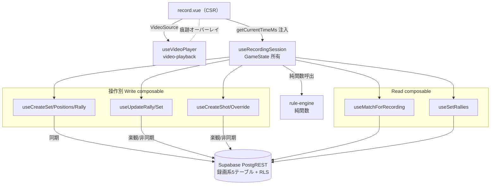

# match-recording アーキテクチャ設計

**作成日**: 2026-06-05
**関連要件定義**: [requirements.md](../../spec/match-recording/requirements.md)
**ヒアリング記録**: [design-interview.md](design-interview.md)

**【信頼性レベル凡例】**:
- 🔵 **青信号**: EARS要件定義書・確定スキーマ・上流実装・ユーザヒアリングを参考にした確実な設計
- 🟡 **黄信号**: 上記から妥当な推測による設計
- 🔴 **赤信号**: 出典のない推測による設計

---

## システム概要 🔵

**信頼性**: 🔵 *requirements.md 概要 + note.md*

match-recording は、録画画面（`/groups/[id]/matches/[matchId]/record`）で動画を再生しながらラリーデータを記録する**統合ユニット**。3つの既存ユニットをオーケストレーションする：

- **video-playback**（`useVideoPlayer`）: 再生位置（ms）の取得・シーク・速度。再生エンジンの黒箱。
- **rule-engine**（`app/utils/rule-engine/`）: `GameState` を返す純関数。サーバー/レシーバー・スコア・勝敗を推論。
- **Supabase PostgREST**: 録画系5テーブルへ RLS 経由で永続化。

データエンジニア的構造: match-recording は **ETL の取り込み層 + ステート計算 + 永続化**。video-playback がソース抽象、rule-engine が純粋な状態遷移関数（副作用なし）、match-recording がそれらを束ねて DB へ denormalize 保存。stats-dashboard は保存済み状態を SQL 集計するだけ（[[project_state_storage]]）。

## アーキテクチャパターン 🔵

**信頼性**: 🔵 *ADR-007 + player-management/match-management 実装パターン*

- **パターン**: **集約オーケストレータ + 操作別 composable**（ADR-007）。`useRecordingSession` が録画中の状態（rule-engine `GameState` + 蓄積ラリー/ショット）を所有し、純粋な読み書きは操作別 sub-composable に委譲する。
- **選択理由**（ヒアリング2026-06-05）: page を薄くし、engine 連携の分岐ロジックを composable 層に集約することで、実プレーヤー・実 DB なしの単体テストを可能にする（NFR-303 / [[feedback_test_coverage]]）。理解負債の返済（[[feedback_understanding_debt]]）も「1つの session に挙動が集まる」ことで容易になる。

## コンポーネント構成

### ページ / コンポーネント層 🔵

**信頼性**: 🔵 *PRD §5.4 レイアウト + 既存 pages 構造*

- **ルート**: `app/pages/groups/[id]/matches/[matchId]/record.vue`（CSR、REQ-408）
- **責務**: ①動画ソース（`VideoSource`）の構築と `useVideoPlayer` の所有 ②`useRecordingSession` への `getCurrentTimeMs` 注入 ③Nuxt UI による記録 UI（打った・得点・レット・スキップ・override・履歴）の描画
- **video-playback のオーバーレイスロット**にショット痕跡を重ねる（NFR-202 / video-playback REQ-009）
- **local 動画**: `matches.video_source_url` はファイル名ラベルのみ。page がファイル再選択 UI を提供し `File` を `LocalSource` に渡す（方式A、REQ-108）

### Composable 層（状態所有・オーケストレーション） 🔵

**信頼性**: 🔵 *ヒアリング2026-06-05（useRecordingSession 集約）+ ADR-007*

```
useRecordingSession(matchId, { getCurrentTimeMs })   ← 集約オーケストレータ（GameState 所有）
├─ Read
│   ├─ useMatchForRecording(matchId)   matches を1件読み VideoSource + 4選手ロスターへ
│   ├─ useSets(matchId)                既存セット（再開・セット番号採番用）
│   └─ useSetRallies(setId)            ラリー履歴一覧（REQ-009）
└─ Write（操作別、ADR-007 / NFR-302）
    ├─ useCreateSet()           sets を insert（同期）          REQ-002
    ├─ useCreateSetPositions()  set_player_positions 4行 insert（同期）  REQ-003
    ├─ useUpdateSet()           sets.winner を update（同期）   REQ-010
    ├─ useCreateRally()         rallies を insert→id 返却（同期・遅延生成） REQ-007
    ├─ useUpdateRally()         point_winner/is_let/is_point_confirmed を update（楽観） REQ-006/103/106
    ├─ useCreateShot()          shots を insert（楽観）          REQ-005
    ├─ useDeleteShot()          shots を物理削除（undo 用）       REQ-110a
    ├─ useDeleteRally()         空 rally を物理削除（undo 用）    REQ-110a
    ├─ useDeleteOverride()      position_overrides を物理削除（undo 用） REQ-110c
    └─ useCreateOverride()      position_overrides を insert（楽観） REQ-105
```

- `useRecordingSession` は **undo スタック**を所有する（記録操作ごとに直前 `GameState` スナップショット + DB 行参照を push）。`undoLast()` が pop して逆操作を行い、ショット/得点/レット/スキップ/override を現在セット内で linear に取り消す（REQ-110、UI 詳細は [ui-design.md](ui-design.md)）。
- **取り消し = 物理削除**: shot/override は行を物理削除、空になった遅延生成 rally も物理削除（REQ-110a）。得点/レットの取り消しは rally を `point_winner=null` へ UPDATE で戻す（REQ-110b）。楽観書き込み途中の行は insert 解決を待ってから削除（delete が insert を追い越さない、REQ-110d）。
- そのため data-foundation に **DELETE RLS ポリシー追加の additive migration**（`rallies`/`shots`/`position_overrides`、FK 経由 is_member_of）を1本加える（DIRECT タスク、CI db:push）。

- Write composable は既存規約踏襲：`{ action, pending }` を返し、`ActionResult<T> = { data, error }` で結果を詰める（`useCreateMatch.ts` 準拠）。`group_id` は FK 経由 RLS で担保されるため直接は持たない（matches→sets は match_id 参照）。
- Read composable は `useAsyncData` 固定キー + PostgREST + camelCase マッピング（`useMatches.ts` 準拠）。

### rule-engine 連携 🔵

**信頼性**: 🔵 *app/utils/rule-engine/ 実装 + types.ts*

`useRecordingSession` は engine を純関数として呼び、戻り `GameState` を reactive に保持する：

| engine 呼び出し | タイミング | 戻り |
|---|---|---|
| `createInitialState(config, positions)` | 立ち位置入力完了時 | 第1ラリーの GameState |
| `applyRally(state, { pointWinner, isLet })` | 得点/レット確定時 | 次ラリーの GameState |
| `applyOverride(state, team)` | override 入力時 | 当該チーム左右トグル後の GameState |
| `determineSetWinner(...)` | applyRally 後 | SetResult \| null（勝者検知） |

**GameState → rallies denormalize マッピング**（REQ-410、ラリー開始時点で確定）：

| GameState | rallies 列 |
|---|---|
| `servingTeam` | `serving_team` |
| `serverPosition` | `server_position` |
| `server` | `server_player_id` |
| `receiver` | `receiver_player_id` |
| （sets から carry） | `camera_near_team` ← `camera_near_team_at_start`（MVP セット単位、REQ-002） |
| 初ショット ms | `video_start_timestamp_ms` |
| 得点時に確定 | `point_winner` / `is_let` / `is_point_confirmed` |

> `score_team_a/b` は **保存しない**（② B-7、`rallies.point_winner` の COUNT で導出）。表示スコアは `GameState.score` を使う。

## 永続化戦略：ハイブリッド 🔵

**信頼性**: 🔵 *ヒアリング2026-06-05（③ハイブリッド採用）+ NFR-001*

| 操作 | 頻度 | 方式 | 理由 |
|---|---|---|---|
| セット作成 / 初期立ち位置 / セット決着(winner) | 低・境界 | **同期 await** | トランザクション境界。後続のFK親（set_id）になるため確実性優先 |
| ラリー行の生成（遅延・初ショット時に1回） | 中 | **同期 await** | shots の FK 親（rally_id）。id 確定が必要 |
| ショット / 得点(point_winner) / override | 高・ホットパス | **楽観ローカル + 非同期 write-behind** | NFR-001（押下→記録 100ms）。UI はメモリ即反映、DB は裏で追従 |

**楽観書き込みの失敗処理**: 非同期 insert/update が失敗したら `useToast()` で通知し、当該アイテムを「未同期」マークして再試行導線を出す（error-handling.md §2.A/F）。MVP では「楽観適用 → 非同期 fire → catch で toast + 再試行」。一瞬の不整合窓はユーザー合意済み（録画は単独ユーザー操作で並行書き込み無し）。

## ラリー行ライフサイクル 🔵

**信頼性**: 🔵 *rallies スキーマ + GameState 意味論（ラリー開始時にサーバー確定）*

```
[立ち位置入力] → createInitialState → state_0（第1ラリーの server/receiver 確定）
     │
     ▼  currentRally = { rallyId: null, shots: [], state: state_0 }
[「打った」初回] → ensureRallyRow()：rallyId==null なら createRally(await) で1行 insert
                  （serving_team/server_position/server/receiver = state, video_start_timestamp_ms = ms）
[「打った」2回目以降] → createShot（楽観、rally_id 既知）
[override] → applyOverride → state 更新 → currentRally 行が既存なら server 系を update（楽観）
[「チームA得点」] → updateRally(point_winner=A, is_point_confirmed=true)（楽観）
                  → applyRally(state, {A}) → state_1 → determineSetWinner 判定
                  → currentRally = { rallyId: null, shots: [], state: state_1 }（次ラリーへ）
[「スキップ」] → ensureRallyRow → updateRally(point_winner=null, is_point_confirmed=false)（楽観）
              → engine は前進させず currentRally を pending 保持（EDGE-003）
[後から確定] → updateRally(point_winner=team, is_point_confirmed=true) → applyRally → 前進
[直前ラリー修正] → 直前 rally の point_winner を update → applyRally を直前 state から再実行
                  → 現在 GameState を再導出（修正は直前のみ、[[project_rally_correction]]）
[セット決着] → updateSet(winner)（同期）→「次のセットへ」CTA → 次セットは firstServingTeam=前勝者
```

## システム構成図 🔵

**信頼性**: 🔵 *上記コンポーネント構成より*



## ディレクトリ構造 🔵

**信頼性**: 🔵 *既存プロジェクト構造（app/composables 直下フラット）*

```
app/
├── pages/groups/[id]/matches/[matchId]/
│   └── record.vue                    # 録画画面（CSR）
├── composables/
│   ├── useRecordingSession.ts        # 集約オーケストレータ
│   ├── useMatchForRecording.ts       # Read: match→VideoSource+ロスター
│   ├── useSets.ts                    # Read: セット一覧
│   ├── useSetRallies.ts              # Read: ラリー履歴
│   ├── useCreateSet.ts               # Write（同期）
│   ├── useCreateSetPositions.ts      # Write（同期）
│   ├── useUpdateSet.ts               # Write（同期・winner）
│   ├── useCreateRally.ts             # Write（同期・遅延生成）
│   ├── useUpdateRally.ts             # Write（楽観）
│   ├── useCreateShot.ts              # Write（楽観）
│   ├── useDeleteShot.ts              # Write（物理削除・undo 用）
│   ├── useDeleteRally.ts             # Write（物理削除・空 rally の undo 用）
│   ├── useCreateOverride.ts          # Write（楽観）
│   └── useDeleteOverride.ts          # Write（物理削除・undo 用）
├── types/
│   └── match-recording.ts            # 本ユニットの型（interfaces.ts を移植）
├── utils/
│   └── match-recording/
│       └── map-game-state.ts         # GameState→rallies 列 + override_type 決定
└── components/
    └── recording/                    # 記録 UI 部品（ScorePanel/RallyControls/RallyHistory 等）
```

> 注: 既存 composable は `app/composables/` 直下フラット配置（`useMatches.ts` 等）。本ユニットも踏襲。型は `app/types/match-recording.ts` に集約（`app/types/match.ts` 準拠）。

## 非機能要件の実現方法

### パフォーマンス 🔵

**信頼性**: 🔵 *NFR-001/002 + video-playback NFR-001*

- **打った→記録 100ms**: `useVideoPlayer.controls.getCurrentTimeMs()` は同期即時返却（ポーリング無し）。ショットは楽観ローカル反映で UI <16ms、DB は非同期。
- **ラリー入力→次サーバー表示 100ms**: rule-engine は純関数で1セット60ラリーでも 10ms 以内（rule-engine NFR-001）。GameState 更新は reactive 即反映。

### セキュリティ 🔵

**信頼性**: 🔵 *database-schema.sql FK 経由 RLS + NFR-102*

- 録画系5テーブルは FK 経由 `is_member_of(matches.group_id)` で RLS（他 Group 不可、NFR-101）。
- publishable key のみ使用、service_role はクライアントに含めない（NFR-102）。

### テスト容易性 🔵

**信頼性**: 🔵 *NFR-303 + ADR-012 + [[feedback_test_coverage]]*

- `useRecordingSession` は `getCurrentTimeMs` を注入で受け、フェイク時計でテスト可能（実プレーヤー不要）。
- engine 連携の分岐（得点→次サーバー、スキップ保留、override トグル、直前修正の再計算）と Zod 検証・composable エラー処理に限定。見た目テストは書かない。
- `map-game-state.ts`（純関数）は単体テスト最優先。

## 技術的制約 🔵

**信頼性**: 🔵 *requirements.md 制約要件*

- DB マイグレーションは **DELETE RLS ポリシー追加の additive 1本のみ**（`rallies`/`shots`/`position_overrides`、undo の物理削除用、REQ-406/REQ-110）。列追加・新規テーブルは不要。適用は CI db:push。
- 新規 API/RPC 無し（PostgREST + rule-engine 純関数のみ、REQ-403）。
- undo は**物理削除（hard delete）**。soft delete（deleted_at）は使わない＝分析 SQL で deleted_at フィルタ不要（REQ-110a/c、ユーザー方針2026-06-05）。
- page/component から supabase/動画 API を直叩きせず composable 経由（REQ-402）。
- 依存方向は match-recording → video-playback の一方向（REQ-404）。
- `recording_gaps` 書き込み禁止（MVP 対象外、REQ-409）。
- ダブルス4選手固定（REQ-407）。

## 既存設計からの差分 🔵

- 既存 Write/Read composable パターン（`useCreateMatch`/`useMatches`）を**そのまま踏襲**。新パターンの導入は `useRecordingSession`（集約 + GameState 所有 + getCurrentTimeMs 注入）と楽観書き込みの2点のみ。
- match-management の `useMatches`（一覧）に対し、本ユニットは `useMatchForRecording`（単件 by id、VideoSource + ロスター射影）を新設。

## 関連文書

- **データフロー**: [dataflow.md](dataflow.md)
- **UI 設計（レイアウト/コート図/操作）**: [ui-design.md](ui-design.md)
- **型定義**: [interfaces.ts](interfaces.ts)
- **要件定義**: [requirements.md](../../spec/match-recording/requirements.md)
- **DBスキーマ（確定済・参照のみ）**: [data-foundation/database-schema.sql](../data-foundation/database-schema.sql)
- **上流設計**: [video-playback](../video-playback/architecture.md) / [match-management](../match-management/architecture.md)
- **rule-engine 実装**: `app/utils/rule-engine/`

## 信頼性レベルサマリー

- 🔵 青信号: 21件 (95%)
- 🟡 黄信号: 1件 (5%)
- 🔴 赤信号: 0件 (0%)

**品質評価**: 高品質（上流が全て実装済 + スキーマ確定済のため出典が豊富）
