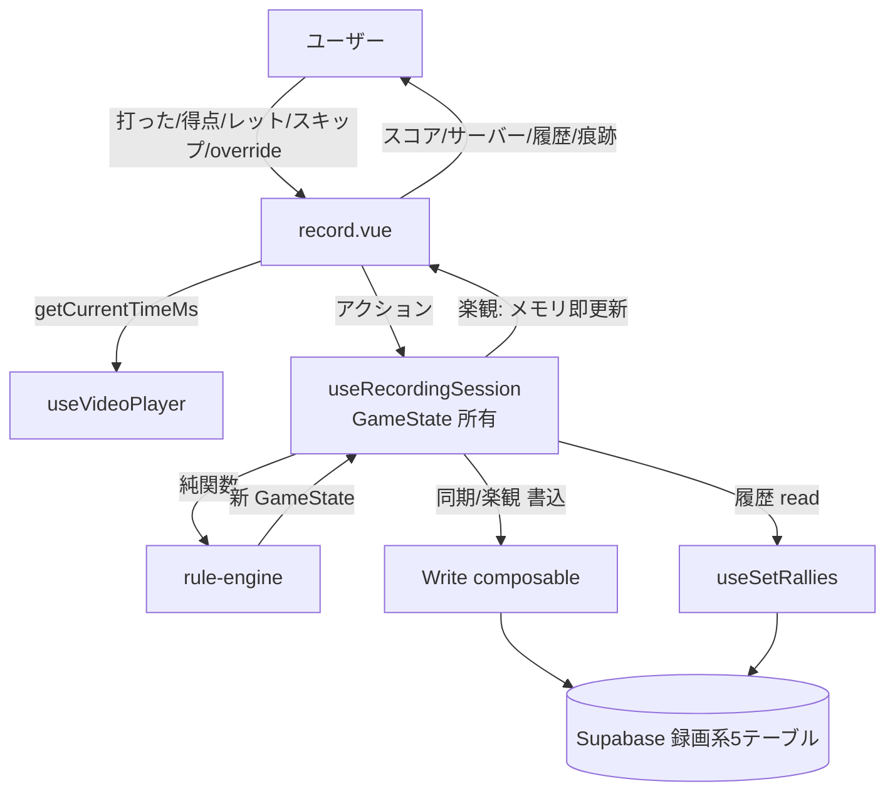
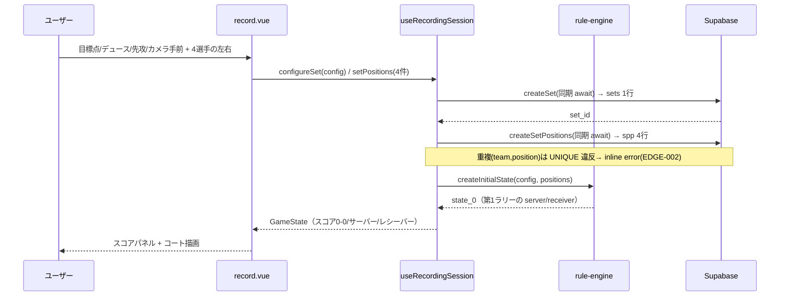
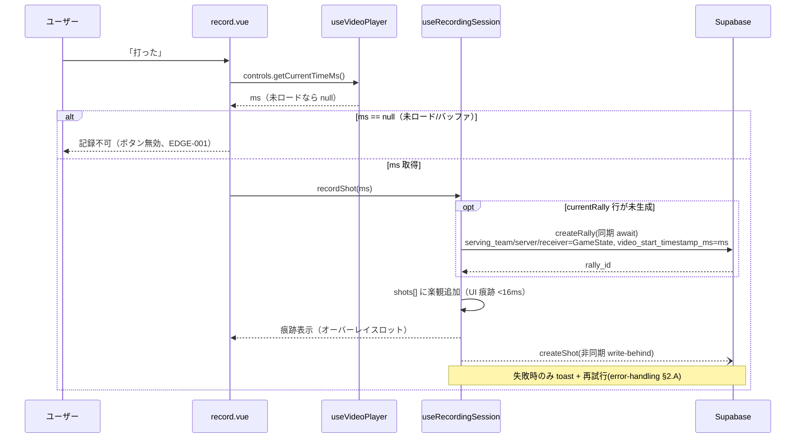
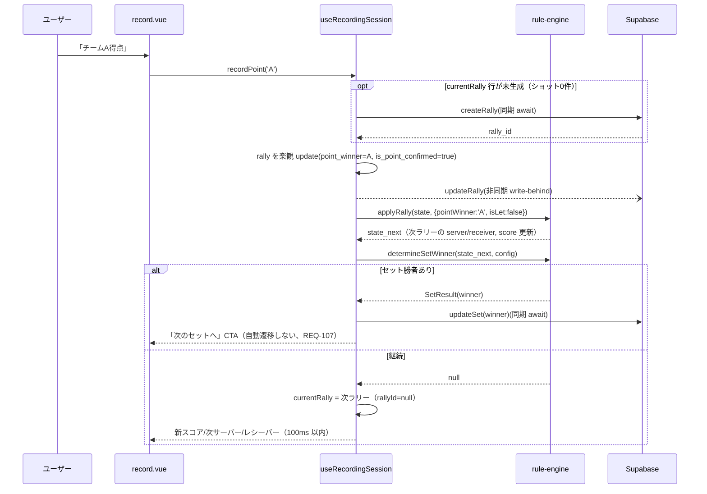
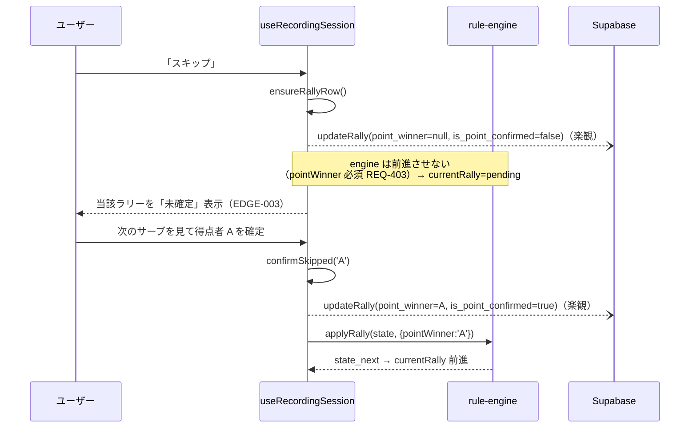
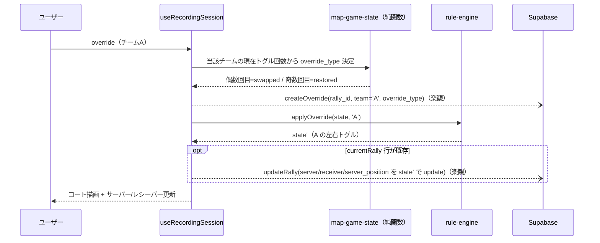
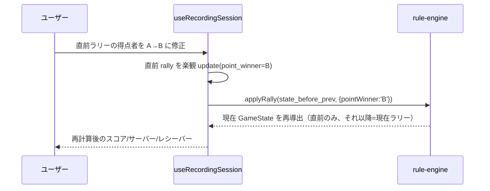
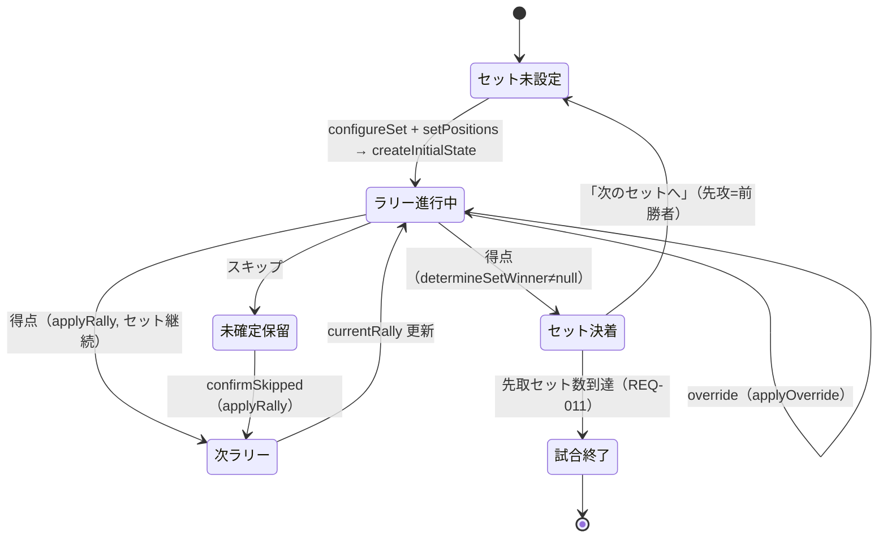
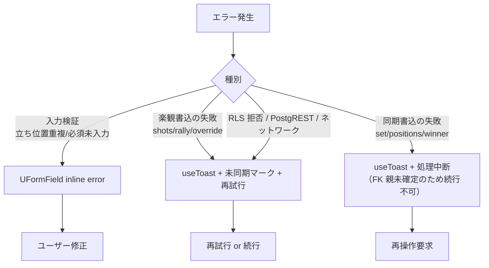

# match-recording データフロー図

**作成日**: 2026-06-05
**関連アーキテクチャ**: [architecture.md](architecture.md)
**関連要件定義**: [requirements.md](../../spec/match-recording/requirements.md)

**【信頼性レベル凡例】**:
- 🔵 **青信号**: EARS要件定義書・確定スキーマ・上流実装・ユーザヒアリングを参考にした確実なフロー
- 🟡 **黄信号**: 上記から妥当な推測によるフロー
- 🔴 **赤信号**: 出典のない推測によるフロー

---

## システム全体のデータフロー 🔵

**信頼性**: 🔵 *architecture.md + PRD §5.4 データフロー*

## 主要機能のデータフロー

### 機能1: セットアップ（セット設定 + 初期立ち位置） 🔵

**信頼性**: 🔵 *REQ-002/003 + TC-002 + rule-engine createInitialState*

**関連要件**: REQ-002, REQ-003, REQ-201

**詳細ステップ**:
1. セット未作成状態（REQ-201）でセットアップフォームを提示。
2. `sets` と `set_player_positions` は **同期 await**（後続 FK 親、整合性優先）。
3. `createInitialState` で第1ラリーの GameState を得て表示。

---

### 機能2: ショット記録（「打った」） 🔵

**信頼性**: 🔵 *REQ-005/101 + TC-005 + NFR-001 + ラリー遅延生成*

**関連要件**: REQ-005, REQ-101, NFR-001

**詳細ステップ**:
1. 現在時刻が `null` なら記録しない（video-playback REQ-201 契約、EDGE-001）。
2. ラリー行は**初ショット時に1回だけ同期生成**（shots の FK 親、id 確定が必要）。
3. 以降のショットは楽観：メモリ即反映 → 非同期 insert。

---

### 機能3: 得点入力とサーバー/レシーバー自動特定 🔵

**信頼性**: 🔵 *REQ-006/007/410 + TC-007 + rule-engine applyRally/determineSetWinner*

**関連要件**: REQ-006, REQ-007, REQ-008, REQ-010, REQ-410

**詳細ステップ**:
1. 得点は楽観 update（ホットパス、NFR-001）。
2. `applyRally` で次 GameState を導出 → 表示更新。
3. `determineSetWinner` が勝者を返したら `sets.winner` を**同期 update**し、手動セット遷移 CTA を出す（REQ-010/107、ヒアリング2026-06-05）。

---

### 機能4: スキップと後確定 🔵

**信頼性**: 🔵 *REQ-103/104 + TC-104 + EDGE-003 + rule-engine REQ-403*

**関連要件**: REQ-103, REQ-104

**備考**: 未確定ラリーがある間は engine が前進できないため、次ラリーの server/receiver は保留。UI で未確定を明示する（EDGE-003）。

---

### 機能5: 左右入れ替わり（override） 🔵

**信頼性**: 🔵 *REQ-105 + TC-105 + EDGE-008 + rule-engine applyOverride（ステートレストグル）*

**関連要件**: REQ-105

**詳細ステップ**:
1. DB は意味ラベル（swapped/restored）を保存、engine はステートレストグルを適用（REQ-105 の不整合解消）。
2. 2回連続で元に戻る（DB は2行、engine 状態は元、EDGE-008）。
3. override が現在ラリー行の生成後なら、その server 系列を update（rule-engine REQ-104: 当該ラリーに反映）。

---

### 機能6: 直前ラリーの修正 🔵

**信頼性**: 🔵 *REQ-106 + TC-106 + [[project_rally_correction]] + EDGE-005*

**関連要件**: REQ-106

**備考**: 修正対象は直前ラリーのみ（[[project_rally_correction]]）。現在ラリーはまだ未得点なので、再計算は「直前 state からの applyRally 1回」で現在 GameState が更新される最小コスト。

---

## 状態管理フロー（録画セッション） 🔵

**信頼性**: 🔵 *architecture.md ラリー行ライフサイクル*

## エラーハンドリングフロー 🔵

**信頼性**: 🔵 *cross-cutting/error-handling.md §2 + EDGE-009*

**信頼性**: 🔵 *EDGE-009（inline / toast の使い分け）+ ハイブリッド永続化の失敗処理*

## データ整合性の保証 🔵

**信頼性**: 🔵 *ハイブリッド永続化 + FK 制約*

- **FK 順序保証**: set → set_player_positions / rally → shots / rally → override の親は**同期生成**で id 確定後に子を書く（楽観の子が先行しない）。
- **楽観の整合性窓**: 録画は単独ユーザー操作で並行書き込みが無いため、メモリ→DB の追従順序は単調。失敗時は toast + 再試行で収束。
- **denormalize の一貫性**: rallies の状態列は GameState 出力をそのまま写すため、再計算（修正/override）時は同じ写像（`map-game-state.ts`）で上書きし二重管理しない。

## 関連文書

- **アーキテクチャ**: [architecture.md](architecture.md)
- **型定義**: [interfaces.ts](interfaces.ts)
- **要件定義**: [requirements.md](../../spec/match-recording/requirements.md)

## 信頼性レベルサマリー

- 🔵 青信号: 14件 (100%)
- 🟡 黄信号: 0件 (0%)
- 🔴 赤信号: 0件 (0%)

**品質評価**: 高品質
