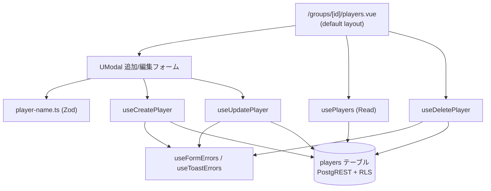

# player-management アーキテクチャ設計

**作成日**: 2026-06-02
**関連要件定義**: [requirements.md](../../spec/player-management/requirements.md)
**ヒアリング記録**: [design-interview.md](design-interview.md)

**【信頼性レベル凡例】**:
- 🔵 **青信号**: EARS要件定義書・設計文書・ヒアリングを参考にした確実な設計
- 🟡 **黄信号**: 妥当な推測による設計
- 🔴 **赤信号**: 出典のない推測による設計

---

## システム概要 🔵

**信頼性**: 🔵 *requirements.md 概要より*

所属 Group の選手（players）ロスターを管理する **UI + composable 層**。新規 DB スキーマ・新規 API は
作らず、data-foundation 確定済みの `players` テーブル（PostgREST + RLS）を消費する。
auth-onboarding と同じ「既存 DB を消費する UI 層」構造。

## アーキテクチャパターン 🔵

**信頼性**: 🔵 *ADR-007 / ADR-011 / auth-onboarding 設計より*

- **パターン**: レイヤード（page/layout → domain composable → PostgREST/RLS）。ADR-007 の domain
  composable 規約に従う。
- **選択理由**: auth-onboarding で確立した「page は supabase を直叩きせず composable 経由」
  （REQ-403 / REQ-406 パターン）を踏襲し、一貫性とテスト容易性を確保する。

## コンポーネント構成

### ルーティング 🔵

**信頼性**: 🔵 *ヒアリング2026-06-02（option 2 で確定）+ 既存 /groups/[id]/settings*

- **パス**: `/groups/[id]/players`（`app/pages/groups/[id]/players.vue`）
- 既存 `/groups/[id]/settings` と一貫。`[id]` は `useCurrentGroup()` の `group_id`（ADR-006 下では
  ユーザーの唯一の Group）。将来 ADR-006 を解除して複数 Group 化する際、URL を変えずに拡張可能。
- **layout**: `default`（認証後レイアウト、無指定で自動適用）。ADR-011 D1。
- **保護**: 非 public path のため auth.global.ts middleware が認証 + Group 所属を保証する
  （未認証 → /login、未所属 → /onboarding）。本 page は到達時点で「認証済み・所属済み」が保証される。

### domain composable（ADR-007 準拠、操作ごとに分割） 🔵

**信頼性**: 🔵 *ADR-007 D1 命名規約 + auth-onboarding composable 構成*

| composable | 種別 | 中身 | 関連要件 |
|---|---|---|---|
| `usePlayers` | Read | `players` を `group_id` 一致 + `deleted_at IS NULL` で SELECT、name 昇順 | REQ-001 / REQ-201 / NFR-001 |
| `useCreatePlayer` | Write | `players` へ insert（group_id / name / handedness） | REQ-002 / REQ-102 |
| `useUpdatePlayer` | Write | `players` の name / handedness を update | REQ-003 |
| `useDeletePlayer` | Write | `players.deleted_at` を now() に update（ソフト削除） | REQ-004 / REQ-103 / REQ-104 |

- Read 系は `useAsyncData<Player[]>('players', …)` の固定キーでラップ（ADR-007 D4、1ナビゲーション
  1クエリの共有キャッシュ思想）。Write 後は `refresh()` で再取得する。
- Write 系は Supabase native の `{ data, error }` を返し、page は error を成否分岐に、表示は
  チャネル state（toast / form field）を見る（ADR-007 §補遺）。

### バリデーション 🔵

**信頼性**: 🔵 *auth-onboarding group-name.ts パターン + players CHECK*

- `app/schemas/player-name.ts`（Zod）で name を `trim().min(1).max(50)` 検証。
  group-name schema と同型。DB の `players_name_length_check`（1〜50字）とクライアントで一致させる。
- handedness は3択（right / left / unknown）の固定 union。

### UI（追加・編集フォーム） 🔵

**信頼性**: 🔵 *ヒアリング2026-06-02（モーダルで確定）+ CLAUDE.md UI規約*

- 一覧画面上で `<UModal>` を開いて追加／編集（一覧から離れない）。Nuxt UI v4 使用（NFR-201）。
- 削除は確認ダイアログなしで `useDeletePlayer` を即実行（REQ-103）。
- 選手0人時は空状態の説明文 + 「選手を追加」CTA（REQ-201）。

## システム構成図



**信頼性**: 🔵 *requirements.md + ADR-007 + error-handling.md より*

## ディレクトリ構造 🔵

**信頼性**: 🔵 *既存プロジェクト構造より*

```
app/
├── pages/groups/[id]/
│   └── players.vue            # 一覧 + 追加/編集モーダル + 削除
├── components/players/        # （任意）PlayerFormModal.vue 等に分割
├── composables/
│   ├── usePlayers.ts
│   ├── useCreatePlayer.ts
│   ├── useUpdatePlayer.ts
│   └── useDeletePlayer.ts
├── schemas/
│   └── player-name.ts         # Zod (group-name.ts と同型)
└── types/
    └── player.ts              # Player / Handedness / 入力型 (任意集約)
```

## 既存 DB マッピング 🔵

**信頼性**: 🔵 *initial_schema.sql / players RLS*

| 操作 | 既存リソース | RLS |
|---|---|---|
| 一覧 | `from('players').select(...).eq('group_id', gid).is('deleted_at', null)` | players_select = is_member_of |
| 追加 | `from('players').insert(...)` | players_insert = is_member_of |
| 編集 | `from('players').update(...).eq('id', id)` | players_update = is_member_of |
| 削除 | `from('players').update({ deleted_at: now }).eq('id', id)` | players_update（DELETE ポリシー無し） |

> **新規 migration・新規 RPC・新規エラーコードは不要**。name 検証はクライアント Zod、その他のエラーは
> 既存チャネル（toast）で処理する（error-handling.md §2.A/C/F + §6）。

## 非機能要件の実現方法

### パフォーマンス 🔵

**信頼性**: 🔵 *NFR-001 / initial_schema.sql:289*

- 一覧 SELECT は `deleted_at IS NULL` 条件を含め、部分インデックス `idx_players_group_id` の対象とする。

### セキュリティ 🔵

**信頼性**: 🔵 *NFR-101 / players RLS*

- 全操作が RLS `is_member_of(group_id)` を通過。他 Group の選手は取得・追加・更新いずれも不可。
- page から supabase 直叩き禁止、composable 経由（REQ-403）。

### 国際化 🔵

**信頼性**: 🔵 *NFR-301 / auth-onboarding i18n 基盤*

- 全文言を locales/ja.json・en.json に定義。キー構造一致 CI チェックの対象。

## 技術的制約 🔵

**信頼性**: 🔵 *requirements.md 制約要件より*

- 物理削除禁止（ソフト削除のみ、REQ-402）。
- 選手は auth.users と非連動（REQ-405）。
- 検索・絞り込み・undelete UI は MVP 範囲外。

## 関連文書

- **データフロー**: [dataflow.md](dataflow.md)
- **型定義**: [interfaces.ts](interfaces.ts)
- **要件定義**: [requirements.md](../../spec/player-management/requirements.md)
- **エラー実装規約**: [error-handling.md](../cross-cutting/error-handling.md)

## 信頼性レベルサマリー

- 🔵 青信号: 全項目（確定スキーマ + 🔵100% 要件 + ヒアリングが出典）
- 🟡 黄信号: 0
- 🔴 赤信号: 0

**品質評価**: 高品質
