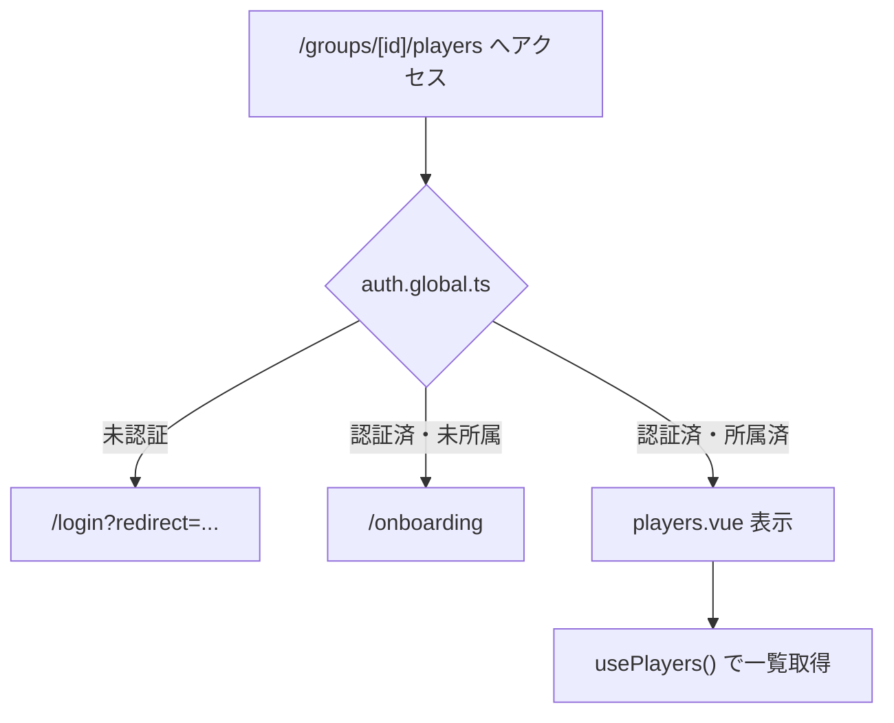
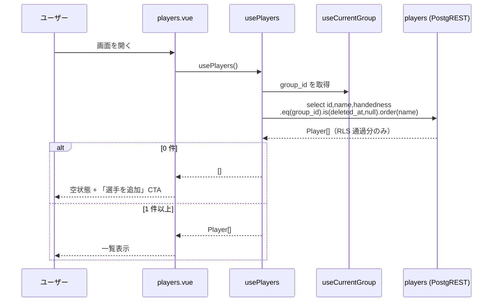
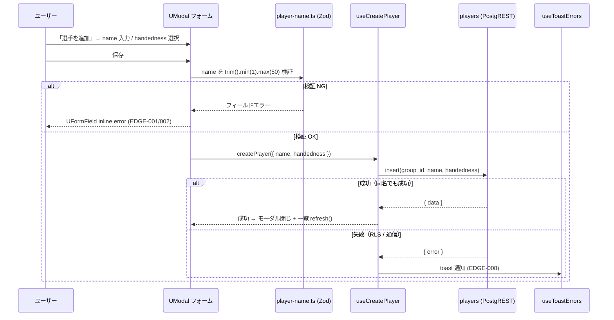
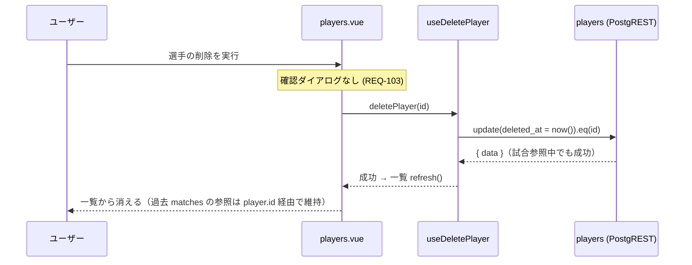
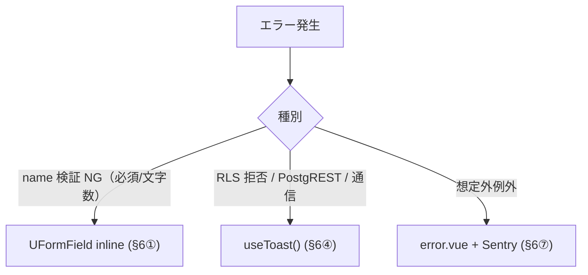
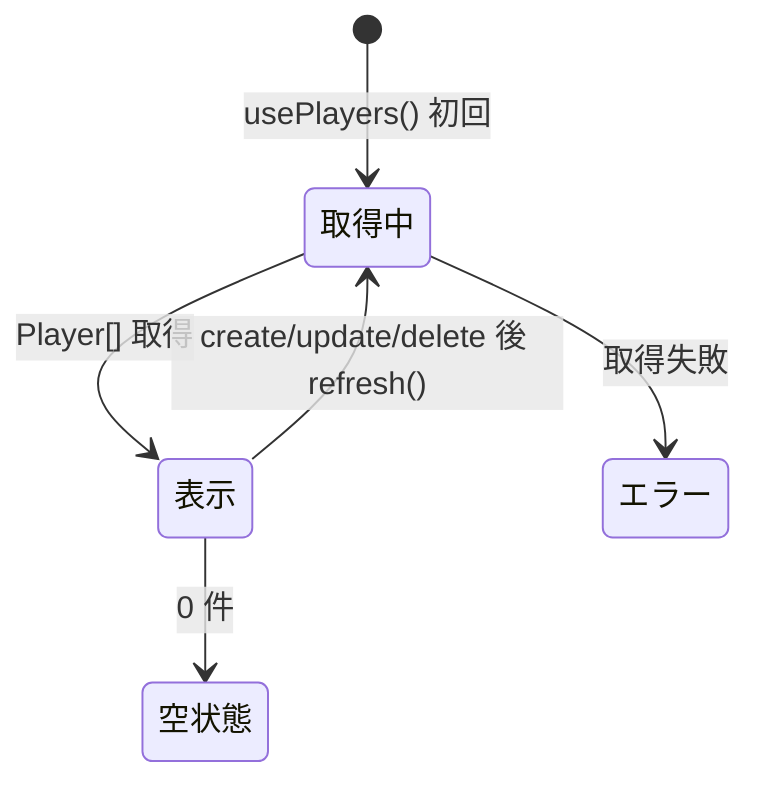

# player-management データフロー図

**作成日**: 2026-06-02
**関連アーキテクチャ**: [architecture.md](architecture.md)
**関連要件定義**: [requirements.md](../../spec/player-management/requirements.md)

**【信頼性レベル凡例】**:
- 🔵 確実なフロー / 🟡 妥当な推測 / 🔴 出典のない推測

---

## 画面到達フロー 🔵

**信頼性**: 🔵 *auth-onboarding auth.global.ts middleware*

> 本 page は非 public path。到達時点で「認証済み・Group 所属済み」が middleware により保証される。

## 機能1: 選手一覧取得 🔵

**信頼性**: 🔵 *user-stories 1.1 / TC-001 / NFR-001*

**関連要件**: REQ-001, REQ-201, NFR-001

**詳細ステップ**:
1. `usePlayers()` が `useCurrentGroup()` の `group_id` を読む 🔵
2. `deleted_at IS NULL` で未削除のみ、name 昇順で SELECT（部分インデックス利用）🔵
3. RLS `is_member_of` により自 Group の選手のみ返る 🔵
4. 0 件なら空状態（REQ-201）、1 件以上なら一覧 🔵

## 機能2: 選手の追加 🔵

**信頼性**: 🔵 *user-stories 1.2 / TC-002 / EDGE-001/002/004*

**関連要件**: REQ-002, REQ-101, REQ-102

**詳細ステップ**:
1. name はクライアント Zod で先に検証（DB CHECK と一致）🔵
2. 検証エラーは UFormField inline（error-handling §6①）🔵
3. insert は group_id を `useCurrentGroup` から付与 🔵
4. 同名選手が既存でも成功（REQ-102 / EDGE-004）🔵
5. RLS・通信エラーは toast（error-handling §6④）🔵
6. 成功後はモーダルを閉じ `usePlayers().refresh()` で一覧更新 🔵

## 機能3: 選手の編集 🔵

**信頼性**: 🔵 *user-stories 1.3 / TC-003*

**関連要件**: REQ-003, REQ-101

機能2 と同型（モーダルに既存値をプリフィル → `useUpdatePlayer` で update → refresh）。
name の境界検証（1〜50字）が編集時も再適用される（TC-003-B01）🔵。

## 機能4: 選手のソフト削除 🔵

**信頼性**: 🔵 *user-stories 1.4 / TC-004 / REQ-103/104*

**関連要件**: REQ-004, REQ-103, REQ-104

**詳細ステップ**:
1. 確認ダイアログを出さず即実行（REQ-103、ヒアリング2026-06-01）🔵
2. `deleted_at` を now() に UPDATE（物理削除はしない、REQ-402）🔵
3. 試合参照中の選手でも成功し、履歴は維持（REQ-104 / EDGE-006）🔵
4. `usePlayers().refresh()` で一覧から除外（`deleted_at IS NULL` フィルタ、EDGE-005）🔵

## エラーハンドリングフロー 🔵

**信頼性**: 🔵 *error-handling.md §2 / §6*

## 状態管理フロー 🔵

**信頼性**: 🔵 *ADR-007 D4 / useAsyncData*

## 関連文書

- **アーキテクチャ**: [architecture.md](architecture.md)
- **型定義**: [interfaces.ts](interfaces.ts)

## 信頼性レベルサマリー

- 🔵 青信号: 全フロー
- 🟡 黄信号: 0
- 🔴 赤信号: 0

**品質評価**: 高品質
