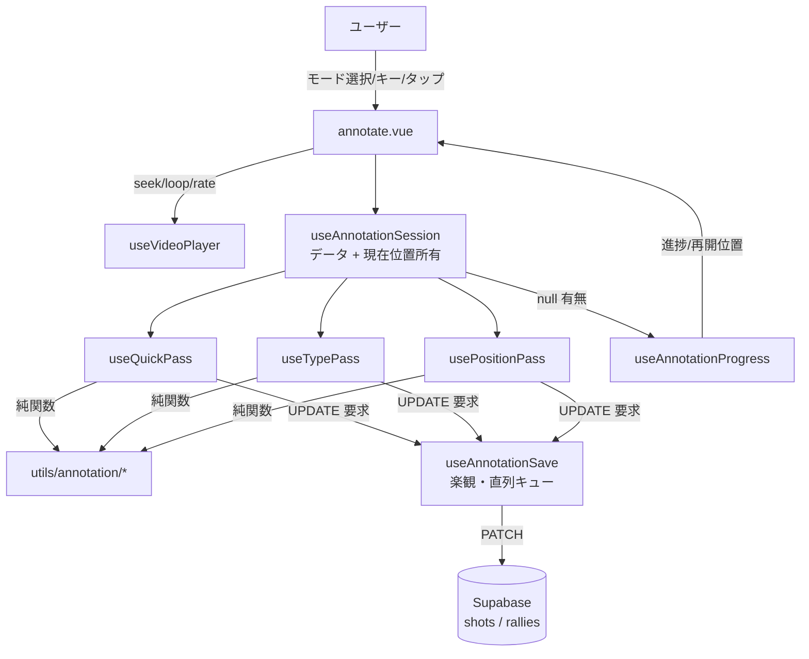
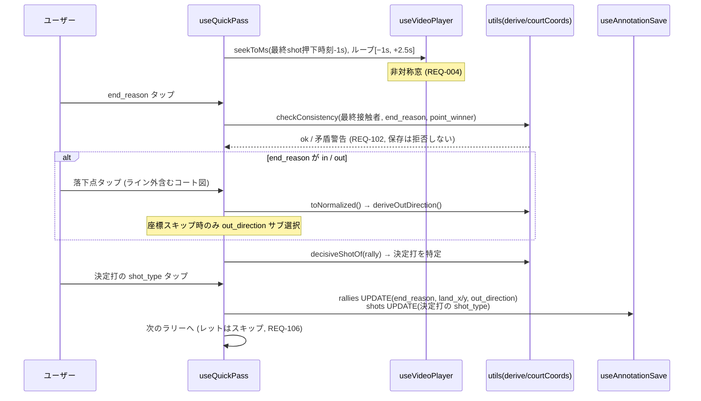
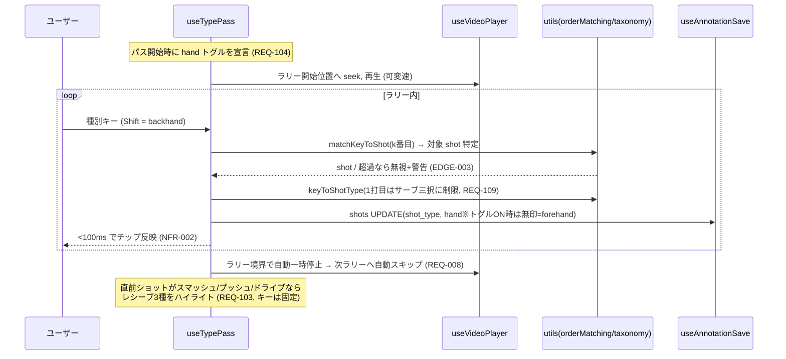
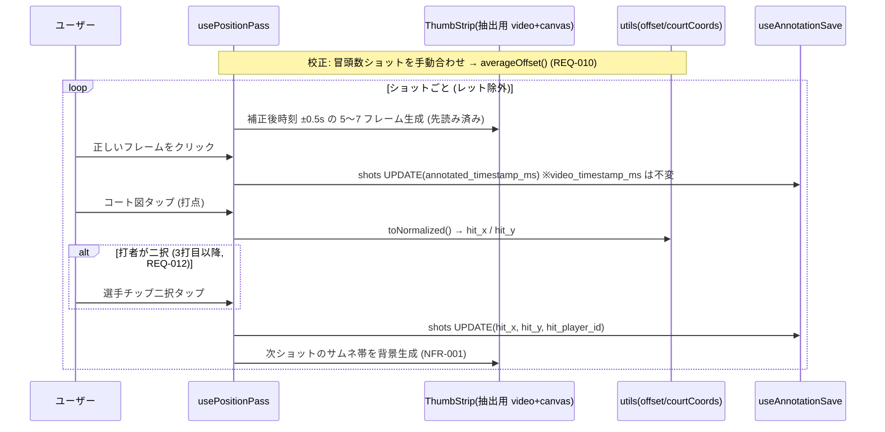
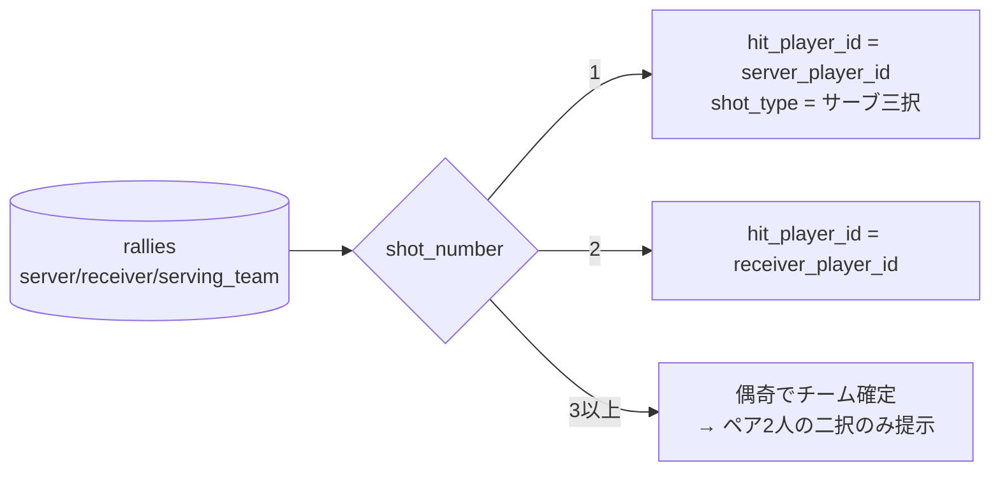

# shot-annotation データフロー図

**作成日**: 2026-07-25
**関連アーキテクチャ**: [architecture.md](architecture.md)
**関連要件定義**: [requirements.md](../../spec/shot-annotation/requirements.md)

**【信頼性レベル凡例】**: 🔵 確定文書由来 / 🟡 妥当な推測 / 🔴 出典なし

---

## システム全体のデータフロー 🔵

## 機能1: クイックパス（決着注釈） 🔵

**関連要件**: REQ-004 / 005 / 006 / 102

## 機能2: 種別パス（順番マッチング） 🔵

**関連要件**: REQ-007 / 008 / 103 / 104 / 109

## 機能3: 打点パス（ローカル動画） 🔵

**関連要件**: REQ-009 / 010 / 011 / 012 / 014

- YouTube モード: TH の代わりに `seekTo` + タイマーのスローループ（窓 = 前1.2s/後0.3s、
  REQ-101）。`annotated_timestamp_ms` は書かない 🔵

## 機能4: プレフィル（rule-engine 出力の読み取りのみ） 🔵

**関連要件**: REQ-012 / 109

- プレフィル値も保存時は通常の UPDATE（`annotation_source='human'`）。
  rule-engine 本体は呼ばず、denormalize 済み列だけを読む 🔵

## 機能5: 保存・undo・進捗 🔵

**関連要件**: REQ-003 / 013 / 108 / EDGE-001 / EDGE-007

- **保存**: `useAnnotationSave` が UPDATE を直列キューで送出（楽観 = UI は即時反映、
  失敗は `useToast()` + ローカル状態保持）。対象は shots 注釈列 / rallies 決着列のみ
- **undo（1段）**: 直前の {テーブル, 行id, 列, 旧値} を保持 → Backspace で逆 UPDATE + 位置を戻す。
  2手以上前は AnnotationRallyList から該当ショットを開いて上書き（REQ-108）
- **進捗**: `useAnnotationProgress` が読込済みデータの null 有無から導出
  （種別 = shot_type 非null率 / 打点 = hit_x 非null率 / クイック = end_reason 非null率、
  いずれもレット除外）。リロード後も同じ計算で再現（REQ-013）

## エラー・境界 🔵

| ケース | フロー |
|---|---|
| 保存失敗（RLS / ネットワーク） | キュー停止 → useToast() → リトライ導線。入力済みローカル状態は保持（EDGE-007） |
| out なのに落下点がコート内 | deriveOutDirection() が null → ソフト警告表示（EDGE-002） |
| キー入力がショット数超過 | matchKeyToShot() が null → 無視 + 警告、ラリーやり直し可（EDGE-003） |
| 補正後時刻が負値 | loopWindowFor() 内で 0 に clamp（EDGE-004） |
| ローカル動画未再選択 | 方式 A の再選択プロンプト（REQ-107）。注釈データの閲覧・一覧は可能 |
