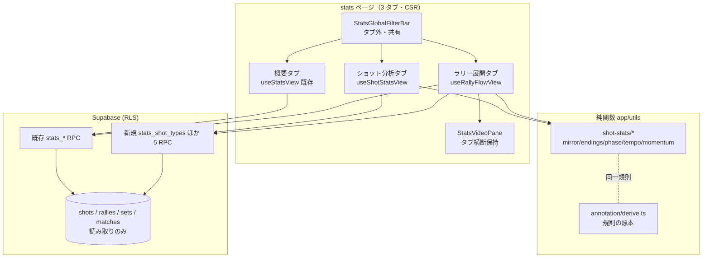

# shot-stats アーキテクチャ設計

**作成日**: 2026-08-03
**関連要件定義**: [requirements.md](../../spec/shot-stats/requirements.md)
**ヒアリング記録**: [design-interview.md](design-interview.md)

**【信頼性レベル凡例】**:
- 🔵 **青信号**: EARS要件定義書・既存設計文書・実装調査・ユーザヒアリングを参考にした確実な設計
- 🟡 **黄信号**: 上記から妥当な推測による設計
- 🔴 **赤信号**: 出典のない推測による設計

---

## システム概要 🔵

**信頼性**: 🔵 *requirements.md 概要より*

既存 stats 画面（試合単位 / Group 横断）を **3 タブ構成**に再編し、「概要（既存ダッシュボード）」「ショット分析（探針 5 枚 = A/C/D/F/G、注釈依存）」「ラリー展開（J/K/L、注釈不要）」を提供する。集計は読み取り専用 RPC（Postgres）、派生計算・分類・ミラーはクライアント純関数、描画は vue-echarts + SVG コート図。書き込み・スキーマ変更は一切行わない。

## アーキテクチャパターン 🔵

**信頼性**: 🔵 *stats-dashboard 実装（useStatsView / callStatsRpc / SFC チャート群）の踏襲。実装調査 2026-08-03*

- **パターン**: 「RPC 集計（Postgres）→ 統合 composable（useAsyncData + computed 派生）→ プレゼンテーション SFC」の 3 層。stats-dashboard と同一
- **フィルタ戦略**: RPC は細粒度 grain（打者 × 球種 × hand 等）で返し、**選手・球種フィルタはクライアント側の computed で適用**（既存のドリルダウン=再フェッチなし方式と統一）。**セット・hand フィルタのみ RPC パラメータ**（grain 爆発防止） 🔵 *ヒアリング2026-08-04 で了承。ただし「実際のアクセスパターン次第でどのフィルタを即時側に置くかは見直してよい」との留保つき*
- **選択理由**: 既存パターンとの一貫性（学習コスト・テスト資産の再利用）、NFR-002（集計は Postgres 側）の充足

## 前提となる実装済みスキーマ（要件定義時点からの差分） 🔵

**信頼性**: 🔵 *実装調査 2026-08-03（migrations / app/types/shot-annotation.ts）*

- `rallies.end_reason` は **6 値**（`floor/net/not_over/body/service_fault/unknown`）。in/out は「最終打者チーム × point_winner」から導出（`deriveInOut`）
- `shots.shot_type` は **19 値**（18 種 + `unknown`。2026-08-05 に lob → lob_high/lob_low、clear → clear_high/clear_driven へ分割。DB CHECK にはレガシー値 lob/clear が旧試合互換で残るが、コードの SHOT_TYPES は 19 値が正）
- `shots` はソフトデリート（`deleted_at`）。集計は必ず `deleted_at IS NULL`
- 純関数の実シグネチャ: `deriveOutDirection(land: CourtPoint): OutDirection | null` / `decisiveShotIndex(shotCount, endReason, winnerHitLast): number | null`

## コンポーネント構成

### ページ（変更） 🔵

**信頼性**: 🔵 *ヒアリング2026-08-03（3 タブ構成）+ 実装調査*

- `app/pages/groups/[id]/stats.vue`（Group 横断）: タブ = 概要 / ショット分析 / ラリー展開（J・K のみ。L は試合単位限定）
- `app/pages/groups/[id]/matches/[matchId]/stats.vue`（試合単位）: タブ = 概要 / ショット分析 / ラリー展開（J・K・L）
- **グローバルフィルタバー（`StatsGlobalFilterBar`）はタブの外（上部）**に置き、全タブで共有 🔵 *REQ-004*
- **動画ペイン（`StatsVideoPane`）は試合単位ページでタブ横断に保持**する。タブは `v-show` 切替（アンマウントしない）とし、プレーヤー状態（ローカルファイル選択・再生位置）をタブ切替で失わない 🔵 *ヒアリング2026-08-04 で了承（video-playback 方式A の負担軽減）*
- タブ実装は Nuxt UI の Tabs コンポーネント 🔵 *CLAUDE.md（Nuxt UI 使用）*

### 新規コンポーネント（app/components/stats/） 🔵

**信頼性**: 🔵 *要件のチャート 8 枚 + ヒアリング2026-08-03（SVG コート図）。命名は既存 `Stats<Name>Chart.vue` 規約*

| コンポーネント | 担当 | 描画 |
|---|---|---|
| `StatsCourtZones.vue` | コート図の共通基盤（コートライン + n×n セル + 凡例） | **SVG 自作** |
| `StatsEndingsChart.vue` | A: 得点/失点内訳の積み上げ横棒 + 決定打球種ランキング | ECharts bar |
| `StatsEndingsCourtMap.vue` | A: 決着落下点（得点/失点切替） | StatsCourtZones |
| `StatsServeTypeChart.vue` | C: サーブ種別 × 得点率（`StatsPositionToggle` 再利用） | ECharts bar |
| `StatsShotMixChart.vue` | D: 球種構成比（100% 積み上げ） | ECharts bar |
| `StatsShotOutcomeChart.vue` | D: 球種別 決定率 ⇄ ミス率（ダイバージング棒） | ECharts bar |
| `StatsShotMixScatter.vue` | D: 使用割合 × 球種別得点率の散布図 | ECharts **scatter** |
| `StatsHandChart.vue` | G: 球種別 F/B 比率 + F/B 別成果 | ECharts bar |
| `StatsShotHeatmap.vue` | F: 打点ヒートマップ（選手・球種フィルタ付き） | StatsCourtZones |
| `StatsPhaseRateChart.vue` | J: 局面別得点率（接戦強調） | ECharts bar |
| `StatsTempoChart.vue` | K: テンポ分布（得点/失点重ね・measure トグル・近似注記） | ECharts line(area) |
| `StatsSetFlowChart.vue` | L: セット推移（階段折れ線 + ラン帯 + 11 点目印 + タップ→動画） | ECharts line + markArea/markLine |
| `StatsAnnotationBadge.vue` | 注釈率バッジ（種別/打点/hand/決着/時刻の率を表示） | Nuxt UI Badge |

- ECharts プラグイン（`app/plugins/echarts.client.ts`）へ **ScatterChart / MarkLineComponent / MarkAreaComponent を追加登録**する 🔵 *実装調査（tree-shaken use([...]) 方式）*
- 全チャートで `useChartTextColor` を利用（ダークテーマ追従）、`<ClientOnly><VChart ... autoresize /></ClientOnly>`、`.chart { height: 300px }` の既存規約に従う 🔵 *実装調査*

### 状態管理（composable） 🔵

**信頼性**: 🔵 *useStatsView の実装パターン踏襲（REQ-407）*

- `app/composables/useShotStatsView.ts` — ショット分析タブの統合 composable。`useAsyncData` で 4 RPC（shot_types / shot_zones / rally_endings / annotation_coverage）を `Promise.all` 取得し、選手・球種・hand・セットのフィルタ状態と派生 computed（各チャートの入力）を持つ
- `app/composables/useRallyFlowView.ts` — ラリー展開タブの統合 composable。**既存 `stats_rallies`（J/L 用）** + `stats_rally_tempo`（K 用）+ coverage を取得
- 既存 `useStatsView`（概要タブ）は変更しない。スコープ型 `StatsViewScope` と `StatsGlobalFilter` は共有 🔵
- **タブ遅延ロード**: 各タブの composable はタブ初回アクティブ時に取得開始（`immediate: false` → activate で `execute()`） 🔵 *ヒアリング2026-08-04 で了承（NFR-001 を概要タブ基準で守る）*

### 純関数（app/utils/shot-stats/） 🔵

**信頼性**: 🔵 *REQ-407（unit テスト可能に分離）。シグネチャは [interfaces.ts](interfaces.ts) 参照*

`mirror.ts` / `zones`（クランプ算入）/ `endings.ts`（決着 4 分類 + unknown）/ `phase.ts`（3 分割 + 接戦）/ `tempo.ts`（適格判定・密度系列）/ `momentum.ts`（ワーム系列・ラン検出）/ `coverage.ts`（注釈率）。決着・in/out・決定打は `app/utils/annotation/derive.ts` の規則と同一（SQL 実装とは integration テストで突き合わせ, REQ-406）

### データベース（追加 RPC のみ） 🔵

**信頼性**: 🔵 *REQ-401/402 + stats-dashboard RPC 規約（実装調査）*

新規 5 関数（詳細は [database-schema.sql](database-schema.sql)）: `stats_annotation_coverage` / `stats_shot_types` / `stats_shot_zones` / `stats_rally_endings` / `stats_rally_tempo`。全て `SECURITY INVOKER` + `STABLE` + `SET search_path = public` + `invalid_scope` ガード + `GRANT TO authenticated`。J/L は既存 `stats_rallies` を再利用し新 RPC を作らない

## システム構成図 🔵



**信頼性**: 🔵 *要件・実装調査より*

## ディレクトリ構造（追加・変更分） 🔵

```
app/
├── pages/groups/[id]/stats.vue                 # 変更: 3 タブ化
├── pages/groups/[id]/matches/[matchId]/stats.vue  # 変更: 3 タブ化
├── components/stats/                            # 追加 13 コンポーネント（上表）
├── composables/useShotStatsView.ts              # 追加
├── composables/useRallyFlowView.ts              # 追加
├── utils/shot-stats/{mirror,endings,phase,tempo,momentum,coverage}.ts  # 追加
├── types/shot-stats.ts                          # 追加（interfaces.ts を配置）
└── plugins/echarts.client.ts                    # 変更: Scatter/MarkLine/MarkArea 登録
supabase/migrations/<ts>_shot_stats_read_functions.sql  # 追加（RPC 5 本 + GRANT）
tests/
├── unit/utils/shot-stats/*.test.ts              # 追加
├── unit/components/stats/Stats*.test.ts         # 追加（新チャート分）
└── integration/stats-dashboard/shot-stats-rpc.integration.test.ts  # 追加
```

## 非機能要件の実現方法

### パフォーマンス 🔵
- 集計は RPC（Postgres）側で実施し、クライアントは細粒度 grain のフィルタ・整形のみ（NFR-002）
- タブ遅延ロードで概要タブの初期表示 3 秒（NFR-001）を既存同等に維持 🔵 *ヒアリング2026-08-04 で了承*
- ショット分析タブは 4 RPC 並列取得。grain 行数は Group 横断でも数千行程度（選手 × 19 球種 × 3 hand / × 18 ゾーン） 🟡 *見積り値。実装時に実測で検証（ヒアリング2026-08-04: 注記を残す前提で了承）*

### セキュリティ 🔵
- SECURITY INVOKER による RLS 継承（NFR-101 / REQ-403）。integration テストで他 Group 0 件を検証
- 書き込み経路なし（REQ-401）。migration は CI 経由 db:push のみ（REQ-402）

### ユーザビリティ 🔵
- 全チャートに n / N 併記、タブヘッダーに `StatsAnnotationBadge`（NFR-201 / REQ-002/003）
- K チャートに「押下時刻ベースの近似」注記を常設（REQ-107）
- レスポンシブ: タブ内は 1 カラム縦積み（モバイル）/ 2 カラム（デスクトップ）。既存 grid 方式踏襲（NFR-202）

## 技術的制約 🔵

- **実装ブランチは PR #50（feat/shot-annotation）マージ後に main から作成**（注釈列の生成型 `app/types/supabase.ts` に依存, note.md §6）
- 実装後に `db:types` で生成型を更新（新 RPC の Functions 型）。`callStatsRpc` の fn union に 5 関数を追加
- CLAUDE.md ワークフロー: ブランチ → dev マージ → localhost 検証 → main へ PR
- vue-echarts / Composition API / TypeScript strict / Nuxt UI（CLAUDE.md・REQ-405 相当規約）

## 関連文書

- **データフロー**: [dataflow.md](dataflow.md)
- **型定義**: [interfaces.ts](interfaces.ts)
- **DBスキーマ（RPC）**: [database-schema.sql](database-schema.sql)
- **RPC 仕様**: [api-endpoints.md](api-endpoints.md)
- **要件定義**: [requirements.md](../../spec/shot-stats/requirements.md)

## 信頼性レベルサマリー

- 🔵 青信号: 29 件（97%）
- 🟡 黄信号: 1 件（3%）— 性能見積り（実装時に実測で検証）
- 🔴 赤信号: 0 件

**品質評価**: 高品質（設計判断 7 件は 2026-08-04 ヒアリングで全て了承済み）
