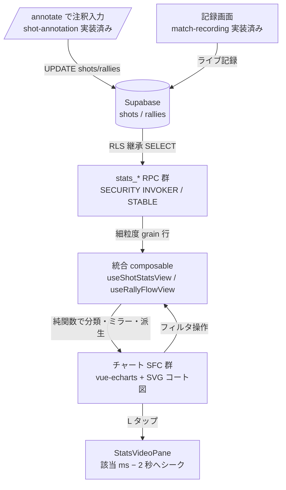
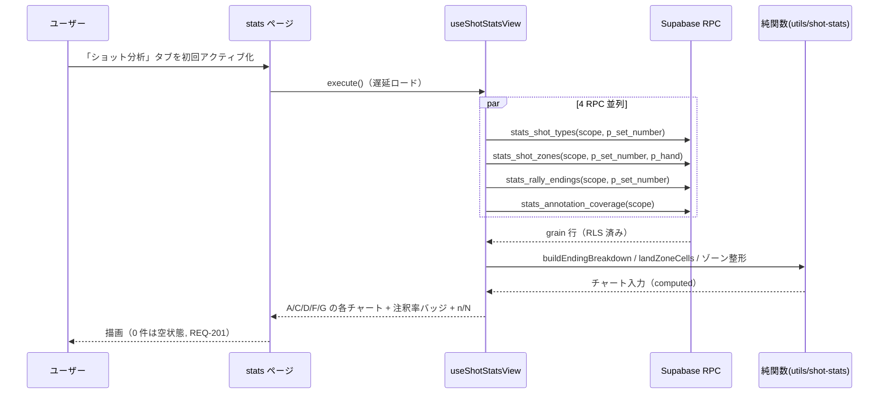
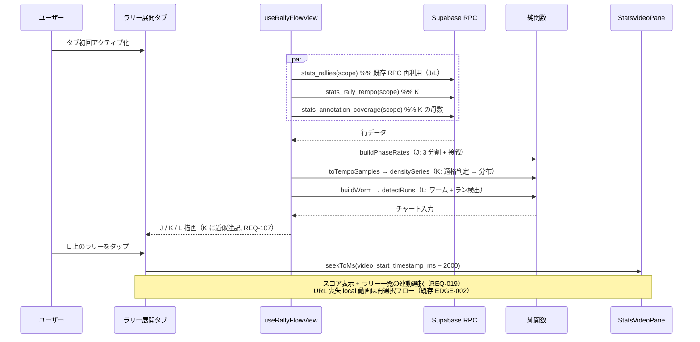
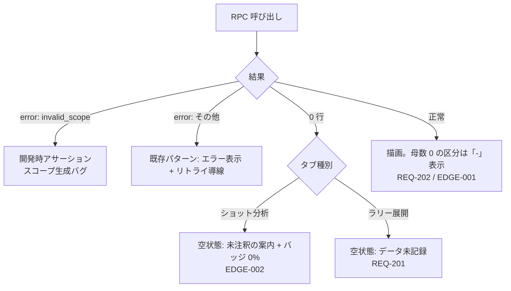

# shot-stats データフロー図

**作成日**: 2026-08-03
**関連アーキテクチャ**: [architecture.md](architecture.md)
**関連要件定義**: [requirements.md](../../spec/shot-stats/requirements.md)

**【信頼性レベル凡例】**:
- 🔵 **青信号**: EARS要件定義書・既存設計文書・実装調査・ユーザヒアリングを参考にした確実なフロー
- 🟡 **黄信号**: 上記から妥当な推測によるフロー
- 🔴 **赤信号**: 出典のない推測によるフロー

---

## システム全体のデータフロー 🔵

**信頼性**: 🔵 *architecture.md + 実装調査（useStatsView の useAsyncData / computed 派生パターン）*



## 主要機能のデータフロー

### ショット分析タブ 初回ロード（A/C/D/F/G） 🔵

**信頼性**: 🔵 *REQ-005〜012 + stats-dashboard の Promise.all 取得パターン*

**関連要件**: REQ-001, REQ-002, REQ-003, REQ-005〜012



**詳細ステップ**:
1. タブ初回アクティブ時のみ取得（遅延ロード 🔵 ヒアリング2026-08-04 了承）。スコープ（match/group + includedMatchIds）は既存グローバルフィルタと共有
2. 決着分類（ace/opponent_error/own_error/opponent_ace/unknown）は `endings.ts` がクライアントで実施。`floor` の in/out は `last_hitter_team × point_winner` で導出（`deriveInOut` と同一規則, REQ-406）
3. 母数併記: 各チャートは coverage 行から n / N を算出（NFR-201）

### フィルタ操作（選手・球種 / セット・hand） 🔵

**信頼性**: 🔵 *既存ドリルダウン（再フェッチなし）方式の踏襲 + grain 分割はヒアリング2026-08-04 で了承（アクセスパターン次第で見直し可の留保つき）*

```mermaid
flowchart LR
    subgraph クライアント側フィルタ（再フェッチなし）
      FP[選手 打者] --> CC[computed が grain 行を絞り込み]
      FT[球種] --> CC
    end
    subgraph RPC パラメータ（変更時 execute 再実行）
      FS[セット] --> RF[p_set_number]
      FH[hand ヒートマップのみ] --> RF2[p_hand]
    end
    CC --> CH[全チャート再描画]
    RF & RF2 --> CH
```

- 選手・球種は RPC の返却 grain（hit_player_id × shot_type × hand）に含まれるため、computed の絞り込みのみで全チャートが連動する 🔵
- セット・hand は grain に含めると行数が爆発するためパラメータ化（変更時のみ再フェッチ。STABLE な軽量クエリ） 🔵 *ヒアリング2026-08-04 で了承。実アクセスパターンに応じて即時側/再取得側の配分は見直してよい*

### ラリー展開タブ（J/K/L） 🔵

**信頼性**: 🔵 *REQ-013〜019 + 既存 stats_rallies の score_a/b・video 列（20260628 migration）*



**J の導出** 🔵: `stats_rallies` の `score_a/score_b`（ラリー開始時スコア）から `phaseOf`（リード側 0-7/8-14/15-）と `isClutch`（終盤かつ 2 点差以内・延長含む）を判定し、視点チーム勝敗で集計（REQ-013/014）

**K の適格判定** 🔵: `timed_count === shot_count && shot_count >= 2 && duration_ms > 0` のラリーのみ（REQ-106 / EDGE-104）。除外数はチャートに併記。measure トグル（avg ⇄ last3）は クライアント再計算のみ（REQ-016）

**L の系列** 🔵: セットごとに `point_winner` を視点チームで ±1 化し累積（REQ-017）。3 連続以上を `detectRuns` で検出し markArea 帯（REQ-018）。11 点到達位置に markLine（REQ-018）

## エラーハンドリングフロー 🔵

**信頼性**: 🔵 *stats-dashboard REQ-103/201 踏襲 + invalid_scope ガード*



## データ整合性の保証 🔵

**信頼性**: 🔵 *REQ-406/407 + ADR-012 テスト戦略*

- **規則の同一性**: 決定打・in/out・out 細分は「原本 = `app/utils/annotation/derive.ts` / `court-coords.ts`」。SQL 実装（stats_shot_types / stats_rally_endings）とは integration テストで同一入力 → 同一出力を突き合わせ（REQ-406）
- **クライアント派生**: 分類・ミラー・ゾーン・局面・テンポ・ワームは全て純関数で unit テスト（REQ-407）
- **読み取り専用**: トランザクション不要。全 RPC STABLE

## 関連文書

- **アーキテクチャ**: [architecture.md](architecture.md)
- **型定義**: [interfaces.ts](interfaces.ts)
- **DBスキーマ（RPC）**: [database-schema.sql](database-schema.sql)
- **RPC 仕様**: [api-endpoints.md](api-endpoints.md)

## 信頼性レベルサマリー

- 🔵 青信号: 14 件（100%）
- 🟡 黄信号: 0 件
- 🔴 赤信号: 0 件

**品質評価**: 高品質（設計判断は 2026-08-04 ヒアリングで了承済み）
