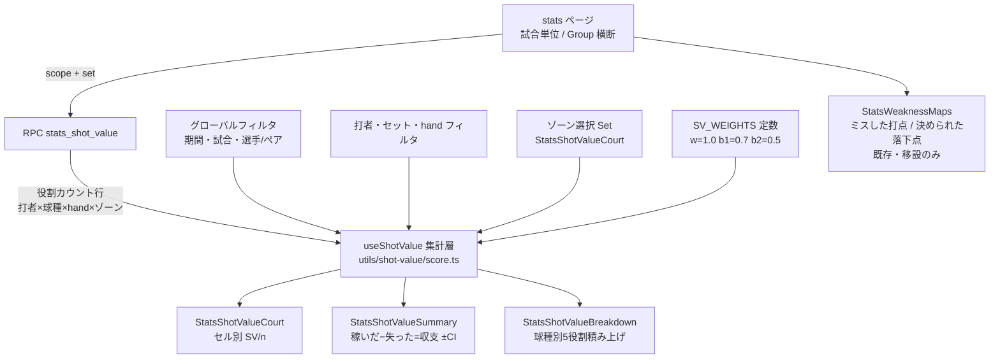
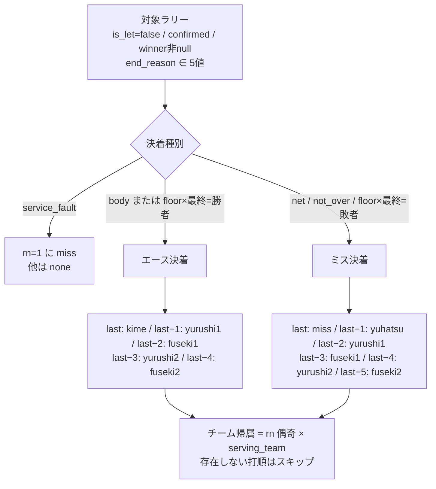
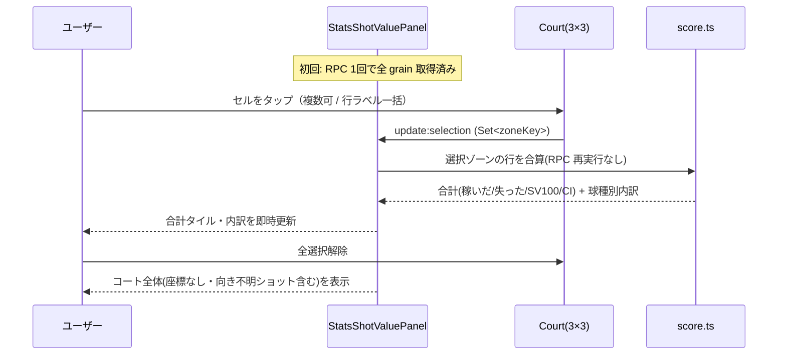

# shot-value データフロー図

**作成日**: 2026-09-16

## 全体フロー

## 採点の割当（RPC 内・ラリー単位）

## 画面インタラクション

## ゾーン割当と除外（REQ-101/102 の境界）

| ショットの状態 | 採点 | 分母 n | ゾーン |
|---|---|---|---|
| 通常（座標あり・向きあり） | する | 入る | 割当（placement と同一ミラー・クランプ） |
| 打点座標 null | する | 入る（全体時） | null → ゾーン選択中は対象外 |
| camera_near_team null | する | 入る（全体時） | null → 同上 |
| hit_player_id null | 位置のみ消費 | 入らない | —（RPC 出力から除外） |
| end_reason null / unknown | しない | **入らない** | — |
