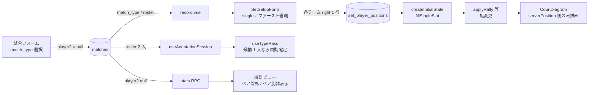
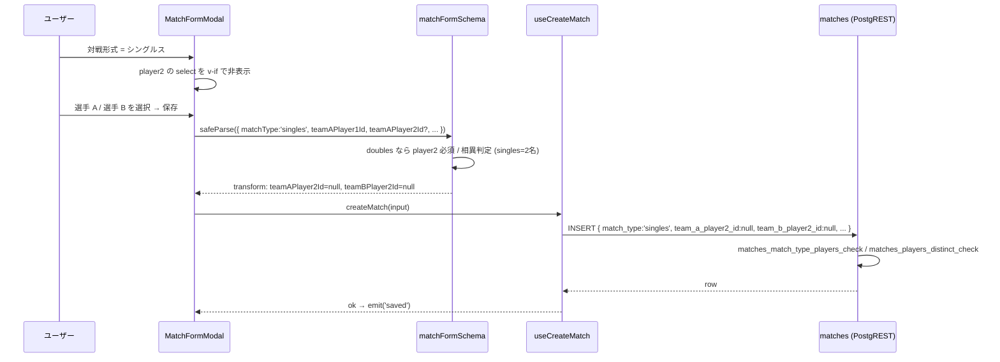
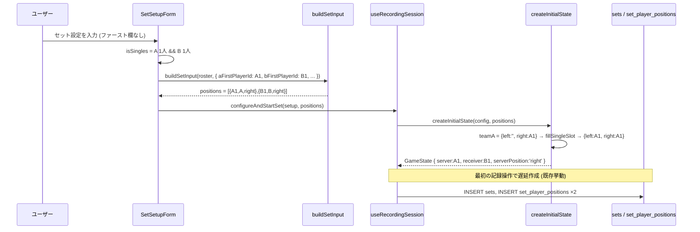
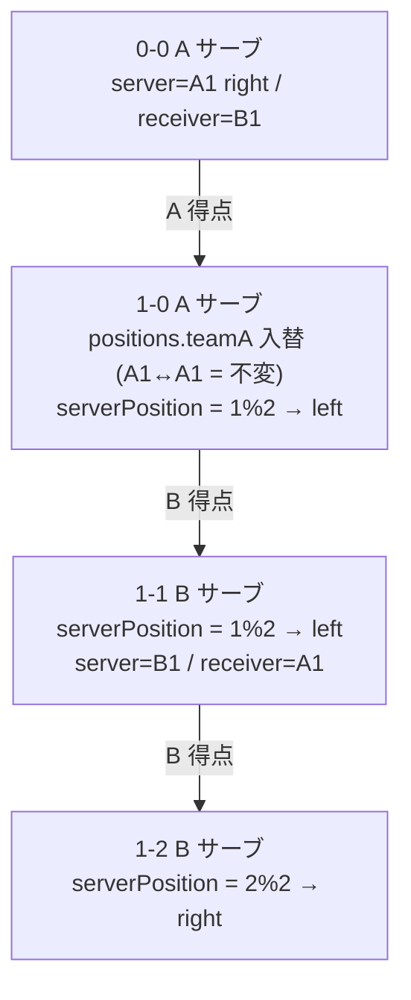
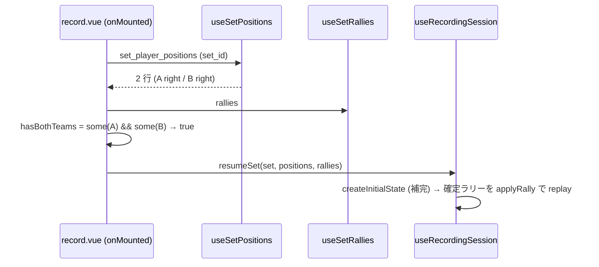
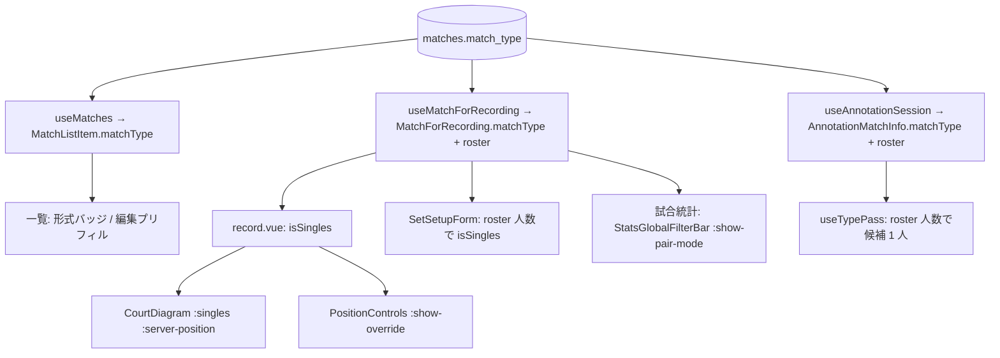

# singles-support データフロー図

**作成日**: 2026-08-28
**関連**: [architecture.md](architecture.md) / [requirements.md](../../spec/singles-support/requirements.md)

**【信頼性レベル凡例】** 🔵 確実 / 🟡 妥当な推測

## システム全体のデータフロー 🔵

形式の分岐点は「フォーム入力」「セット開始」「表示」の 3 箇所だけ。中央の記録・注釈・統計は形式を意識しない。



## 機能1: 試合の作成（シングルス） 🔵



## 機能2: セット開始（立ち位置）とルールエンジン初期化 🔵



## 機能3: ラリー進行（サーブ位置の偶奇） 🔵



`applyRally` は無変更。`rallies` の denorm 列（`server_position` / `server_player_id` / `receiver_player_id`）もダブルスと同じ写像で保存される。

## 機能4: 再開（リロード） 🔵



## 機能5: 注釈（種別パス）の打者自動確定 🔵

```mermaid
flowchart TD
    K[種別キー入力 3打目以降] --> C{hitterCandidates.length}
    C -->|2 doubles| W[awaitingHitter = true<br/>1/2 キーで選択]
    C -->|1 singles| P[patch { shotType, hitPlayerId: 唯一の選手 }] --> A[advance]
    W --> SH[selectHitter] --> A
```

`hitterTeam` は従来どおり打順の偶奇（奇数打 = サーブ側）で確定。ロスターが 2 人なので候補が 1 人になる。

## 機能6: 統計（player2 NULL の扱い） 🔵

```mermaid
flowchart LR
    M[(matches<br/>player2 = null)] --> PR[stats_pair_rates<br/>match_pairs: player2 IS NOT NULL → 除外]
    M --> RE[stats_rally_endings / tempo<br/>4 列を出力 (player2 = null)]
    RE --> CL[endings.ts / flow.ts<br/>filter(id !== null) → teamA = [A1]]
    M --> SH[shot_stats 系<br/>hit_player_id IN (a1, NULL) → a1 のみ一致]
    PR --> UI1[Group 統計 ペア別: ダブルスのみ]
    CL --> UI2[選手別: 通常どおり]
```

## 状態管理フロー（形式の伝播） 🔵



## 信頼性レベルサマリー

🔵 青信号: 全フロー（プロトタイプ実装で検証済み）
