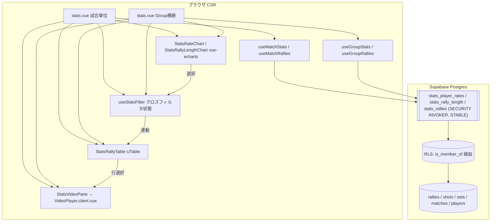

# stats-dashboard アーキテクチャ設計

**作成日**: 2026-06-08
**関連要件定義**: [requirements.md](../../spec/stats-dashboard/requirements.md)
**ヒアリング記録**: [design-interview.md](design-interview.md)

**【信頼性レベル凡例】**:
- 🔵 **青信号**: EARS要件定義書・設計文書・ユーザヒアリングを参考にした確実な設計
- 🟡 **黄信号**: 妥当な推測による設計
- 🔴 **赤信号**: 出典のない推測による設計

---

## システム概要 🔵

**信頼性**: 🔵 *requirements.md §概要*

録画系テーブルに蓄積された denormalize 済みデータを **集計（読み取り専用 RPC）→ 可視化（vue-echarts）→ クロスフィルタ → 埋め込み再生** するインタラクティブな分析画面。MVP 最終ユニットで、上流（data-foundation / match-recording / video-playback / rule-engine）の成果物を**読み取り専用で消費**する。書き込み・既存スキーマ変更は行わず、集計用の**読み取り専用 RPC を additive migration で追加**するのみ。

2 つのダッシュボードを提供する:
- **試合単位** `/groups/[id]/matches/[matchId]/stats`：1 試合。チャート＋ラリーテーブル＋埋め込みプレーヤーが共存し、クロスフィルタで連動。
- **Group 横断** `/groups/[id]/stats`：複数試合を跨いだ **選手別 / ペア別**（同じ 2 選手の組）累計（REQ-012）。初期はチャートのみ、絞り込み後にラリーテーブルをサーバー側フィルタで取得。

**フィルタ・集計のキーは選手（player_id）／ペア（player_id の組）であり、チーム A/B は軸にしない**（A/B は試合ごとの便宜ラベル。serve/receive 判定の内部利用のみ, ヒアリング2026-06-09）。per-match の「チーム視点」も実際の 2 ペア（選手名）として表示し、ペア → 個人へドリルダウン（REQ-004）。

## アーキテクチャパターン 🔵

**信頼性**: 🔵 *ADR-007 / ADR-010 / 既存単位（match-recording / video-playback）の構成*

- **パターン**: Nuxt 4 の「**ページ → 操作別 composable（Read）→ 集計 RPC（SQL）/ PostgREST**」レイヤード構成。純ロジックは `app/utils/stats-dashboard/` に分離（ADR-007）。
- **集計の所在**: 得点率・ラリー長・ラリー行は **Postgres 側の読み取り専用 RPC**（`SECURITY INVOKER` + `STABLE`）で算出。RLS が呼び出しユーザーに自然適用されるため他 Group は混入しない（NFR-002 / REQ-408）。
- **選択理由**: ① データエンジニアである利用者の SQL 資産を活かせる ② Group 横断（大量データ）でもクライアントへ生行を全ロードせず集計済みを返せる ③ 集計定義を 1 箇所（SQL）に集約でき UI から重複しない。

## コンポーネント構成

### フロントエンド 🔵

**信頼性**: 🔵 *CLAUDE.md / 既存実装パターン*

- **フレームワーク**: Nuxt 4 (Vue 3, `<script setup lang="ts">`) + Nuxt UI（`UTable` 等）
- **チャート**: **echarts + vue-echarts**（PRD §6 指定, REQ-406）。CSR 限定のため client plugin（`app/plugins/echarts.client.ts`）でツリーシェイク登録（BarChart / LineChart / ScatterChart + 必要 component）。`<ClientOnly>` でラップ。
- **状態管理**: composable のローカル ref（クロスフィルタ状態 `useStatsFilter`）。グローバルストアは導入しない（既存単位と同様）。
- **再生**: 既存 `useVideoPlayer` + `VideoPlayer.client.vue`（timeline/overlay スロット）を再利用。stats 用ラッパ `StatsVideoPane.vue` を追加。
- **ルーティング**: file-based。`/groups/[id]/matches/[matchId]/stats`・`/groups/[id]/stats`。

### バックエンド（集計層） 🔵

**信頼性**: 🔵 *requirements.md NFR-002 / REQ-408 + database-schema.sql の既存規約*

- **DB アクセス**: `@nuxtjs/supabase` の `useSupabaseClient<Database>()`。集計は `client.rpc(...)`、補助的な行取得は PostgREST `.from().select()`。
- **集計 RPC（新設・読み取り専用）**:
  - `stats_player_rates(p_match_id, p_group_id)` — 選手別 サービス/レシーブ 得点率の母数・分子
  - `stats_pair_rates(p_match_id, p_group_id)` — **ペア別**（同一チームの 2 選手）サービス/レシーブ 得点率。試合のチーム構成から無向ペアを導出し、ペアの所属チームが serving_team のラリーを集計（REQ-012）
  - `stats_rally_length(p_match_id, p_group_id)` — ラリー長別の本数分布 + サーブ側勝数
  - `stats_rallies(p_match_id, p_group_id, filters…, limit, offset)` — ラリー行（テーブル/クロスフィルタ/再生用、shot 数集計込み）。filters は 1 選手（server/receiver）またはペア（2 選手の所属チーム）を含む（REQ-012）
- **認可方式**: 既存 Supabase Auth（middleware で Group 所属を担保）。RPC は `SECURITY INVOKER` で RLS を継承（`is_member_of(matches.group_id)` 経由）。`SET search_path = public` を付与（既存 SECURITY 関数規約と整合）。

### データベース 🔵

**信頼性**: 🔵 *initial_schema.sql（確定済）+ requirements.md REQ-402*

- **DBMS**: PostgreSQL (Supabase)。
- **スキーマ変更**: **既存テーブルは不変**。`supabase/migrations/<ts>_stats_dashboard_read_functions.sql` で **RPC 3 本 + GRANT のみ**追加（additive、CI 適用＝`db:push`、ローカル不可, [[feedback_db_password_ci_only]]）。
- **読み取り対象**: `rallies`（denormalize 列）/ `shots`（count）/ `sets` / `matches`（video ソース）/ `players`（表示名）。詳細は [database-schema.sql](database-schema.sql)。

## システム構成図



**信頼性**: 🔵 *requirements.md + 既存構成*

## ディレクトリ構造 🔵

**信頼性**: 🔵 *既存プロジェクト構造*

```
app/
├── pages/groups/[id]/
│   ├── stats.vue                         # Group 横断ダッシュボード
│   └── matches/[matchId]/stats.vue       # 試合単位ダッシュボード
├── components/stats/
│   ├── StatsRateChart.vue                # サービス/レシーブ得点率 (棒, 選択で絞り込み)
│   ├── StatsRallyLengthChart.vue         # ラリー長 本数分布(棒)+勝率(線) コンボ
│   ├── StatsRallyTable.vue               # ラリー一覧 (UTable, 行選択で再生)
│   ├── StatsVideoPane.vue                # VideoPlayer ラッパ (timeline にラリー区切り)
│   └── StatsEmptyState.vue               # 空状態 (REQ-103/201)
├── composables/
│   ├── useMatchStats.ts                  # 試合単位 集計 RPC (player/pair rates + rally_length)
│   ├── useMatchRallies.ts                # 試合単位 ラリー行 (stats_rallies, クライアント絞り込み元)
│   ├── useGroupStats.ts                  # Group 横断 集計 RPC (選手別/ペア別, REQ-012)
│   ├── useGroupRallies.ts                # Group 横断 ラリー行 (絞り込み後にサーバー側取得)
│   └── useStatsFilter.ts                 # クロスフィルタ状態 (選手/ペア/チーム/役割/ラリー長) + 適用
├── utils/stats-dashboard/
│   ├── compute-player-rate.ts            # 母数/分子 → {rate|null, denominator} (0除算→null)
│   ├── filter-rallies.ts                 # StatsFilter (選手/ペア×役割/ラリー長ビン, 全て player_id) を RallyRow[] に適用 (per-match)
│   ├── to-rate-series.ts                 # RPC 行 → echarts シリーズ (選手別/ペア別)
│   ├── rally-length-bins.ts              # ビン定義 + ショット数粒度→ビン集約 + binsToRanges (複数選択→OR範囲)
│   └── to-rally-length-series.ts         # ビン → 本数(棒)+勝率(線) シリーズ
├── plugins/echarts.client.ts             # vue-echarts 登録 (ツリーシェイク, CSR)
└── types/stats-dashboard.ts              # 型 (docs/design/stats-dashboard/interfaces.ts と同期)

supabase/migrations/
└── <ts>_stats_dashboard_read_functions.sql   # RPC 3本 + GRANT (additive, CI 適用)
```

## 非機能要件の実現方法

### パフォーマンス 🔵

**信頼性**: 🔵 *NFR-001 + ヒアリング2026-06-08*

- **チャート初期表示 3 秒以内（NFR-001）**: 集計を Postgres 側 RPC で実施し転送量を最小化。echarts は client plugin で必要モジュールのみ import。
- **Group 横断のラリーテーブル**: 初期はチャートのみ。**絞り込み条件が選ばれて初めて** `stats_rallies` を **サーバー側フィルタ + `LIMIT`** で取得（大量ロード回避, ヒアリング2026-06-08）。
- **試合単位のクロスフィルタ**: ラリー行は小規模のため一度 `stats_rallies(p_match_id)` で取得し、以降の絞り込みは**クライアント側**（往復なし）。

### セキュリティ 🔵

**信頼性**: 🔵 *NFR-101 / REQ-403 / REQ-408 + database-schema.sql RLS*

- RPC は `SECURITY INVOKER` で RLS を継承し、他 Group のデータを集計・返却しない（`rallies/sets/matches` の FK 経由 `is_member_of`）。
- 全 RPC に `SET search_path = public`（search_path 攻撃防御。既存 SECURITY 関数と方針統一）。
- RPC は読み取り専用（`STABLE`、`SELECT` のみ）。書き込み・DDL を含まない（REQ-401）。
- スコープ引数の検証（`p_match_id` / `p_group_id` のいずれか一方必須）。不正は `invalid_scope` を `RAISE`。

### スケーラビリティ 🟡

**信頼性**: 🟡 *ヒアリング2026-06-08 + 一般的な妥当推測*

- 公開 SaaS 化（ADR-013）でデータ量が増えても、集計が SQL 側のため「生行を全ロードしてクライアント集計」のボトルネックを回避できる。
- 既存インデックス（`idx_rallies_set_id` / `idx_shots_rally_id` / `idx_sets_match_id` / `idx_matches_group_id`）が集計 JOIN を支える。追加インデックスは性能計測後に判断（MVP では不要と判断, 🟡）。

### 可用性 🟡

**信頼性**: 🟡 *一般方針*

- 読み取り専用のため整合性リスクは低い。RPC 失敗時はトースト/空状態にフォールバック（既存 `useNoticeErrors` パターン）。

## 技術的制約

### 制約 🔵

**信頼性**: 🔵 *requirements.md 制約要件 + ADR*

- **読み取り専用**（REQ-401）: 録画系テーブルへ INSERT/UPDATE/DELETE しない。
- **既存スキーマ不変**（REQ-402）: 列追加・新規テーブルなし。RPC 追加のみ。
- **CSR 限定**（REQ-404 / ADR-010）: Supabase クライアント取得・echarts 描画はクライアント側。
- **依存方向**（REQ-405 / ADR-002）: stats-dashboard → video-playback の一方向。video-playback にドメイン概念を持ち込まない。
- **チャート**（REQ-406）: vue-echarts を用いる。
- **migration 適用**（REQ-408 / [[feedback_db_password_ci_only]]）: CI 経由（`db:push`）。ローカル不可。型再生成は gen-types CI が自動（[[project_gen_types_automation]]）。

## ショット種別/打者分析の不在（重要な前提） 🔵

**信頼性**: 🔵 *requirements.md §含まない + initial_schema.sql shots 定義*

`shots` に種別・打者列が無いため、ショット分析は **ラリー長（shot 本数）** に限定。種別/打者分析は将来（AI）拡張で、集計層を拡張可能に保つ（REQ-302）。

## 関連文書

- **データフロー**: [dataflow.md](dataflow.md)
- **型定義**: [interfaces.ts](interfaces.ts)
- **DBスキーマ（集計 RPC）**: [database-schema.sql](database-schema.sql)
- **API/RPC 仕様**: [api-endpoints.md](api-endpoints.md)
- **要件定義**: [requirements.md](../../spec/stats-dashboard/requirements.md)

## 信頼性レベルサマリー

- 🔵 青信号: 22 件 (88%)
- 🟡 黄信号: 3 件 (12%)
- 🔴 赤信号: 0 件 (0%)

**品質評価**: 高品質
