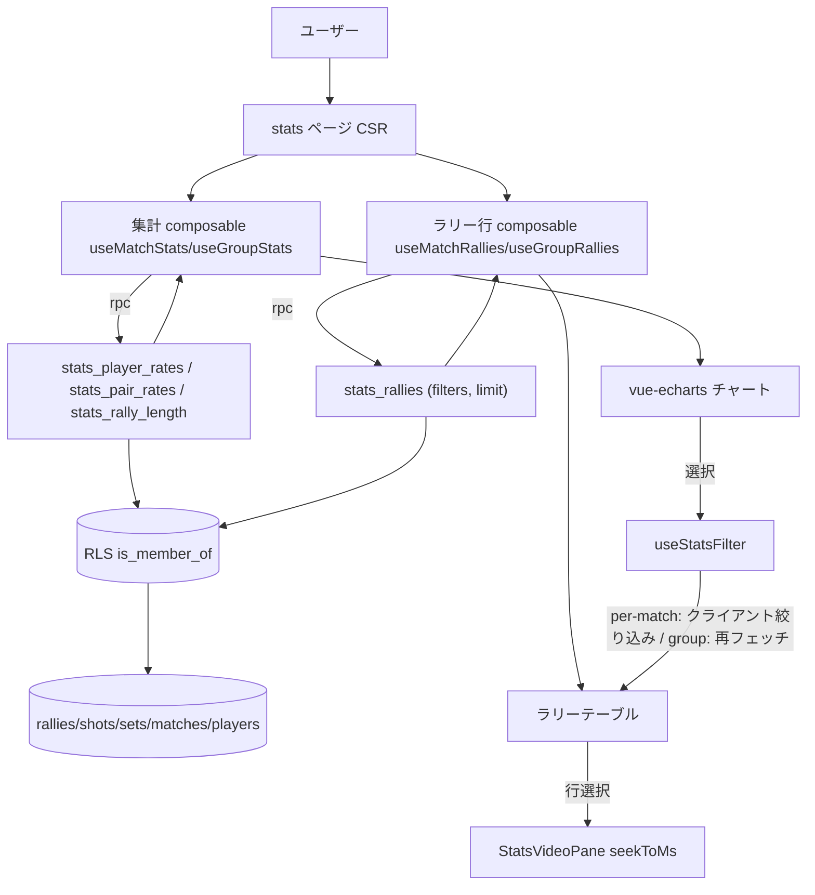
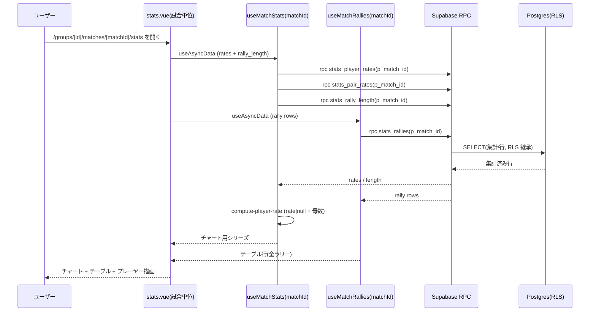
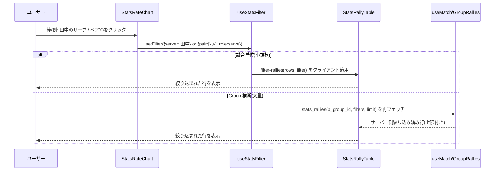
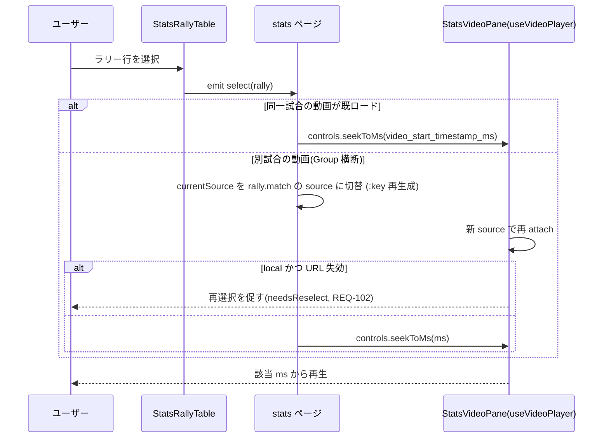
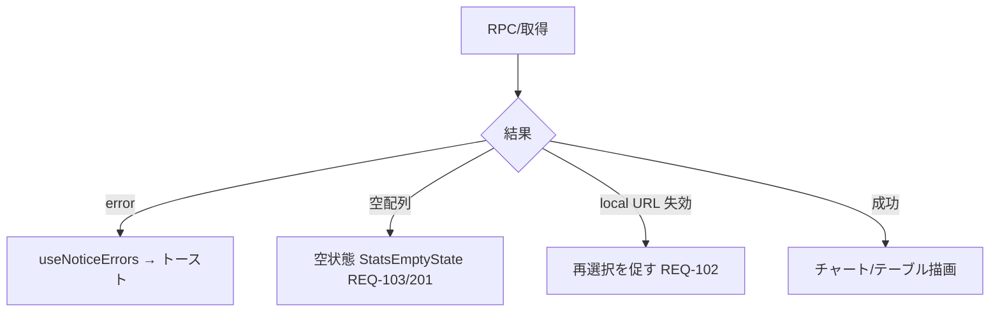
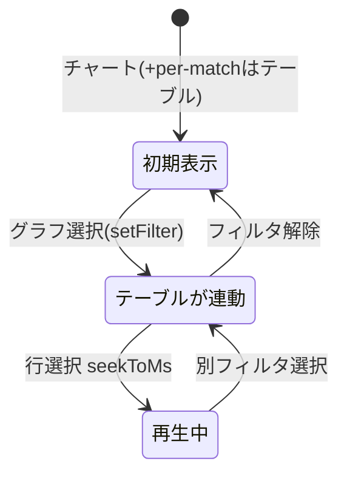

# stats-dashboard データフロー図

**作成日**: 2026-06-08
**関連アーキテクチャ**: [architecture.md](architecture.md)
**関連要件定義**: [requirements.md](../../spec/stats-dashboard/requirements.md)

**【信頼性レベル凡例】**:
- 🔵 **青信号**: EARS要件定義書・設計文書・ユーザヒアリングを参考にした確実なフロー
- 🟡 **黄信号**: 妥当な推測によるフロー
- 🔴 **赤信号**: 出典のない推測によるフロー

---

## システム全体のデータフロー 🔵

**信頼性**: 🔵 *requirements.md + architecture.md*



## 主要機能のデータフロー

### 機能1: 試合単位ダッシュボードの初期表示 🔵

**信頼性**: 🔵 *REQ-001/003/005/006 + 受け入れ基準 TC-003-01/005-01*

**関連要件**: REQ-001, REQ-003, REQ-005, REQ-006



**詳細ステップ**:
1. ページ mount で集計 RPC（選手別/ペア別 rate・ラリー長）とラリー行 RPC を並行取得。
2. `compute-player-rate` が母数 0 を `null`（「-」表示）に変換（EDGE-001 / REQ-202）。
3. 確定ラリーのみ集計（`is_let=false ∧ point_winner IS NOT NULL ∧ is_point_confirmed=true`）— SQL 側で除外（REQ-101）。
4. ラリーテーブルは**全ライブラリー**を表示（レット/未確定も結果列で区別、REQ-006）。
5. データ 0 件なら空状態（REQ-103/201）。

### 機能2: クロスフィルタ（グラフ → テーブル連動）🔵

**信頼性**: 🔵 *REQ-010 + ヒアリング2026-06-08*

**関連要件**: REQ-010, REQ-004, REQ-012



**詳細ステップ**:
1. チャートの要素クリックで `useStatsFilter` の状態を更新（次元: 選手 / ペア（いずれも player_id）/ 役割 serve|receive / ラリー長ビン）。チーム A/B は軸にしない（ヒアリング2026-06-09）。
   - **ラリー長ビンは複数選択可**。選んだビンの和集合で絞る（例: 1〜3 と 4〜6 → 1〜6, ヒアリング2026-06-09）。
   - **ペア / 選手は役割（serve/receive）と連動**（「ペアX のサーブ時」= ペアX が serving 側のラリー, ヒアリング2026-06-09）。
2. **試合単位**: 既読のラリー行に `filter-rallies` をクライアント適用（往復なし）。
3. **Group 横断**: 初期はテーブル非表示。フィルタ確定で `stats_rallies`（`p_role` / `p_shot_ranges`(jsonb) 等）をサーバー側で評価し `LIMIT` 取得（ヒアリング2026-06-08/09）。
4. フィルタ解除でテーブルは全件（per-match）/ 非表示（group 初期）へ戻る。

### 機能3: ラリー再生（テーブル → 埋め込みプレーヤー）🔵

**信頼性**: 🔵 *REQ-007/011/104 + video-playback 契約*

**関連要件**: REQ-007, REQ-011, REQ-104, EDGE-103



**詳細ステップ**:
1. 行選択で `selectedRally` を更新。`video_start_timestamp_ms` が `null` の行は非選択（EDGE-103）。
2. rally の試合が現在ソースと異なる場合（Group 横断）、`currentSource` を切替え `VideoPlayer.client.vue` を `:key` で再生成（`youtube`=ソース切替 / `local`=方式 A 再選択, REQ-104）。
3. 同一試合なら `seekToMs` のみ（往復なし）。

### 機能4: ペア / 選手フィルタの導出（Group 横断）🔵

**信頼性**: 🔵 *REQ-012 + ヒアリング2026-06-08*

**関連要件**: REQ-002, REQ-012

```mermaid
flowchart TD
    A[stats_pair_rates p_group_id] --> B{各試合の team 構成から無向ペア導出}
    B --> C[ペア = team_a {p1,p2} / team_b {p3,p4}]
    C --> D[ペアの所属チーム = serving_team のラリーを集計]
    D --> E[ペア別 serve/receive 得点率 + 母数]
    F[stats_player_rates p_group_id] --> G[選手別 serve/receive 得点率 + 母数]
    E --> H[Group 横断チャート: ペア別/選手別 切替]
    G --> H
```

**詳細ステップ**:
1. ペアは試合のチーム構成（`matches.team_*_player*`）から無向 2 選手集合として導出（同じ 2 人が複数試合で組めば累計）。
2. ペアの得点率 = ペアの所属チームが `serving_team` のラリーを集計（serve）/ 相手が serving のラリー（receive）。
3. UI はチャートで「選手別 / ペア別」を切替え、選択でクロスフィルタ（機能2）に渡す。

## データ処理パターン

### 同期/非同期 🔵

**信頼性**: 🔵 *architecture.md*

- データ取得は `useAsyncData`（非同期, CSR）。集計は SQL 側で完結する単発 RPC。
- クロスフィルタ（per-match）は同期的なクライアント計算（`filter-rallies`）。

### バッチ処理 🔵

**信頼性**: 🔵 *requirements.md §含まない*

- 事前集計テーブル / マテビューは持たない（MVP は都度 RPC 集計）。将来データ量増で検討（🟡）。

## エラーハンドリングフロー 🟡

**信頼性**: 🟡 *既存 useNoticeErrors / cross-cutting error-handling から妥当な推測*



## 状態管理フロー 🔵

**信頼性**: 🔵 *ADR-007 + useStatsFilter 設計*



## データ整合性 🔵

**信頼性**: 🔵 *REQ-401 読み取り専用*

- 書き込みが無いためトランザクション・ロックは不要。RPC は `STABLE`（同一トランザクション内一貫読み取り）。

## 関連文書

- **アーキテクチャ**: [architecture.md](architecture.md)
- **型定義**: [interfaces.ts](interfaces.ts)
- **DBスキーマ**: [database-schema.sql](database-schema.sql)
- **API/RPC 仕様**: [api-endpoints.md](api-endpoints.md)

## 信頼性レベルサマリー

- 🔵 青信号: 13 件 (87%)
- 🟡 黄信号: 2 件 (13%)
- 🔴 赤信号: 0 件 (0%)

**品質評価**: 高品質
