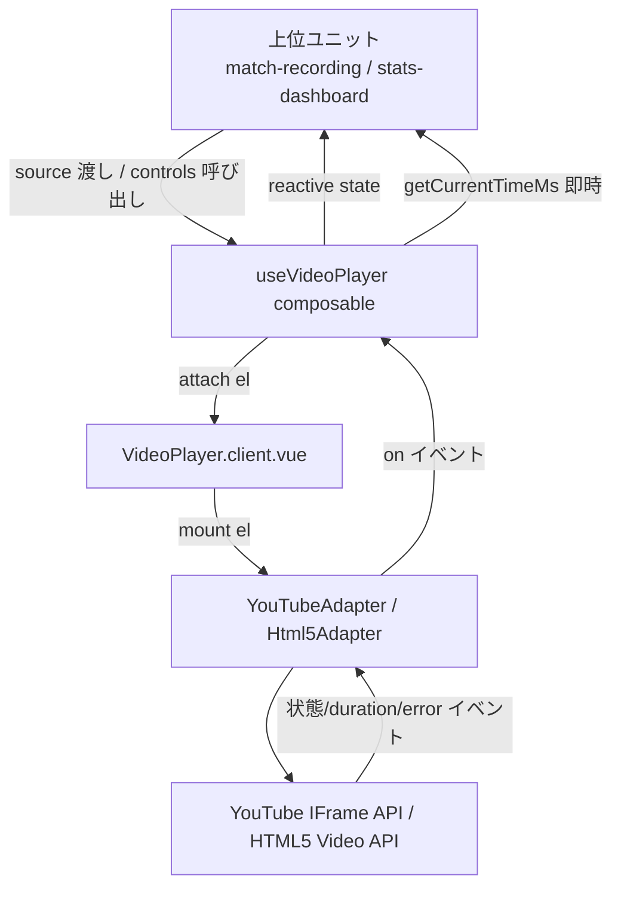
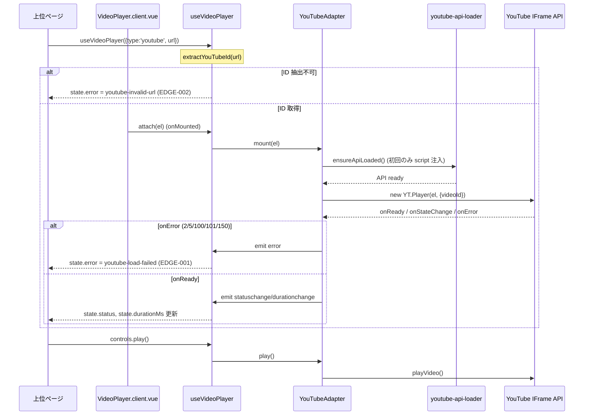
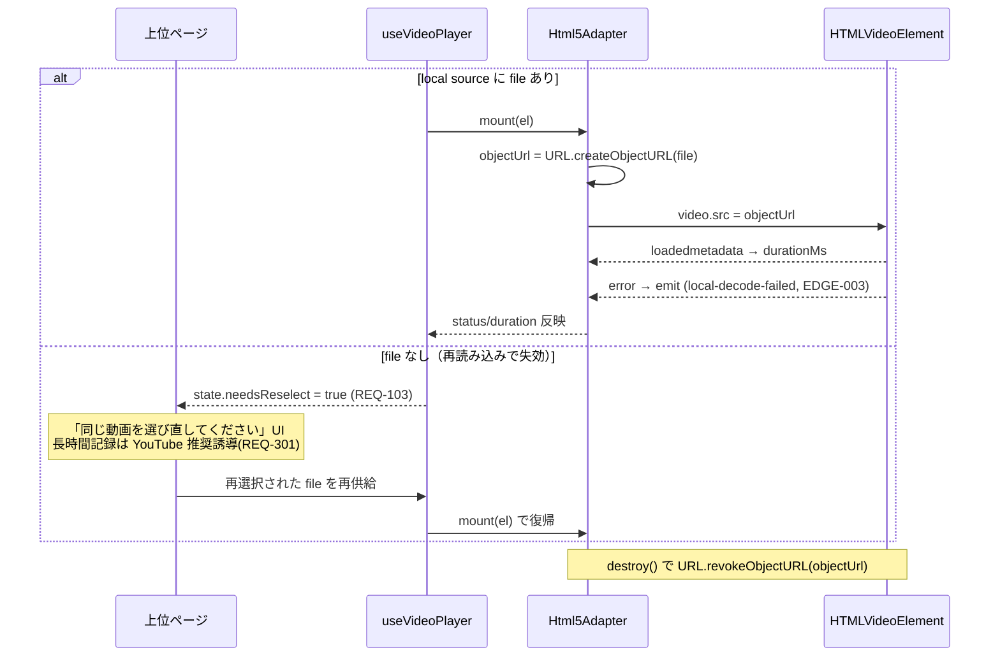
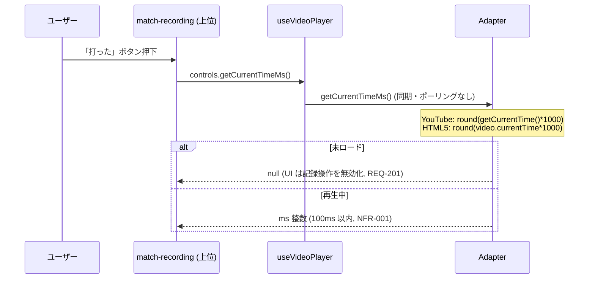
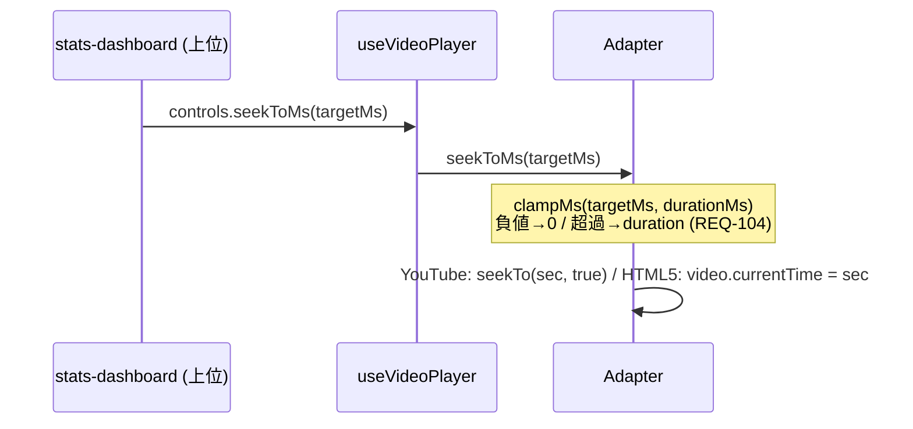
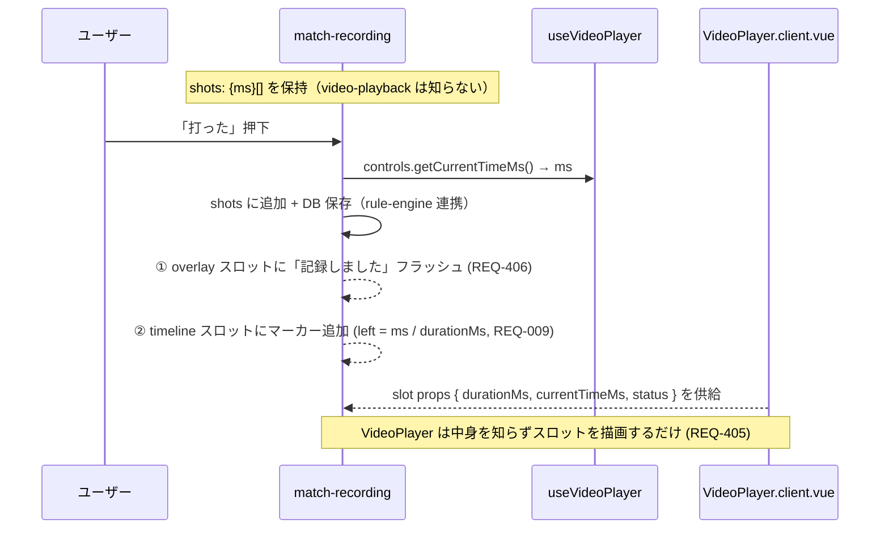
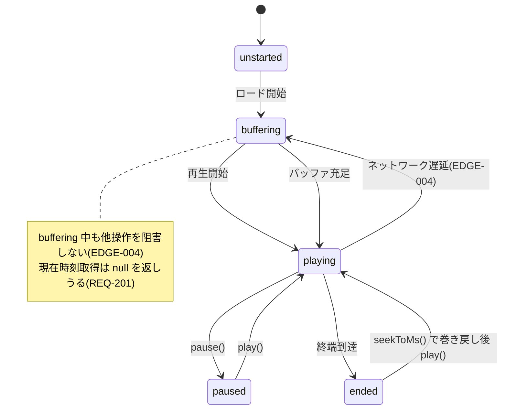
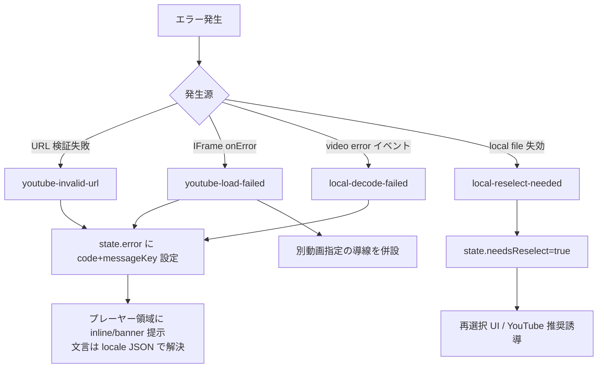

# video-playback データフロー図

**作成日**: 2026-06-01
**関連アーキテクチャ**: [architecture.md](architecture.md)
**関連要件定義**: [requirements.md](../../spec/video-playback/requirements.md)

**【信頼性レベル凡例】**:
- 🔵 **青信号**: EARS要件定義書・設計文書・ADR・ユーザヒアリングを参考にした確実なフロー
- 🟡 **黄信号**: 妥当な推測によるフロー
- 🔴 **赤信号**: 上記資料にない推測によるフロー

---

## システム全体のデータフロー 🔵

**信頼性**: 🔵 *architecture.md / requirements.md*

## 主要フロー

### フロー1: YouTube 動画のロードと再生 🔵

**信頼性**: 🔵 *user-stories 1.1 / REQ-101 / EDGE-001,002*
**関連要件**: REQ-001, REQ-101, EDGE-001, EDGE-002

### フロー2: ローカル動画のロードと再選択 🔵

**信頼性**: 🔵 *user-stories 1.2 / REQ-102,103 / EDGE-003*
**関連要件**: REQ-102, REQ-103, EDGE-003, NFR-101

### フロー3: 「打った」瞬間の現在時刻取得（記録経路） 🔵

**信頼性**: 🔵 *user-stories 2.1 / REQ-004,202 / NFR-001*
**関連要件**: REQ-004, REQ-202, REQ-201, NFR-001

### フロー4: 指定位置へのジャンプ（シーク） 🔵

**信頼性**: 🔵 *user-stories 2.2 / REQ-005,104 / EDGE-101*
**関連要件**: REQ-005, REQ-104, EDGE-101

### フロー5: 「打った痕跡」のオーバーレイ表示（責務境界） 🔵

**信頼性**: 🔵 *requirements.md REQ-008/009/405/406 / ユーザヒアリング 2026-06-01*
**関連要件**: REQ-008, REQ-009, REQ-405, REQ-406

video-playback はスロットと slot props（durationMs/currentTimeMs）だけを提供し、match-recording がショット意味づけと描画を担う。依存は一方向。

## 状態遷移 🔵

**信頼性**: 🔵 *REQ-007 / EDGE-004*

## エラーハンドリングフロー 🔵

**信頼性**: 🔵 *cross-cutting/error-handling カテゴリ D・決定木*

## 関連文書

- **アーキテクチャ**: [architecture.md](architecture.md)
- **型定義**: [interfaces.ts](interfaces.ts)
- **要件定義**: [requirements.md](../../spec/video-playback/requirements.md)

## 信頼性レベルサマリー

- 🔵 青信号: 全フロー（要件 🔵 100% から導出）
- 🟡 黄信号: 0
- 🔴 赤信号: 0

**品質評価**: 高品質
