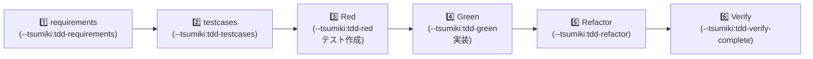

# TASK-0012 開発コンテキストノート

**タスク**: useGenerateInvitation + useListInvitations (招待リンク一覧・発行 composable)
**作成日**: 2026-06-01
**フェーズ**: Phase 2 - ドメインロジック層

---

## 1. 技術スタック

### 使用技術・フレームワーク
- **Nuxt 4** (Vue 3 Composition API + `<script setup lang="ts">`)
- **TypeScript** (strict mode)
- **Supabase** (`useSupabaseClient<Database>()` 型付き呼び出し)
- **@nuxt/test-utils** + **Vitest** (mock unit テスト、ADR-012 D5)
- **Nuxt UI** コンポーネント
- **@nuxtjs/i18n** (日本語ローカライゼーション、NFR-204)

### アーキテクチャパターン
- **Composable** (Vue 3 Composition API 推奨、ADR-007)
- **useAsyncData** (Nuxt キャッシュ機構、ADR-008 D4 / NFR-002)
- **ActionResult パターン** (`{ data, error }` Supabase native)
- **一過性 toast チャネル** (`useToast` / `useToastErrors`, error-handling.md §6.5)
- **同一 useAsyncData キー共有** (composable 間キー共有で refresh 効果を統一)

**参照元**: 
- docs/design/auth-onboarding/architecture.md
- docs/design/auth-onboarding/interfaces.ts
- docs/design/cross-cutting/error-handling.md

---

## 2. 開発ルール

### プロジェクト固有ルール
- **composable は業務ロジック層**: UI 層 (page/component) から分離し、直接 Supabase を呼ばない
- **Write composable は `pending` 必須**: 二重送信防止 (EDGE-003)
- **エラーチャネル分離** (error-handling.md §6.5 代表例 #5):
  - **フィールド検証**: `useFormErrors` + `<UFormField>` inline
  - **永続通知**: `useNoticeErrors` + `<UAlert>` (auth 等)
  - **一過性 toast**: `useToastErrors().showError()` / `useToast().add()` (招待発行・成功等)
- **同一 useAsyncData キー共有**: `useListInvitations(groupId).refresh()` が `useGenerateInvitation` から呼ばれる場合、キー `'invitations-list:{groupId}'` 一致が必須 (ADR-007 D2-3/D5-4)
- **UI 派生値**: `group_invitations` に `status` 列は無く、`expires_at < now()` で **UI が算出** する
- **deleted_at フィルタ**: MVP に削除機能はないが、ソフトデリート前提で `deleted_at is null` を明示選択

### コーディング規約 (CLAUDE.md)
- Vue SFC: `<script setup lang="ts">` のみ (Options API 禁止)
- ESLint: 1tbs (1True Brace Style)、comma dangle 禁止
- TypeScript: strict mode、auto-import 利用
- Composable 命名: `use*` prefix
- 相対パス import: `~/types`, `~/composables`, `~/utils` 等を alias で統一

**参照元**: 
- CLAUDE.md
- docs/design/auth-onboarding/TASK-0012.md §完了条件・実装詳細

---

## 3. 関連実装

### 既存の類似 composable パターン

#### useCurrentGroup (TASK-0009)
- **機能**: ログイン中ユーザの所属 Group を 1 件読み取る Read
- **パターン**: `useAsyncData('current-group', async () => { ... })` 固定キー
- **位置づけ**: middleware と page で同一キー共有 (ADR-008 D4 / NFR-002)
- **エラー**: クエリエラー → throw → error.vue グローバルフォールバック
- **参考**: 
  - app/composables/useCurrentGroup.ts (実装)
  - docs/design/auth-onboarding/dataflow.md §1 (middleware フロー)

#### useToastErrors (TASK-0007)
- **機能**: エラーを toast で一過性表示する
- **パターン**: `errorToMessage()` で変換、`useToast().add({ title, color: 'error' })` 呼び出し
- **遅延評価**: `showError()` 内で `useToast()` を呼ぶ (テスト環境での mock 注入容易性)
- **参考**: app/composables/useToastErrors.ts (実装)

#### useErrorMessage (TASK-0007)
- **機能**: エラーオブジェクトを i18n 文言に変換
- **パターン**: APP_ERROR_CODES (app/types/error-codes.ts) → locales/ja.json マッピング
- **context 出し分け**: 'join_group' / 'create_group' / 'generic' (error-handling.md §4.1)

#### useCreateGroup (TASK-0010)
- **機能**: RPC `create_group_with_owner` を呼び、フィールド検証・一覧更新
- **パターン**: 
  - `useFormErrors()` で検証エラー収集
  - `useCurrentGroup().refresh()` で currentGroup cache 更新 (D5-4)
  - 成功/失敗の action result `{ data, error }` を返す
- **pending**: try/finally で制御
- **参考**: 
  - app/composables/useCreateGroup.ts (実装)
  - docs/design/auth-onboarding/dataflow.md §3 (sequence)

### テストユーティリティ

#### Mock 戦略 (ADR-012 D4)
- **vi.hoisted()**: TDZ 回避のため mock 変数を先に定義
- **vi.mock('#imports')**: Nuxt auto-import 丸ごと差し替え
- **vi.mock('#supabase-client')**: Nuxt Vite transform 対応の安定エイリアス (vitest.config.ts 定義済)
- **vi.mock('~/composables/*')**: composable ファイル直接 mock
- **beforeEach**: `vi.clearAllMocks()` + state リセット (TC 間漏れ防止)
- **参考**: tests/unit/composables/useCreateGroup.test.ts (テンプレート)

#### スパイ検証パターン
- RPC 呼び出し: `expect(rpcMock).toHaveBeenCalledWith('generate_invitation_code', { target_group_id })`
- チェーンメソッド: `.eq()` / `.is()` 等の mock chain が呼ばれたことを検証
- 一覧更新: `expect(refreshMock).toHaveBeenCalled()` (useListInvitations.refresh)
- toast 表示: `expect(toastAddMock).toHaveBeenCalledWith({ title: ... })`

---

## 4. 設計文書

### 型定義 (interfaces.ts)

#### Invitation (Pick 型)
```ts
type Invitation = Pick<
  Database['public']['Tables']['group_invitations']['Row'],
  'id' | 'code' | 'created_at' | 'expires_at'
>
```
- **SELECT 列**: `id, code, created_at, expires_at` のみ
- **status 列は無い**: 有効/期限切れは `expires_at < now()` で UI が派生算出
- **deleted_at フィルタ**: `deleted_at is null` で論理削除を除外

#### UseListInvitationsReturn
```ts
type UseListInvitationsReturn = AsyncState<Invitation[]>
// AsyncState<T> = { data: Ref<T|null>, pending: Ref<bool>, error: Ref<Error|null>, refresh: ()=>Promise<void> }
```

#### UseGenerateInvitationReturn
```ts
interface UseGenerateInvitationReturn {
  generate: (targetGroupId: string) => Promise<ActionResult<string>>
  pending: Ref<boolean>
}
// ActionResult<T> = { data: T|null, error: unknown }
```

#### AsyncState<T> (Read composable 共通)
- `data: Ref<T | null>` — クエリ結果
- `pending: Ref<boolean>` — ローディング状態
- `error: Ref<Error | null>` — クエリエラー
- `refresh: () => Promise<void>` — 手動更新 (D5-4)

**参照元**: docs/design/auth-onboarding/interfaces.ts

### Supabase スキーマ

#### group_invitations テーブル (app/types/supabase.ts)
```ts
{
  id: string
  code: string
  group_id: string
  created_at: string
  created_by: string
  expires_at: string
  deleted_at: string | null
  updated_at: string
}
```
- **RPC**: `generate_invitation_code({ target_group_id: string }) -> string` (8 hex code)
- **エラー応答**:
  - `not_a_member`: ユーザが target_group_id のメンバーではない (REQ-110)
  - `invitation_code_collision_after_retry`: リトライ後も衝突 (EDGE-008)

#### generate_invitation_code RPC
```ts
// supabase.ts 型定義
generate_invitation_code: {
  Args: { target_group_id: string }
  Returns: string  // 8 hex code
}
```
- **引数名**: `target_group_id` (composable も同じ名前で渡す)
- **戻り値**: code string (uuid ではなく 8 hex CSPRNG)
- **本体**: data-foundation で既に実装・検証済 (TASK-0012 は UI 層消費のみ)

**参照元**: app/types/supabase.ts

### エラー処理 (error-handling.md)

#### NOT_A_MEMBER 一過性 toast (REQ-110)
- **識別**: `error.message.includes('not_a_member')`
- **文言**: `locales/ja.json` → `errors.not_a_member`
- **チャネル**: `useToastErrors().showError(error)` → toast 一過性表示
- **UI**: toast のみ (page にエラー留め置きなし)

#### invitation_code_collision_after_retry 一過性 toast (EDGE-008)
- **識別**: `error.message.includes('invitation_code_collision_after_retry')`
- **文言**: `locales/ja.json` → `errors.invitation_code_collision_after_retry`
- **チャネル**: toast 一過性表示
- **原因**: 生成リトライ後も衝突 (稀)

#### 成功 toast (NFR-203/204)
- **文言**: 「招待リンクを発行しました」 → `locales/ja.json` に追加予定
- **チャネル**: `useToast().add({ title: ... })`
- **消滅**: 2 秒後 (Nuxt UI toast デフォルト)

**参照元**: 
- docs/design/cross-cutting/error-handling.md §6.5 代表例 #5
- app/composables/useToastErrors.ts

### データフロー

#### D5: 招待リンク発行フロー (dataflow.md §5)
1. page (`/groups/[id]/settings.vue`) が `useGenerateInvitation().generate(groupId)` 呼び出し
2. RPC `generate_invitation_code({ target_group_id })` → code string or error
3. 成功: `useListInvitations(groupId).refresh()` (同一キー) → 一覧キャッシュ更新
4. 成功: toast 「招待リンクを発行しました」
5. エラー (`not_a_member` / `invitation_code_collision_after_retry`): `showError(error)` → toast

#### D5-4: 同一キー refresh パターン
- `useListInvitations(groupId)` の useAsyncData キー: `'invitations-list:{groupId}'`
- `useGenerateInvitation().generate(targetGroupId)` 内で `useListInvitations(targetGroupId).refresh()` 呼び
- キー一致により、cache 無効化 → 再フェッチ → UI 自動更新

**参照元**: docs/design/auth-onboarding/dataflow.md §5 (sequence diagram)

---

## 5. テスト関連情報

### テストフレームワーク・設定

#### Vitest 設定 (vitest.config.ts)
```ts
export default defineVitestConfig({
  resolve: {
    alias: {
      '#nuxt-router': ROOT + '/node_modules/nuxt/dist/app/composables/router.js',
      '#supabase-client': ROOT + '/node_modules/@nuxtjs/supabase/dist/runtime/composables/useSupabaseClient.js',
      '#supabase-user': ROOT + '/node_modules/@nuxtjs/supabase/dist/runtime/composables/useSupabaseUser.js',
      '#async-data': ROOT + '/node_modules/nuxt/dist/app/composables/asyncData.js'
    }
  },
  test: {
    passWithNoTests: true,
    include: ['tests/unit/**/*.test.ts'],
    exclude: ['**/*.integration.test.ts', ...]
  }
})
```
- **mock unit**: tests/unit/ (pre-commit + CI)
- **integration**: tests/integration/ (CI 専用)
- **fileParallelism**: false 必須 (shared DB の cross-file 干渉対策)

#### Integration テスト設定 (vitest.integration.config.ts)
- 共有 DB でのテスト (generate_invitation_code RPC 本体検証)
- data-foundation で既に検証済 → TASK-0012 は **mock unit のみ** (ADR-012 D2)

**参照元**: 
- vitest.config.ts
- vitest.integration.config.ts

### テスト構成・命名パターン

#### ディレクトリ構成
```
tests/
  unit/
    composables/
      useGenerateInvitation.test.ts
      useListInvitations.test.ts
      useCreateGroup.test.ts (参考)
      useErrorMessage.test.ts (参考)
  integration/
    rpc.integration.test.ts
    rls.integration.test.ts
```

#### ファイル命名
- **Mock unit**: `{composable-name}.test.ts`
- **Integration**: `{feature}.integration.test.ts`

### テストケース (TASK-0012)

#### TC1: useListInvitations が一覧を返す 🔵
- **要件**: REQ-006 + interfaces.ts Invitation
- **given**: `select(...).eq(...).is('deleted_at', null)` チェーンが `{ data: [{ id, code, created_at, expires_at }], error: null }` 返す
- **when**: `useListInvitations('g1')` の handler 解決
- **then**: `data.value` が `Invitation[]` (1 件) / `eq('group_id', 'g1')` と `is('deleted_at', null)` で呼ばれた
- **ファイル**: `tests/unit/composables/useListInvitations.test.ts`

#### TC2: useGenerateInvitation 成功 → refresh 呼出 + 成功 toast 🔵
- **要件**: REQ-007 + dataflow.md §5 D5-4
- **given**: `rpc` が `{ data: 'a1b2c3d4', error: null }` 返す
- **when**: `generate('g1')` 呼び出し
- **then**: 
  - `rpc` が `('generate_invitation_code', { target_group_id: 'g1' })` で呼ばれた
  - `useListInvitations('g1').refresh` が呼ばれた
  - 成功 toast (`toast.add`) が出た
- **ファイル**: `tests/unit/composables/useGenerateInvitation.test.ts`

#### TC3: not_a_member → toast 🔵
- **要件**: REQ-110 + error-handling.md §6.5 代表例 #5
- **given**: `rpc` が `{ data: null, error: { message: 'not_a_member' } }` 返す
- **when**: `generate('g1')` 呼び出し
- **then**: 
  - `showError(error)` が呼ばれた (NOT_A_MEMBER 一過性 toast)
  - `refresh` と成功 toast は呼ばれない
- **ファイル**: `tests/unit/composables/useGenerateInvitation.test.ts`

### Mock 設定テンプレート

#### useListInvitations mock
```ts
const { selectMock, eqMock, isMock } = vi.hoisted(() => {
  const isMock = vi.fn().mockResolvedValue(undefined)
  const eqMock = vi.fn().mockReturnValue({ is: isMock })
  const selectMock = vi.fn().mockReturnValue({ eq: eqMock })
  
  return { selectMock, eqMock, isMock }
})

vi.mock('#imports', async (importOriginal) => {
  const vue = await importOriginal<typeof import('vue')>()
  return {
    ref: vue.ref,
    useSupabaseClient: () => ({
      from: () => ({ select: selectMock })
    })
  }
})
```

#### useGenerateInvitation mock
```ts
const { rpcMock, refreshMock, showErrorMock, toastAddMock } = vi.hoisted(() => ({
  rpcMock: vi.fn(),
  refreshMock: vi.fn().mockResolvedValue(undefined),
  showErrorMock: vi.fn(),
  toastAddMock: vi.fn()
}))

vi.mock('#imports', async (importOriginal) => {
  const vue = await importOriginal<typeof import('vue')>()
  return {
    ref: vue.ref,
    useSupabaseClient: () => ({ rpc: rpcMock }),
    useToastErrors: () => ({ showError: showErrorMock }),
    useToast: () => ({ add: toastAddMock }),
    useListInvitations: (groupId: string) => ({ refresh: refreshMock })
  }
})
```

**参照元**: 
- tests/unit/composables/useCreateGroup.test.ts (詳細テンプレート)

---

## 6. 注意事項

### 技術的制約

#### group_invitations に status 列は無い ⚠️
- DB スキーマ: `id, code, created_at, expires_at, created_by, group_id, deleted_at, updated_at`
- **UI 派生値**: `expires_at < now()` で有効/期限切れを算出 (**DB 列を探さない**)
- **Invitation 型**: Pick は `id, code, created_at, expires_at` のみ

#### useAsyncData キー一致が必須 ⚠️
- `useListInvitations(groupId)` キー: `'invitations-list:{groupId}'`
- `useGenerateInvitation().generate()` 内から同じ groupId で refresh 呼び出し
- **キー不一致だと refresh が効かない** → 実装時に確認必須
- data-foundation では `'invitations-list' + ':' + groupId` 文字列連結を明示

#### エラーチャネルは一過性 toast のみ ⚠️
- `not_a_member` / `invitation_code_collision_after_retry` は `<UAlert>` でも inline でもない
- 必ず `useToastErrors().showError()` → toast
- error-handling.md §6.5 代表例 #5 と同型

#### deleted_at フィルタは MVP では等価だが明示すること ⚠️
- MVP: 削除機能なし → `deleted_at` は常に null
- `deleted_at is null` 条件は全件取得と等価だが、ソフトデリート前提で **明示的に書く**
- 将来の削除機能追加時に機能する

### セキュリティ・パフォーマンス

#### RPC は data-foundation 既に検証済
- `generate_invitation_code` の本体 (8 hex CSPRNG / `not_a_member` / `invitation_code_collision_after_retry` 発火)
- RLS / group_members 権限チェック
- →本単位は **UI 層消費** のみ (TASK-0012 では新規 RPC なし)

#### キャッシング (NFR-002)
- `useAsyncData('invitations-list:{groupId}')` で composable 間 cache 共有
- page で複数回呼ぶ場合 1 ナビゲーション 1 クエリを保証
- refresh は明示的に呼んだときのみ再フェッチ (D5-4)

#### i18n キー確認 ⚠️
- **既存**: errors.not_a_member / errors.invitation_code_collision_after_retry は `locales/ja.json` に存在
- **新規**: 成功 toast 「招待リンクを発行しました」 → requirements フェーズで i18n キー確認必須
- **@エスケープ**: i18n キーに `@` 含む場合は `.json` 内で `@` をエスケープ (TASK-0004 実装済)

**参照元**: 
- docs/tasks/auth-onboarding/TASK-0012.md §注意事項
- i18n/locales/ja.json

---

## 7. 実装トビラ

### TDD 実装フロー



### Next Step: Requirements フェーズ

**実行コマンド**: `/tsumiki:tdd-requirements auth-onboarding TASK-0012`

**確認項目**:
1. ✅ `supabase.ts` group_invitations 列構成確認
   - `id, code, created_at, expires_at, created_by, group_id, deleted_at, updated_at`
2. ✅ RPC 引数名確認
   - `generate_invitation_code({ target_group_id })` (snake_case)
3. ✅ i18n キー確認
   - `errors.not_a_member` (既存)
   - `errors.invitation_code_collision_after_retry` (既存)
   - 成功文言「招待リンクを発行しました」 → キー定義を requirements で追加予定
4. ✅ useAsyncData キー形式
   - `'invitations-list:' + groupId` (文字列連結明示)
5. ✅ ActionResult 型
   - `{ data: string | null, error: unknown }`

---

## 参考リンク

### 設計文書
- docs/tasks/auth-onboarding/TASK-0012.md (タスク仕様)
- docs/design/auth-onboarding/architecture.md (全体設計)
- docs/design/auth-onboarding/interfaces.ts (型定義)
- docs/design/auth-onboarding/dataflow.md (§5 招待発行フロー)
- docs/design/cross-cutting/error-handling.md (§6.5 toast パターン)

### 実装参考
- app/composables/useCurrentGroup.ts (useAsyncData パターン)
- app/composables/useCreateGroup.ts (RPC + refresh パターン)
- app/composables/useToastErrors.ts (error チャネル)
- tests/unit/composables/useCreateGroup.test.ts (mock unit テンプレート)

### スキーマ・型
- app/types/supabase.ts (RPC / テーブル型定義)
- app/types/error-codes.ts (APP_ERROR_CODES)
- i18n/locales/ja.json (エラー文言・UI 文言)

### テスト設定
- vitest.config.ts (mock unit 設定)
- vitest.integration.config.ts (integration 設定)
