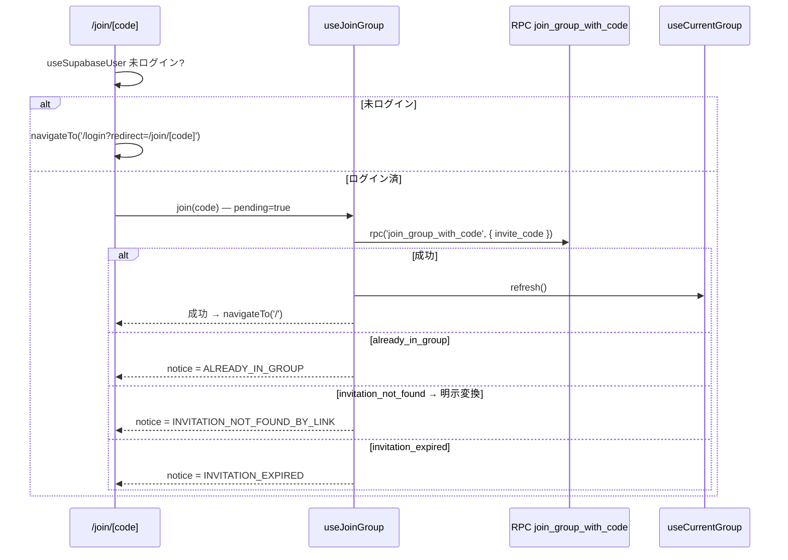

# TASK-0018 TDD コンテキストノート

## タスク概要

**TASK-0018**: `/join/[code]` ページ実装（TDD）  
**要件**: REQ-005/105/106/107/108 + EDGE-001/005  
**信頼性**: 🔵 高品質  
**推定工数**: 6 時間

### 役割と責務

招待リンク着地画面を実装。未ログイン時は page 内で `/login?redirect=/join/[code]` へリダイレクト（ADR-008 D1 例外）。ログイン済の場合は `useJoinGroup().join(code)` を呼び、成功時は `/` へ、失敗時は `useJoinGroup.notice` を `<UAlert>` で永続表示。

---

## 1. 技術スタック

### フレームワーク・ライブラリ

| 技術 | 用途 | バージョン管理 |
|---|---|---|
| Nuxt 4 | SSR/CSR フレームワーク | package.json |
| Vue 3 + Composition API | UI 構築 (SFC with `<script setup lang="ts">`) | Nuxt 付属 |
| TypeScript | 型安全性 (strict mode) | tsconfig.json |
| Nuxt UI v4 | `<UAlert>`, `<USkeleton>`, etc. | package.json |
| Vitest | 単体テスト (mock unit) | package.json |

### ファイルパス

- 参照元: `CLAUDE.md` (プロジェクト技術スタック)
- 参照元: `docs/design/auth-onboarding/architecture.md` (§フロントエンド)

---

## 2. 開発ルール

### コーディング規約

- **SFC**: `<script setup lang="ts">` のみ (Options API 禁止)
- **Composition API**: 組み込み composable (useI18n, useRoute, useNavigateTo) + 自作 composable
- **型付け**: TypeScript strict mode。`Ref<T>` / `computed<T>` には明示型付け
- **ESLint**: 1tbs brace style, no comma dangle

### ページ・レイアウト規約

- **ページファイル**: `app/pages/join/[code].vue` (ファイルベース動的ルーティング)
- **レイアウト指定**: `definePageMeta` で指定しない → `default.vue` を自動継承 (ADR-011 D1)
- **public path**: middleware `auth.global.ts` で `/join/**` は public path として通す (dataflow.md §1)
- **未ログイン処理**: page 内で `navigateTo('/login?redirect=/join/[code]')` (ADR-008 D1 例外)

### 認証・状態管理規約

- **ユーザー取得**: `useSupabaseUser()` のみ (直接 `supabase.auth` 叩き禁止)
- **Group 所属更新**: `useCurrentGroup().refresh()` で呼び出し (composable が内部で呼び出し済)
- **Group 参加ロジック**: `useJoinGroup().join(code)` 経由 (page は UI のみ)
- **error handling**: DB / RPC エラー → `useJoinGroup` 内で App 識別子へ明示変換 → `notice` チャネルへ

### i18n・文言規約

- **辞書ソース**: `i18n/locales/ja.json` (キー: `join.title`, `join.description`, `errors.*`)
- **コード内の文字列リテラル**: 禁止。`t()` 経由で取得
- **キー透過性**: テストで `t` を mock する場合は `key => key` で直接キー名を返す (useErrorMessage/notice 検証用)

### エラーハンドリング規約

- **App エラー識別子**: `APP_ERROR_CODES` から選択 (app/types/error-codes.ts)
  - `ALREADY_IN_GROUP`: すでに参加済み (REQ-105)
  - `INVITATION_NOT_FOUND_BY_LINK`: 招待リンク無効 (REQ-107, EDGE-005 で明示変換)
  - `INVITATION_EXPIRED`: 有効期限切れ (REQ-106)
- **notice チャネル**: 詳細参照 → `docs/design/cross-cutting/error-handling.md` (D2-D5)
- **永続通知**: `<UAlert>` で表示。ユーザが明示クリアまで残す (error-handling.md §6.1)

### ローディング状態

- **pending フラグ**: `useJoinGroup.pending` から取得
- **UI 制御**: `<USkeleton>` / `disabled` でボタン・入力を無効化 (NFR-202)

### 参照元ドキュメント

- `CLAUDE.md` (コーディング規約)
- `docs/design/auth-onboarding/architecture.md` (§画面構成, §既存 API マッピング, ADR-011 D1)
- `docs/design/cross-cutting/error-handling.md` (§4 識別子, §5.3 useNoticeErrors, §6 UI チャネル)
- `docs/spec/auth-onboarding/requirements.md` (REQ-005/105/106/107/108)

---

## 3. 関連実装

### 依存 Composable

#### useJoinGroup (TASK-0011 ✅)

```ts
// app/composables/useJoinGroup.ts
export function useJoinGroup(): UseJoinGroupReturn {
  const pending = ref(false)
  const { notice, setNotice, clear } = useNoticeErrors()
  
  async function join(inviteCode: string): Promise<ActionResult<string>> {
    // clear → pending=true → rpc → 成否分岐 → pending=false (finally)
    // EDGE-005: 'invitation_not_found' → APP_ERROR_CODES.INVITATION_NOT_FOUND_BY_LINK に明示変換
  }
  return { join, pending, notice }
}
```

**テスト状況**: useJoinGroup.test.ts が TC1-TC4 を全て通す状態
- TC1: join 成功 → data: group_id, error: null, notice: null
- TC2: invitation_not_found → 明示変換で INVITATION_NOT_FOUND_BY_LINK を notice に反映
- TC3: already_in_group → notice に反映
- TC4: invitation_expired → notice に反映

**提供インターフェース**:

```ts
interface UseJoinGroupReturn {
  join: (inviteCode: string) => Promise<ActionResult<string>>
  pending: Ref<boolean>
  notice: Ref<string | null>
}
```

#### useSupabaseUser (Nuxt Supabase Plugin)

```ts
const user = useSupabaseUser()  // user.value: User | null
```

#### useCurrentGroup (TASK-0009 ✅)

```ts
const { data: currentGroup } = await useCurrentGroup()  // data.value: Group | null
// useJoinGroup 内で refresh() 呼び出し済み
```

#### useI18n (Vue I18n)

```ts
const { t } = useI18n()
t('join.title')  // キー → 文言翻訳
```

### 既存 Page 実装パターン

#### `/login` (TASK-0015 ✅)

参照元: `app/pages/login.vue`

```vue
<script setup lang="ts">
definePageMeta({ layout: 'auth' })  // 認証前ページは auth layout
const { t } = useI18n()
const route = useRoute()
const { login, pending, notice } = useLogin()

function handleLogin() {
  const redirect = resolveQueryParam(route.query.redirect)
  login(redirect)
}
</script>

<template>
  <div class="w-full flex flex-col gap-6">
    <h1 class="text-2xl font-bold text-center">{{ t('login.title') }}</h1>
    <UAlert v-if="notice" color="error" variant="soft" :description="notice" />
    <UButton
      block size="lg" color="neutral"
      :label="t('login.google')" :loading="pending" :disabled="pending"
      icon="i-simple-icons-google" @click="handleLogin"
    />
  </div>
</template>
```

**学習点**: notice → `<UAlert>`, pending → disabled+loading, `<script setup>` + `t()` + route パラム

#### `/onboarding` (TASK-0016 ✅)

参照元: `app/pages/onboarding.vue`

**学習点**: public page でも default layout (ADR-011 D1), template 内での `t()` 活用

### Layout (TASK-0014 ✅)

#### `app/layouts/default.vue`

参照元: TASK-0014 verify-report.md

```vue
<template>
  <div>
    <UHeader>
      <template #left>
        <NuxtLink to="/">
          <AppLogo />
        </NuxtLink>
      </template>
      <template #right>
        <UAvatar :src="userAvatarUrl" size="sm" :alt="t('layout.default.avatar.alt')" />
        <UButton icon="i-heroicons-arrow-right-on-rectangle-20-solid" :label="t('layout.default.logout')" :loading="pending" @click="logout" />
      </template>
    </UHeader>
    <UMain>
      <slot />
    </UMain>
  </div>
</template>
```

**学習点**: `/join/[code]` は `definePageMeta` を指定しないため自動的に `default.vue` を継承

### 類似パターン: 詰め替え変換 (EDGE-005)

参照元: `app/composables/useJoinGroup.ts` (100 行目付近)

```ts
// DB の 'invitation_not_found' と App 識別子 'invitation_not_found_by_link' は文字列が異なる
const msg = (error as { message?: string }).message ?? ''
const mapped = msg.includes('invitation_not_found') && !msg.includes('invitation_not_found_by_link')
  ? { ...error, message: APP_ERROR_CODES.INVITATION_NOT_FOUND_BY_LINK }
  : error
setNotice(mapped)
```

**パターン**: isAppError は includes で判定 → DB メッセージと App 識別子が異なる場合は page から見えない composable 内で明示変換

---

## 4. 設計文書

### 認証 Middleware フロー (`dataflow.md §1`)

```
/join/[code] は public path
  ↓ (未ログイン)
page 内で navigateTo('/login?redirect=/join/[code]')  ← ADR-008 D1 例外
  ↓ (ログイン成功 + confirm)
middleware で /join/[code] に戻る
  ↓ (ログイン済)
useJoinGroup().join(code) を実行
  ↓ (成功)
navigateTo('/') + useCurrentGroup.refresh() 済み
```

参照元: `docs/design/auth-onboarding/dataflow.md` (§1 middleware, §4 join)

### 招待リンク参加フロー (`dataflow.md §4`)



参照元: `docs/design/auth-onboarding/dataflow.md` (§4 sequence diagram)

### エラー識別子と文言マッピング

| DB メッセージ | App 識別子 | 文言キー | 文言 |
|---|---|---|---|
| `already_in_group` | `ALREADY_IN_GROUP` | `errors.already_in_group` | すでにグループに参加しています |
| `invitation_not_found` | `INVITATION_NOT_FOUND_BY_LINK` | `errors.invitation_not_found_by_link` | 招待リンクが無効です。発行者にご確認ください |
| `invitation_expired` | `INVITATION_EXPIRED` | `errors.invitation_expired` | 招待コードの有効期限が切れています |

参照元: 
- `app/types/error-codes.ts` (APP_ERROR_CODES)
- `i18n/locales/ja.json` (errors.* キー)
- `docs/design/cross-cutting/error-handling.md` (§4 識別子の集約)

### API マッピング規約

参照元: `docs/design/auth-onboarding/architecture.md` (§既存 API マッピング)

- **RPC**: `join_group_with_code(invite_code: string) → { data: group_id, error }`
- **error.message**: DB 側 `RAISE EXCEPTION 'xxx'` のメッセージ
- **EDGE-005**: DB と App の識別子が文字列で異なる場合、composable で明示変換（素朴な includes に頼らない）

---

## 5. テスト関連情報

### テストフレームワーク・設定

| 項目 | パス | 用途 |
|---|---|---|
| Vitest 設定 (unit) | `vitest.config.ts` | mock unit テスト |
| Vitest 設定 (integration) | `vitest.integration.config.ts` | 共有 DB integration テスト |
| テストディレクトリ | `tests/unit/` | mock unit テストのみ (ADR-012 D5) |
| ディレクトリ構成 | `tests/unit/composables/`, `tests/unit/middleware/`, etc. | 機能別テストグループ |

参照元: `vitest.config.ts`

### 既存テストパターン

#### Mock Unit テスト構造 (useJoinGroup.test.ts より)

参照元: `tests/unit/composables/useJoinGroup.test.ts`

```ts
// 【vi.hoisted】ブロック: vi.mock ファクトリより先に評価
const { rpcMock, refreshMock, tFn, teFn } = vi.hoisted(() => ({
  rpcMock: vi.fn(),
  refreshMock: vi.fn().mockResolvedValue(undefined),
  tFn: vi.fn((key: string) => key),  // キー透過
  teFn: vi.fn((_key: string) => false)
}))

// 【vi.mock 設定】: useI18n / Sentry / #imports / #supabase-client / ~/composables
vi.mock('vue-i18n', () => ({ useI18n: () => ({ t: tFn, te: teFn }) }))
vi.mock('@sentry/nuxt', () => ({ captureException: vi.fn() }))
vi.mock('#imports', async (importOriginal) => { /* ... */ })
vi.mock('#supabase-client', () => ({ useSupabaseClient: () => ({ rpc: rpcMock }) }))
vi.mock('~/composables/useCurrentGroup', () => ({ useCurrentGroup: () => ({ refresh: refreshMock }) }))

// 【beforeEach】: 各テスト前に mock をリセット
beforeEach(() => {
  vi.clearAllMocks()
  refreshMock.mockResolvedValue(undefined)
  tFn.mockImplementation((key: string) => key)
  teFn.mockReturnValue(false)
})

// 【テストケース】: describe → it で構成
describe('useJoinGroup', () => {
  it('TC1: join 成功', async () => {
    rpcMock.mockResolvedValue({ data: 'group-123', error: null })
    const { join, notice } = useJoinGroup()
    await join('code')
    expect(refreshMock).toHaveBeenCalled()
    expect(notice.value).toBeNull()
  })
  // TC2, TC3, TC4 similarly
})
```

**Mock 戦略**:
- `vi.hoisted()`: TDZ 回避
- `vi.mock()`: vue-i18n, Sentry, #imports (vue + useSupabaseClient/useCurrentGroup), #supabase-client, composable 直接
- `beforeEach`: clearAllMocks + initialValue reset
- `tFn` キー透過: notice.value の文言ではなく識別子キー文字列で検証可能

### Page テストの最小化（NFR-301）

参照元: `docs/tasks/auth-onboarding/TASK-0018.md` (§単体テスト要件)

**TASK-0018 の page テスト戦略**:
- **join ロジック・識別子変換**: useJoinGroup (TASK-0011) のテストで検証済
- **page 固有テスト**: 最小 / 省略
  - 理由: useSupabaseUser / navigateTo は標準 Nuxt API（テスト済）
  - 構成要素の組み立てテストは TASK-0020 E2E (NFR-302) に委譲
- **単体テスト対象外**: 
  - `<UAlert>` rendering (Nuxt UI 標準)
  - `<USkeleton>` / disabled (pending フラグ連動)

**代替検証**: `/login?redirect=...` リダイレクト → TASK-0020 E2E (EDGE-001 全体フロー) で実施

参照元:
- `docs/tasks/auth-onboarding/TASK-0018.md` (§単体テスト要件 / §統合テスト要件)
- `docs/rule/nfr/` (NFR-301 page テスト最小化, NFR-302 E2E)

### テストディレクトリ構成

```
tests/unit/
  composables/
    useJoinGroup.test.ts (TC1-TC4)
    useCurrentGroup.test.ts
    useLogin.test.ts
    useErrorMessage.test.ts
    useNoticeErrors.test.ts
    ...
  middleware/
    auth.global.test.ts (TC1-TC7)
  schemas/
  utils/
  setup/
```

**ポイント**: page テストは tests/unit/pages/ なし（NFR-301 に従い最小化）

参照元: `tests/unit/` directory structure

---

## 6. 注意事項

### 認証フロー制約 (ADR-008 D1 例外)

- **public path**: middleware は `/join/[code]` を通す
- **page 内リダイレクト**: 「未ログイン → `/login?redirect=/join/[code]`」を page 内で判定・実行
- **理由**: オンボーディング動線の URI 保持 (EDGE-001 リダイレクトチェーン)
- **リダイレクトチェーン**: `/join/[code]` (未ログイン) → `/login?redirect=/join/[code]` → Google OAuth → `/confirm?redirect=/join/[code]` → `/join/[code]` (ログイン済) → join 成功 → `/`

参照元: `docs/design/auth-onboarding/dataflow.md` (§1 / §4), `docs/tasks/auth-onboarding/TASK-0018.md` (§注意事項 EDGE-001)

### EDGE-005: 識別子明示変換

- **DB メッセージ**: `invitation_not_found`
- **App 識別子**: `INVITATION_NOT_FOUND_BY_LINK`
- **文字列が異なる**: isAppError は `message.includes(code)` で判定 → includes('invitation_not_found_by_link') で false
- **解決**: useJoinGroup 内で `msg.includes('invitation_not_found') && !msg.includes('invitation_not_found_by_link')` で詰め替え
- **page への影響**: なし（詰め替えは composable に閉じる）

参照元: `docs/tasks/auth-onboarding/TASK-0018.md` (§注意事項 EDGE-005)

### Layout 設定

- **指定なし**: `definePageMeta` で layout を指定しない
- **自動継承**: `default.vue` (public path だがレイアウト分岐とは独立, ADR-011 D1)
- **理由**: 認証前ページですが、ヘッダー + ログアウトボタンが必要な場合もあるため public path 所属よりも layout の論理が優先

参照元: `docs/decisions/011-*` (ADR-011 D1)

### 無効な招待コード処理

- **空白・特殊文字・極端な長さ**: DB 側でマッチせず `invitation_not_found` エラー → `INVITATION_NOT_FOUND_BY_LINK` に統一
- **新規識別子追加**: 不要（既存識別子で吸収）
- **page への認識**: 不要（composable で詰め替え済み）

参照元: `docs/tasks/auth-onboarding/TASK-0018.md` (§注意事項)

---

## 7. TDD 実装手順

### 推奨ステップ (6 フェーズ)

1. **tdd-requirements**: REQ-005/105/106/107/108 + EDGE-001/005 を整理
   - 未ログイン redirect / join 成否 / notice 永続の契約明確化
   
2. **tdd-testcases**: page 単体テスト最小化 (NFR-301)
   - join ロジック・識別子変換は useJoinGroup (TASK-0011) で検証済
   - page 固有テストは依存層に不足がある場合のみ red で起こす
   
3. **tdd-red**: 依存層に不足があれば赤で起こす
   - 基本は TASK-0011 で充足済
   
4. **tdd-green**: `app/pages/join/[code].vue` を実装
   - 未ログイン分岐 (`/login?redirect=...`)
   - useJoinGroup 結線、notice `<UAlert>` 永続、pending ローディング
   
5. **tdd-refactor**: 文言 locales 化 (NFR-204), 識別子変換が composable に閉じることを確認
   
6. **tdd-verify-complete**: `pnpm typecheck` / `pnpm lint`, 依存テスト緑を確認

参照元: `docs/tasks/auth-onboarding/TASK-0018.md` (§実装手順)

---

## 8. リンク集

### 要件・設計・タスク

| ドキュメント | パス | 用途 |
|---|---|---|
| 要件定義 | `docs/spec/auth-onboarding/requirements.md` | REQ-005/105/106/107/108 |
| 設計書 | `docs/design/auth-onboarding/architecture.md` | API mapping, ADR 参照 |
| データフロー | `docs/design/auth-onboarding/dataflow.md` | middleware + join フロー図 |
| インターフェース | `docs/design/auth-onboarding/interfaces.ts` | ActionResult, UseJoinGroupReturn 等 |
| タスク詳細 | `docs/tasks/auth-onboarding/TASK-0018.md` | 実装詳細・完了条件 |
| エラー戦略 | `docs/design/cross-cutting/error-handling.md` | 5 層モデル, 識別子, UI チャネル |

### 実装・テスト参考

| ドキュメント | パス | 用途 |
|---|---|---|
| CLAUDE.md | `CLAUDE.md` | 技術スタック, コーディング規約, ビルドコマンド |
| useJoinGroup note | `docs/implements/auth-onboarding/TASK-0011/note.md` | 依存 composable の実装背景 |
| TASK-0014 report | `docs/implements/auth-onboarding/TASK-0014/verify-report.md` | layout 設定確認 |
| useJoinGroup test | `tests/unit/composables/useJoinGroup.test.ts` | mock 戦略, TC 例 |
| login.vue 実装 | `app/pages/login.vue` | page パターン (notice, pending, layout) |
| middleware | `app/middleware/auth.global.ts` | public path 判定, リダイレクト |

---

## ✅ ノート作成完了

このノートは TASK-0018 TDD 開発の入口。以下の情報を網羅しています：

- **技術スタック**: Nuxt 4, Vue 3 Composition API, TypeScript, Nuxt UI, Vitest
- **開発ルール**: コーディング規約, page/layout/auth 規約, i18n, エラーハンドリング
- **関連実装**: useJoinGroup (TC1-TC4), useSupabaseUser, useCurrentGroup, useI18n, page/layout パターン
- **設計文書**: 認証フロー, 招待参加フロー, エラーマッピング, API 規約
- **テスト関連**: vitest 設定, mock 戦略, page テスト最小化 (NFR-301)
- **注意事項**: ADR-008 D1 (page 内リダイレクト), EDGE-005 (識別子詰め替え), EDGE-001 (リダイレクトチェーン)
- **TDD 手順**: 6 ステップ流れ

次フェーズ: `tdd-requirements` を実行してください。
