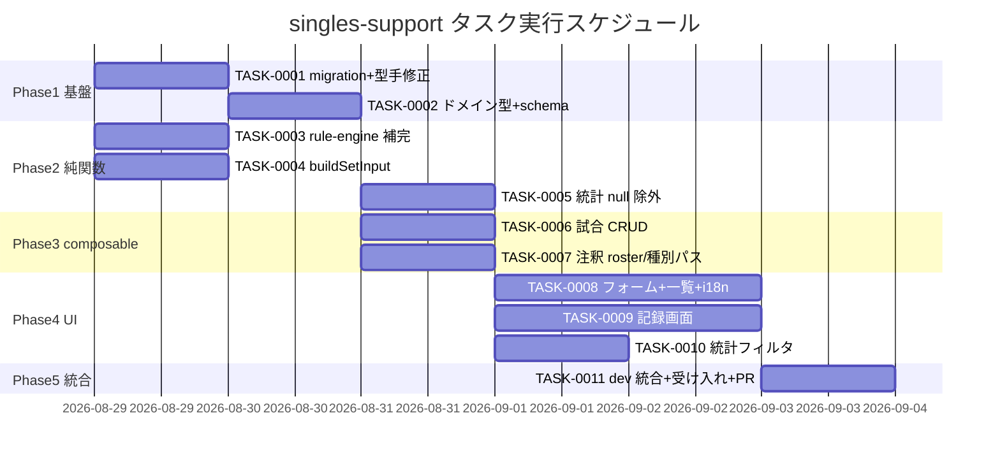

# singles-support タスク概要

**作成日**: 2026-08-28
**推定工数**: 35.5 時間
**総タスク数**: 13 件
**クリティカルパス**: TASK-0001 → TASK-0002 → TASK-0006 → TASK-0008 → TASK-0011

## 関連文書

- **要件定義書**: [📋 requirements.md](../../spec/singles-support/requirements.md)
- **ユーザストーリー**: [📖 user-stories.md](../../spec/singles-support/user-stories.md)
- **受け入れ基準**: [✅ acceptance-criteria.md](../../spec/singles-support/acceptance-criteria.md)
- **アーキテクチャ**: [📐 architecture.md](../../design/singles-support/architecture.md)
- **データフロー図**: [🔄 dataflow.md](../../design/singles-support/dataflow.md)
- **UI 設計**: [🎨 ui-design.md](../../design/singles-support/ui-design.md)
- **インターフェース定義**: [📝 interfaces.ts](../../design/singles-support/interfaces.ts)
- **migration**: [🗄️ database-schema.sql](../../design/singles-support/database-schema.sql)
- **API（PostgREST/RPC）**: [🔌 api-endpoints.md](../../design/singles-support/api-endpoints.md)

> 注: TASK-NNNN の詳細ファイルは各フェーズ着手時に作成する（overview 先行方式、shot-annotation と同方式）。
> 番号は本ユニット内で TASK-0001 から採番。
> プロトタイプ実装がブランチ `wip/singles-prototype` にある。各 TDD タスクはこれを**参照**しつつ、
> Red → Green → Refactor の順で `feature/singles` に再構成する（そのまま cherry-pick しない）。

## フェーズ構成

| フェーズ | 成果物 | タスク数 | 工数 |
|---------|--------|----------|------|
| Phase 1 | migration + 生成型の先行手修正 + ドメイン型 / フォーム schema | 2 | 5h |
| Phase 2 | 純関数（rule-engine 補完 / buildSetInput / 統計 null 除外）+ 単体テスト | 3 | 6h |
| Phase 3 | composable（試合 CRUD 4 本 / 注釈セッション + 種別パス）+ 単体テスト | 2 | 7h |
| Phase 4 | UI（試合フォーム・一覧 / 記録画面 / 統計フィルタ / コートライン / 失点マップ注記）+ i18n + コンポーネントテスト | 5 | 14.5h |
| Phase 5 | dev 統合（CI migration・型再生成・ブラウザ受け入れ確認）+ PR | 1 | 3h |

## マイルストーン

- **M1: 基盤完成**: migration ファイル + 型が揃い、`pnpm typecheck` が通る（Phase 1）
- **M2: ドメイン完成**: シングルスのサーブ位置導出・立ち位置組み立て・統計 null 除外がテスト green（Phase 2）
- **M3: データ層完成**: シングルス試合の作成・読込・注釈ロスターが composable 単体テストで green（Phase 3）
- **M4: UI 完成**: シングルスで登録 → 記録 → 注釈 → 統計が画面上で一通り操作できる（Phase 4）
- **M5: 統合完了**: dev に migration 適用済み、受け入れ基準 TC を実機で確認、PR 作成（Phase 5）

---

## Phase 1: 基盤構築（5h）

### TASK-0001: matches additive migration + 生成型の先行手修正

- [x] **タスク完了**
- **タスクタイプ**: DIRECT
- **要件リンク**: REQ-001, REQ-003, REQ-203, REQ-401, REQ-402, REQ-403, REQ-404, REQ-407, REQ-408
- **依存タスク**: なし
- **実装詳細**:
  - `supabase/migrations/20260828120000_singles_match_type.sql` を [database-schema.sql](../../design/singles-support/database-schema.sql) の内容で作成
    - `match_type` 追加（既定 `doubles`）/ player2 `DROP NOT NULL` / `matches_match_type_players_check` / `matches_players_distinct_check` 再定義 / `stats_pair_rates` CREATE OR REPLACE
  - `app/types/supabase.ts` を手修正（`matches` Row/Insert/Update の `match_type`・player2 nullable、`stats_rally_endings` / `stats_rally_tempo` の player2 nullable）
  - `scripts/check-migration-integrity`（pre-commit）が既存 migration 不変を検証することを確認
- **テスト要件**:
  - [ ] `pnpm typecheck` が通る（手修正型で下流がまだ壊れないこと）
  - [ ] SQL の構文を目視 + 既存 `20260808180000` の `stats_pair_rates` と差分が CTE の `IS NOT NULL` 2 箇所のみであること
- **完了条件**:
  - [ ] migration ファイルが存在し、pre-commit の整合チェックが OK
  - [ ] 生成型の手修正差分が interfaces.ts「SupabaseTypesManualPatch」の記載と一致

### TASK-0002: ドメイン型 + 試合フォーム schema の形式分岐

- [x] **タスク完了**
- **タスクタイプ**: TDD
- **要件リンク**: REQ-001, REQ-002, REQ-101, REQ-102, REQ-103, EDGE-001, EDGE-002, NFR-302
- **依存タスク**: TASK-0001
- **実装詳細**:
  - `app/types/match.ts`: `MatchType` / `PLAYERS_PER_TEAM` / `MatchListItem.matchType` / `teamA, teamB: MatchPlayerRef[]` / `CreateMatchInput.teamXPlayer2Id: string | null`
  - `app/types/match-recording.ts`: `MatchForRecording.matchType`
  - `app/types/shot-annotation.ts`: `AnnotationMatchInfo.matchType`
  - `app/types/shot-stats.ts`: `RallyEndingRow` / `RallyTempoRow` の player2 nullable、`FlowRally.teamA/teamB: string[]`
  - `app/schemas/match-form.ts`: `matchType` enum 必須、player2 `nullish`、doubles で player2 必須（path 付き）、相異判定を形式別人数で、singles の player2 を `transform` で null 化
  - i18n: `errors.invalid_match_type` 追加、`errors.players_must_be_distinct` を形式非依存の文言に
- **テスト要件**（`tests/unit/schemas/match-form.test.ts`）:
  - [ ] 既存 TC1〜TC7 が `matchType: 'doubles'` 付与で通る
  - [ ] TC8: doubles で player2 欠落 → `player_required`（path = teamAPlayer2Id）
  - [ ] TC9: singles で player2 なし OK、出力 player2 = null
  - [ ] TC10: singles で残存 player2 は null に正規化（EDGE-001）
  - [ ] TC11: singles で A = B → `players_must_be_distinct`（EDGE-002）
  - [ ] TC12: matchType 未指定は拒否
- **完了条件**:
  - [ ] 上記テスト green、`pnpm typecheck` は型変更に追従できていない箇所（Phase 3/4 で直す）以外でエラーなし

## Phase 2: ドメイン純関数（6h）

### TASK-0003: rule-engine `createInitialState` のスロット補完

- [x] **タスク完了**
- **タスクタイプ**: TDD
- **要件リンク**: REQ-005, REQ-105, REQ-405, EDGE-202
- **依存タスク**: なし（TASK-0002 と並行可）
- **実装詳細**:
  - `app/utils/rule-engine/create-initial-state.ts` に `fillSingleSlot`（片側だけのチームを同一選手で埋める）
  - `applyRally` / `applyOverride` / `determineSetWinner` は**変更しない**
- **テスト要件**（`tests/unit/utils/rule-engine/singles.test.ts` 新規）:
  - [ ] TC-105-01: 各チーム right 1 行 → 両スロット同一選手、server=A1 / receiver=B1 / right
  - [ ] TC-005-01: A 連続得点で serverPosition が left → right と交互、positions 不変
  - [ ] TC-005-02: B 得点でサーブ権移動、server=B1 / receiver=A1 / left
  - [ ] TC-405-01: applyOverride が no-op 相当
  - [ ] 回帰: doubles 4 行入力は従来どおり
- **完了条件**:
  - [ ] 新規テスト green、既存 rule-engine / useRecordingSession テストが無変更で green

### TASK-0004: `buildSetInput` の 1 人/チーム許容

- [x] **タスク完了**
- **タスクタイプ**: TDD
- **要件リンク**: REQ-104
- **依存タスク**: なし
- **実装詳細**:
  - `app/utils/match-recording/build-set-input.ts`: 各チーム 1 or 2 人を許容、`teamPositions` ヘルパで singles は right の 1 行のみ、人数不一致・0 人・ファースト不在は throw
- **テスト要件**（`tests/unit/utils/match-recording/build-set-input.test.ts` 既存に追記）:
  - [ ] 既存 4 ケース（doubles）が無変更で green
  - [ ] singles: right 2 行のみ
  - [ ] singles: ファーストがチーム外 → throw
  - [ ] 空ロスター → throw
- **完了条件**:
  - [ ] テスト green

### TASK-0005: 統計純関数の player2 null 除外

- [x] **タスク完了**
- **タスクタイプ**: TDD
- **要件リンク**: REQ-006, REQ-406, EDGE-104
- **依存タスク**: TASK-0002（型）
- **実装詳細**:
  - `app/utils/shot-stats/endings.ts`: `endingSubjectTeam` と `byPlayer` 集計で `[p1, p2].filter(id !== null)`
  - `app/utils/shot-stats/flow.ts`: `teamA/teamB` を null 除外した `string[]` に
- **テスト要件**（既存 endings / flow テストに追記）:
  - [ ] player2 = null の行で `endingSubjectTeam` が player 主体を正しく解決し、pair 主体は null
  - [ ] player2 = null の行で選手別集計に null キーが混入しない
  - [ ] `subjectTeamOf` が 1 人構成のチームで正しく動く
- **完了条件**:
  - [ ] テスト green、`pnpm typecheck` で shot-stats 系のエラーが解消

## Phase 3: データ層 composable（7h）

### TASK-0006: 試合 CRUD composable の `match_type` / player2 null 対応

- [x] **タスク完了**
- **タスクタイプ**: TDD
- **要件リンク**: REQ-003, REQ-007, REQ-203, REQ-109
- **依存タスク**: TASK-0002
- **実装詳細**:
  - `useCreateMatch` / `useUpdateMatch`: `match_type` を送り、player2 は null をそのまま送る
  - `useMatches`: `match_type` を select、埋め込み `ta2/tb2` の null を 1 人構成に射影
  - `useMatchForRecording`: `match_type` を select、ロスターを 2 or 4 人で組み `matchType` を返す
- **テスト要件**（`tests/unit/composables/useCreateMatch / useUpdateMatch / useMatches / useMatchForRecording.test.ts`）:
  - [ ] insert/update ペイロードに `match_type` が含まれ、singles で player2 = null
  - [ ] useMatches: `ta2 = null` の行が `teamA.length === 1`、`matchType === 'singles'`
  - [ ] useMatchForRecording: singles で roster 2 人 / doubles で 4 人（回帰）
- **エラーハンドリング**:
  - [ ] DB CHECK 違反は従来どおり `ActionResult.error` → toast（既存テストで担保）
- **完了条件**:
  - [ ] テスト green

### TASK-0007: 注釈セッションのロスター + 種別パスの打者自動確定

- [x] **タスク完了**
- **タスクタイプ**: TDD
- **要件リンク**: REQ-006, REQ-108, EDGE-105
- **依存タスク**: TASK-0002
- **実装詳細**:
  - `useAnnotationSession.load`: `match_type` を select、`teamOf` Map を NULL スキップで構築、`match.matchType` を保持
  - `useTypePass.inputType`: 3 打目以降で `hitterCandidates.length === 1` なら `hitPlayerId` を同時 patch して `advance()`
  - `usePositionPass` / `useQuickPass` / `annotate.vue` のキー処理は変更なし
- **テスト要件**:
  - [ ] `useAnnotationSession.test.ts`: player2 null の試合で roster が 2 人、`matchType` が入る
  - [ ] `useTypePass.test.ts`: singles ロスターで 3 打目の種別入力が二択なしに hitPlayerId 確定 + 前進（TC-108-01）
  - [ ] 既存「3打目以降: 打者二択」テストが doubles で green（TC-108-02 回帰）
- **完了条件**:
  - [ ] テスト green

## Phase 4: UI（11.5h）

### TASK-0008: 試合フォーム（形式ラジオ）+ 一覧（バッジ・2 人閾値）+ i18n

- [x] **タスク完了**
- **タスクタイプ**: TDD
- **要件リンク**: REQ-002, REQ-007, REQ-101, REQ-102, REQ-201, REQ-202, REQ-409, NFR-201, EDGE-201, EDGE-003
- **依存タスク**: TASK-0002, TASK-0006
- **実装詳細**:
  - `MatchFormModal.vue`: `matchType` ref（既定 doubles）、`URadioGroup`（`data-testid="match-type"`）、singles で player2 select を `v-if` 非表示、ラベル「選手 A/B」、edit プリフィル `teamA[1]?.id`、エラー表示の割当（ui-design.md §1）
  - `matches/index.vue`: 形式バッジ（`match-type-{id}`）、`hasEnoughPlayers >= 2`、対戦カード `join('・')`
  - i18n: `matches.matchTypeLabel` / `matchTypeOptions.*` / `playerALabel` / `playerBLabel`、`notEnoughPlayers` 文言更新（ja/en 構造一致）
- **UI/UX 要件**:
  - [ ] ローディング: 既存の保存ボタン `loading` を維持
  - [ ] エラー表示: 相異／player_required は該当チーム欄に inline（EDGE-009 踏襲）
  - [ ] モバイル: ラジオは `orientation="horizontal"`、既存レイアウト内に収まる
  - [ ] アクセシビリティ: ラジオ／セレクトは Nuxt UI 既定のラベル関連付けを利用
- **テスト要件**:
  - [ ] `MatchFormModal.test.ts`: 既存 TC を `matchType` 付きで維持（TC6 は radio を value で特定）、TC10 singles 切替 → 2 枠 → createMatch(player2 null)、TC11 singles edit プリフィル
  - [ ] `matches.test.ts`: TC4 を「1 人で disabled」に、TC4b 2 人で活性、TC4c singles 対戦カード + バッジ
  - [ ] `matches.flow.test.ts`: `UBadge` スタブ追加、fixture に `matchType`
  - [ ] `pnpm i18n:check` OK
- **完了条件**:
  - [ ] テスト green、`pnpm lint` / `pnpm typecheck` OK

### TASK-0009: 記録画面（セット設定 / コート図 / 入替ボタン / 再開判定）

- [x] **タスク完了**
- **タスクタイプ**: TDD
- **要件リンク**: REQ-004, REQ-104, REQ-106, REQ-107, REQ-109, NFR-202, NFR-203, EDGE-102, EDGE-202
- **依存タスク**: TASK-0003, TASK-0004, TASK-0006
- **実装詳細**:
  - `SetSetupForm.vue`: `isSingles`（各チーム 1 人）でファースト欄を非表示、唯一の選手を `buildSetInput` へ
  - `CourtDiagram.vue`: props `singles` / `serverPosition`、`cell()` が非サービスコートを空セルに、`.is-empty` スタイル
  - `PositionControls.vue`: `showOverride`（`withDefaults` 既定 true）
  - `record.vue`: `isSingles` を配線、再開判定を「A/B の行が両方ある」に
- **UI/UX 要件**:
  - [ ] モバイル: コート図は既存の `max-width: 18rem`、空セルも同じ高さを保つ
  - [ ] アクセシビリティ: 空セルは装飾のみ（`aria-hidden` 不要、テキストなし）
- **テスト要件**:
  - [ ] `SetSetupForm.test.ts`（既存があれば追記／なければ新規）: singles ロスターで `positions-title` / `a-first` が存在せず、submit で right 2 行
  - [ ] `CourtDiagram.test.ts`（同上）: singles + serverPosition=right で `cell-A1` が右列・`cell-empty-A-left` が空、left で反転（TC-107-01/02）
  - [ ] `PositionControls`: `showOverride=false` で `override-a/b` が無く `next-set` は存在
  - [ ] `useRecordingSession.test.ts`: singles 2 行で `configureAndStartSet` → 得点 → serverPosition 交互（統合的確認）
- **完了条件**:
  - [ ] テスト green、ダブルスの既存記録テストが無変更で green

### TASK-0010: 統計フィルタ（ペア別モードの非表示）

- [x] **タスク完了**
- **タスクタイプ**: TDD
- **要件リンク**: REQ-110, EDGE-103
- **依存タスク**: TASK-0006
- **実装詳細**:
  - `StatsGlobalFilterBar.vue`: `showPairMode`（`withDefaults` 既定 true）で `mode-pair` を `v-if`
  - `matches/[matchId]/stats.vue`: `:show-pair-mode="match?.matchType !== 'singles'"`
- **テスト要件**:
  - [ ] `StatsGlobalFilterBar.test.ts`: 既定でペア別ボタンあり（既存）、`showPairMode=false` で無し
- **完了条件**:
  - [ ] テスト green

### TASK-0012: シングルスサイドラインのコート図描画

- [x] **タスク完了**
- **タスクタイプ**: TDD
- **要件リンク**: REQ-301（a/b）
- **依存タスク**: TASK-0009
- **実装詳細**:
  - `CourtDiagramInput.vue` / `StatsCourtZones.vue`: シングルスサイドライン（左右 0.46m 内側）を常時描画
  - `CourtDiagram.vue`（記録）: `singles=true` のときサイドラインを描画
- **テスト要件**:
  - [ ] 各コンポーネントで `singles-sideline` 要素の有無を検証（記録図は singles のみ）
- **完了条件**:
  - [ ] テスト green

### TASK-0013: 失点マップのシングルス注記切替

- [x] **タスク完了**
- **タスクタイプ**: TDD
- **要件リンク**: REQ-302
- **依存タスク**: TASK-0010
- **実装詳細**:
  - `StatsWeaknessMaps.vue` に `singles` prop、注記を `weakness.playerNote` / `weakness.teamNote` で切替
  - `matches/[matchId]/stats.vue` から `:singles` を配線、i18n キー追加（ja/en）
- **テスト要件**:
  - [ ] singles=true で playerNote、false で teamNote（TC-302-01/02）
- **完了条件**:
  - [ ] テスト green、`pnpm i18n:check` OK

## Phase 5: 統合（3h）

### TASK-0011: dev 統合・migration 適用・受け入れ確認・PR

- [ ] **タスク完了**
- **タスクタイプ**: DIRECT
- **要件リンク**: 全要件（特に REQ-407, REQ-408, 受け入れ基準 §1〜§6）
- **依存タスク**: TASK-0008, TASK-0009, TASK-0010, TASK-0012, TASK-0013
- **実装詳細**:
  - `feature/singles` を `dev` worktree（`../badkichi-dev`）へマージ → push（`migrate-dev.yml` 発火）
  - CI 完了後 `pnpm db:types` で `app/types/supabase.ts` を再生成し、手修正との差分を確認（差分があれば取り込む）
  - `http://localhost:3000` で acceptance-criteria.md の TC-002-01 〜 TC-110-02 を実施（シングルス登録 → 記録 → リロード再開 → 注釈種別パス → 試合統計 / Group 統計）
  - 既存ダブルス試合の回帰（一覧・記録・統計）を目視
  - `main` への PR 作成（単一論理単位: singles-support）
- **テスト要件**:
  - [ ] `pnpm test` / `pnpm lint` / `pnpm typecheck` / `pnpm i18n:check` 全て OK
  - [ ] 統合テスト（`tests/integration`）の matches fixture が 4 選手 + 既定 doubles で従来どおり通ることを確認（CI）
- **完了条件**:
  - [ ] dev DB に migration 適用済み（`supabase migration list` で確認）
  - [ ] 受け入れ基準の機能テスト項目が全てチェック済み
  - [ ] PR が作成され CI green

---

## 実行順序

**並行実行可能なグループ**:
- G1: TASK-0001 / TASK-0003 / TASK-0004（相互依存なし）
- G2: TASK-0005 / TASK-0006 / TASK-0007（TASK-0002 の後）
- G3: TASK-0008 / TASK-0009 / TASK-0010（Phase 3 の後）

## TDD タスクの進め方

各 TDD タスクは `tdd-requirements` → `tdd-testcases` → `tdd-red` → `tdd-green` → `tdd-refactor` → `tdd-verify-complete` の順で進め、実装記録を `docs/implements/singles-support/TASK-NNNN/` に残す。DIRECT タスクは `direct-setup` → `direct-verify`。
